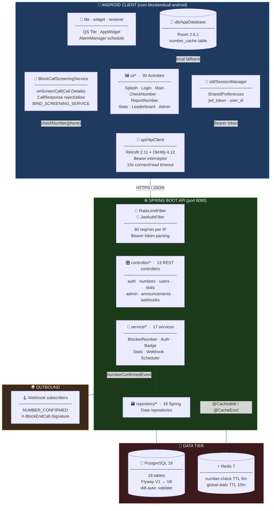
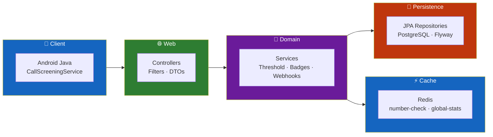
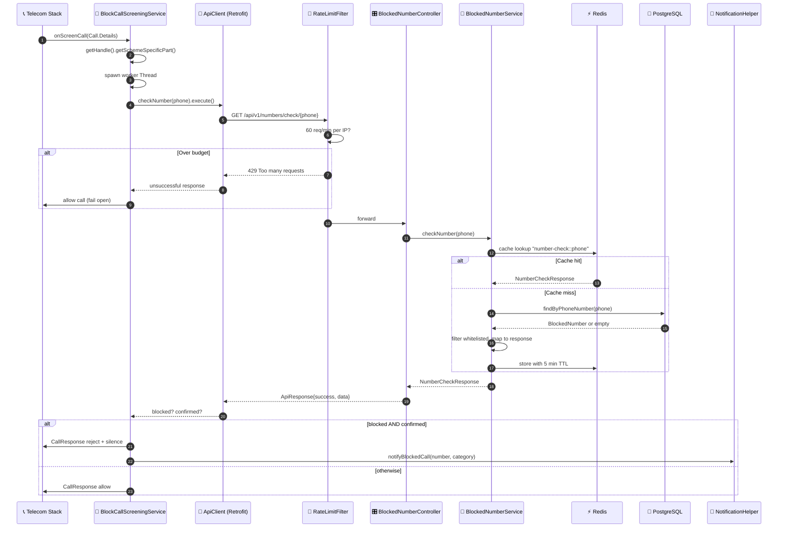
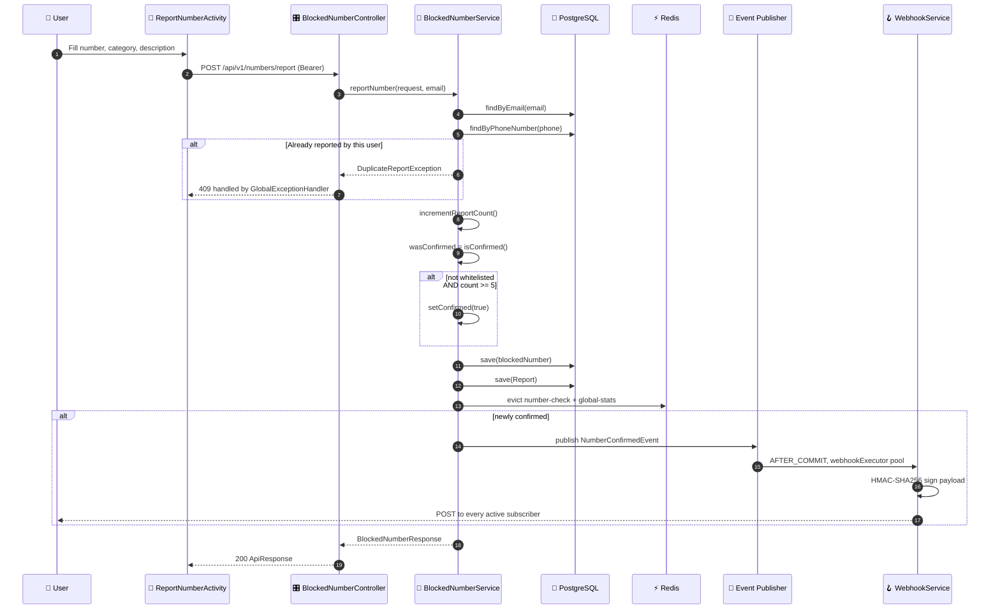
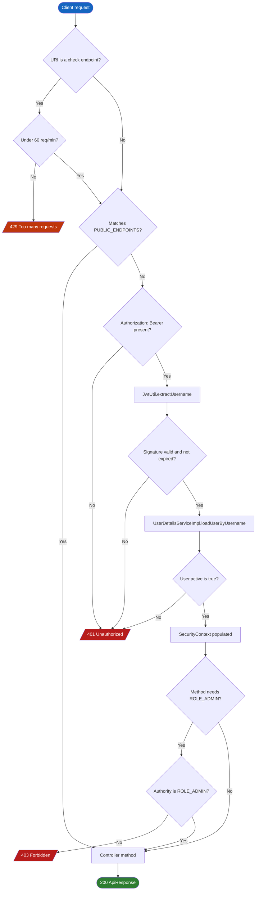
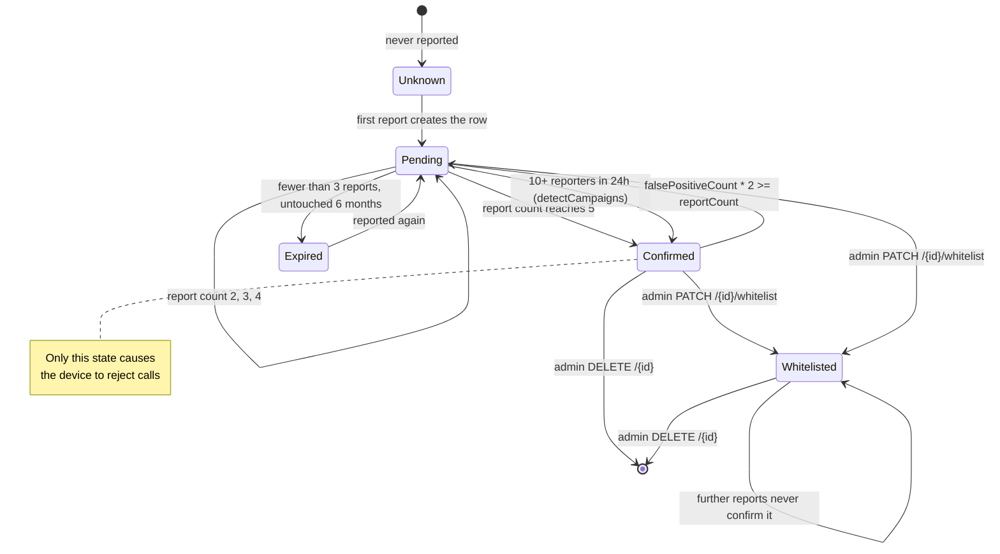

<div align="center">

**🌐 Choose Language / Selecione o Idioma / Elija el Idioma**

[](README.md)&nbsp;&nbsp;&nbsp;[](README_PT.md)&nbsp;&nbsp;&nbsp;[](README_ES.md)

</div>

---

<div align="center">

```
██████╗ ██╗      ██████╗  ██████╗██╗  ██╗███████╗███╗   ██╗██████╗
██╔══██╗██║     ██╔═══██╗██╔════╝██║ ██╔╝██╔════╝████╗  ██║██╔══██╗
██████╔╝██║     ██║   ██║██║     █████╔╝ █████╗  ██╔██╗ ██║██║  ██║
██╔══██╗██║     ██║   ██║██║     ██╔═██╗ ██╔══╝  ██║╚██╗██║██║  ██║
██████╔╝███████╗╚██████╔╝╚██████╗██║  ██╗███████╗██║ ╚████║██████╔╝
╚═════╝ ╚══════╝ ╚═════╝  ╚═════╝╚═╝  ╚═╝╚══════╝╚═╝  ╚═══╝╚═════╝
         ██████╗ █████╗ ██╗     ██╗
        ██╔════╝██╔══██╗██║     ██║
        ██║     ███████║██║     ██║
        ██║     ██╔══██║██║     ██║
        ╚██████╗██║  ██║███████╗███████╗
         ╚═════╝╚═╝  ╚═╝╚══════╝╚══════╝
        Community-Powered Spam Call Blocking Platform
```

---

[](https://openjdk.org/)
[](https://spring.io/projects/spring-boot)
[](https://www.postgresql.org/)
[](https://redis.io/)
[](https://developer.android.com/)
[](https://www.docker.com/)
[](https://swagger.io/)

<br/>

> **Report a spam number once, and it gets blocked for everyone.**
> A Spring Boot API plus a native Android `CallScreeningService` that rejects community-confirmed spam before the phone ever rings.

<br/>


</div>

---

## 📑 Table of Contents

<details>
<summary>▶️ <strong>Click to expand / collapse this section</strong></summary>

<table>
<tr>
<td valign="top" width="50%">

**🏗️ System**
- [Overview](#-overview)
- [System Architecture](#️-system-architecture)
- [Technology Stack](#️-technology-stack)
- [Design Patterns](#-design-patterns-applied)
- [Project Structure](#-project-structure)

**📦 Modules**
- [REST API Layer](#-rest-api-layer--13-controllers)
- [Service Layer](#-service-layer--17-services)
- [Persistence Layer](#️-persistence-layer--jpa--flyway)
- [Security Layer](#-security-layer--jwt--bcrypt)
- [Rate Limit Filter](#-rate-limit-filter--sliding-window)
- [Cache Layer](#-cache-layer--redis)
- [Webhook Subsystem](#-webhook-subsystem--outbound-events)
- [Scheduler Subsystem](#-scheduler-subsystem--cron-jobs)
- [Android Call Screening](#-android-call-screening--the-blocking-core)
- [Android API Client](#-android-api-client--retrofit--session)
- [Android Room Cache](#-android-room-cache--offline-lookups)
- [Android UI Surface](#-android-ui-surface--30-activities)
- [Android System Surfaces](#-android-system-surfaces--tile-widget-alarm)
- [Infrastructure](#-infrastructure--docker--ci)

</td>
<td valign="top" width="50%">

**💼 Business**
- [Business Rules](#-business-rules)
- [Functional Requirements](#-functional-requirements)
- [Non-Functional Requirements](#-non-functional-requirements)

**📐 Design**
- [Data Model](#️-data-model)
- [System Flows](#-system-flows)
- [Call Screening Flow](#incoming-call-screening-flow)
- [Report & Confirmation Flow](#report--confirmation-flow)
- [Authentication Flow](#authentication-flow)
- [Number Lifecycle](#number-lifecycle-state-machine)

**🔐 Security & Ops**
- [Security](#-security)
- [Installation & Execution](#-installation--execution)
- [Automated Tests](#-automated-tests)
- [Metrics & Monitoring](#-metrics--monitoring)
- [Known Limitations](#️-known-limitations)

</td>
</tr>
</table>

---

</details>

## 🌟 Overview

<details>
<summary>▶️ <strong>Click to expand / collapse this section</strong></summary>

**BlockEndCall** is a two-tier platform for collaborative spam call defence. A **Spring Boot 3.2.5 REST API** holds the shared reputation database of phone numbers, and a **native Android client** written in Java registers itself as the device's Call Screening application so that every incoming call is checked against that database before the phone rings.

The economic idea behind the project is simple. Blocking a spam number is cheap for one person and expensive for a whole population, unless the cost is shared. When a user reports a number through `POST /api/v1/numbers/report`, the backend increments a report counter on the `blocked_numbers` row. Once the counter reaches the configured threshold, `app.report.threshold` (default **5**), the number is flipped to `confirmed = true`, and from that moment every device running the app rejects it silently. One person's annoyance becomes everyone's protection.

The system defends itself against the obvious abuse of that mechanism. A user may report a given number only once, enforced by a `UNIQUE (user_id, blocked_number_id)` constraint on the `reports` table and a pre-check in `BlockedNumberService.reportNumber`. Numbers that receive false-positive reports lose confirmation when `falsePositiveCount * 2 >= reportCount`. Administrators can whitelist a number permanently, a public whitelist protects known institutional callers, and each user keeps a personal blacklist and whitelist that overrides the community verdict locally. A nightly scheduler expires stale pending numbers and auto-confirms coordinated spam campaigns.

### 🎯 System Objectives

| Objective | Description |
|-----------|-------------|
| 📵 **Silent Rejection** | Reject community-confirmed spam through `CallScreeningService` before the device rings |
| 🤝 **Shared Reputation** | Turn individual reports into a global block list via a report-count threshold |
| ⚖️ **Abuse Resistance** | One report per user per number, false-positive counter-voting, admin whitelist, public whitelist |
| ⚡ **Low Latency** | Redis-cached number lookups with a 5 minute TTL, plus a local Room cache on the device |
| 🔐 **Stateless Auth** | JWT bearer tokens (jjwt 0.12.5), BCrypt password hashing, role-based method security |
| 🧭 **Personal Override** | Per-user personal whitelist and blacklist that take precedence over the community verdict |
| 🏅 **Engagement** | Reputation score, eight badge tiers and a public leaderboard to reward reporters |
| 🪝 **Integrability** | HMAC-SHA256 signed outbound webhooks on `NUMBER_CONFIRMED`, plus per-user API keys |
| 🇧🇷 **Local Enrichment** | Brazilian DDD area-code resolution for 67 area codes, reported caller names, event timelines |
| 🐳 **Reproducibility** | Docker Compose stack (API + PostgreSQL 16 + Redis 7) and a GitHub Actions CI pipeline |

---

</details>

## 🏗️ System Architecture

<details>
<summary>▶️ <strong>Click to expand / collapse this section</strong></summary>

### Module Diagram



### Architecture Layers



---

</details>

## 🛠️ Technology Stack

<details>
<summary>▶️ <strong>Click to expand / collapse this section</strong></summary>

<table>
<thead>
<tr>
<th>Layer</th>
<th>Technology</th>
<th>Version</th>
<th>Purpose</th>
</tr>
</thead>
<tbody>
<tr>
<td rowspan="2"><strong>🧠 Language</strong></td>
<td>Java (backend)</td>
<td>17</td>
<td><code>java.version</code> property in <code>backend/pom.xml</code></td>
</tr>
<tr>
<td>Java (Android)</td>
<td>17</td>
<td><code>sourceCompatibility</code> / <code>targetCompatibility</code> in <code>app/build.gradle</code></td>
</tr>
<tr>
<td rowspan="5"><strong>🌐 Backend</strong></td>
<td>Spring Boot</td>
<td>3.2.5</td>
<td>Parent starter, auto-configuration, embedded Tomcat on port 8080</td>
</tr>
<tr>
<td>Spring Web MVC</td>
<td>3.2.5</td>
<td><code>spring-boot-starter-web</code>, 13 REST controllers</td>
</tr>
<tr>
<td>Spring Security</td>
<td>6.x</td>
<td>Stateless filter chain, <code>@EnableMethodSecurity</code>, <code>@PreAuthorize</code></td>
</tr>
<tr>
<td>Spring Data JPA</td>
<td>3.2.5</td>
<td>18 repositories, Hibernate <code>ddl-auto: validate</code></td>
</tr>
<tr>
<td>Bean Validation</td>
<td>starter</td>
<td><code>spring-boot-starter-validation</code> on request DTOs</td>
</tr>
<tr>
<td rowspan="2"><strong>🔐 Auth</strong></td>
<td>jjwt (api / impl / jackson)</td>
<td>0.12.5</td>
<td>HS256 token issue and verification in <code>JwtUtil</code></td>
</tr>
<tr>
<td>BCryptPasswordEncoder</td>
<td>Spring Security</td>
<td>Password hashing bean in <code>SecurityConfig</code></td>
</tr>
<tr>
<td rowspan="3"><strong>💾 Data</strong></td>
<td>PostgreSQL</td>
<td>16-alpine</td>
<td>Primary datastore, 18 tables</td>
</tr>
<tr>
<td>Flyway</td>
<td>Boot-managed</td>
<td>8 versioned migrations under <code>db/migration</code></td>
</tr>
<tr>
<td>Redis</td>
<td>7-alpine</td>
<td><code>spring-boot-starter-data-redis</code>, cache manager with 5 / 10 minute TTLs</td>
</tr>
<tr>
<td rowspan="2"><strong>📖 API Docs</strong></td>
<td>springdoc-openapi</td>
<td>2.5.0</td>
<td>OpenAPI 3 document at <code>/v3/api-docs</code></td>
</tr>
<tr>
<td>Swagger UI</td>
<td>bundled</td>
<td>Interactive console at <code>/swagger-ui.html</code></td>
</tr>
<tr>
<td rowspan="6"><strong>📱 Android</strong></td>
<td>Android SDK</td>
<td>min 29 / target 34</td>
<td><code>CallScreeningService</code> requires API 29 (Android 10)</td>
</tr>
<tr>
<td>Retrofit + Gson converter</td>
<td>2.11.0</td>
<td>Typed HTTP client in <code>api/ApiClient</code></td>
</tr>
<tr>
<td>OkHttp + logging interceptor</td>
<td>4.12.0</td>
<td>Transport, auth header injection, debug body logging</td>
</tr>
<tr>
<td>Room</td>
<td>2.6.1</td>
<td>Local <code>number_cache</code> table, <code>blockendcall.db</code></td>
</tr>
<tr>
<td>Material Components</td>
<td>1.12.0</td>
<td>Material 3 widgets across 46 layouts</td>
</tr>
<tr>
<td>AndroidX Biometric / Security-Crypto</td>
<td>1.1.0 / 1.1.0-alpha06</td>
<td><code>BiometricHelper</code> and encrypted-preference dependency</td>
</tr>
<tr>
<td rowspan="4"><strong>🔧 Build & Ops</strong></td>
<td>Maven</td>
<td>Boot plugin</td>
<td>Backend build, <code>spring-boot-maven-plugin</code></td>
</tr>
<tr>
<td>Gradle (Groovy DSL)</td>
<td>wrapper-pinned</td>
<td>Android build, R8 enabled on release</td>
</tr>
<tr>
<td>Docker / Compose</td>
<td>3.9 schema</td>
<td>Multi-stage <code>eclipse-temurin:17</code> image plus Postgres and Redis services</td>
</tr>
<tr>
<td>GitHub Actions</td>
<td><code>backend-ci.yml</code></td>
<td>Test with live Postgres and Redis services, package JAR, build image on <code>main</code></td>
</tr>
<tr>
<td rowspan="3"><strong>🧪 Testing</strong></td>
<td>JUnit 5 (Boot Test)</td>
<td>starter</td>
<td>12 test classes, 129 <code>@Test</code> methods</td>
</tr>
<tr>
<td>Spring Security Test</td>
<td>matching</td>
<td><code>@WithMockUser</code>-style controller slice tests</td>
</tr>
<tr>
<td>H2</td>
<td>test scope</td>
<td>In-memory PostgreSQL-mode database, Flyway disabled in tests</td>
</tr>
</tbody>
</table>

---

</details>

## 🎨 Design Patterns Applied

<details>
<summary>▶️ <strong>Click to expand / collapse this section</strong></summary>

| Pattern | Where | Rationale |
|---------|-------|-----------|
| 🧱 **Layered Architecture** | `controller/` → `service/` → `repository/` → `entity/` | Each tier depends only downward, so persistence concerns never leak into the HTTP surface |
| 🗂️ **Repository** | 18 interfaces in `repository/`, e.g. `BlockedNumberRepository` | Spring Data derives queries from method names, custom JPQL only where needed (`autocomplete`, `findExpiredPending`) |
| 📦 **DTO / Assembler** | `dto/request` (23) and `dto/response` (21) with static `from(...)` factories | Entities never cross the wire, so lazy associations and internal columns stay private |
| 🏗️ **Builder** | Lombok `@Builder` on `BlockedNumber`, `User`, `NumberCheckResponse`, `Webhook` | Immutable-style construction with `@Builder.Default` field defaults |
| 🔗 **Chain of Responsibility** | `RateLimitFilter` then `JwtAuthFilter`, both before `UsernamePasswordAuthenticationFilter` | Cheap rejections happen before expensive token parsing |
| 📣 **Observer / Domain Event** | `NumberConfirmedEvent` published by `BlockedNumberService`, consumed by `WebhookService` | Webhook delivery is decoupled from the report transaction |
| ⏳ **Transactional Outbox (lite)** | `@TransactionalEventListener(phase = AFTER_COMMIT)` on `notifyConfirmed` | Subscribers that call back only ever observe committed state |
| 🎭 **Proxy / Decorator** | `@Cacheable("number-check")` and `@CacheEvict` on `BlockedNumberService` | Redis caching added without a single line inside the business method |
| 🔒 **Singleton** | `ApiClient.getInstance`, `AppDatabase.getInstance`, both double-checked locking | One Retrofit stack and one Room handle per process on the device |
| 🧩 **Adapter** | `ui/adapter/BlockedNumberAdapter`, `UserReportAdapter`, `BlockedCallLogAdapter` | RecyclerView adapters translate model objects into row views |
| 🛡️ **Strategy (policy)** | `UserPreference` flags: `paranoiaMode`, `blockOnlyConfirmed`, per-category toggles | The blocking decision is parameterized per user rather than hard-coded |
| 🚨 **Global Exception Handler** | `exception/GlobalExceptionHandler` with `@RestControllerAdvice` | One place maps `DuplicateReportException`, `ResourceNotFoundException` and validation errors to HTTP status codes |

---

</details>

## 📁 Project Structure

<details>
<summary>▶️ <strong>Click to expand / collapse this section</strong></summary>

```
BlockEndCall/
│
├── 📄 docker-compose.yml                 # Postgres 16 + Redis 7 + API, with healthchecks
├── 📄 .gitignore                         # Build outputs, IDE files, local properties
│
├── 📂 .github/workflows/
│   └── 📄 backend-ci.yml                 # Test (live PG + Redis) → package → docker build
│
├── 📂 backend/                           # ☕ Spring Boot 3.2.5 REST API
│   ├── 📄 pom.xml                        # Java 17, jjwt 0.12.5, springdoc 2.5.0
│   ├── 📄 Dockerfile                     # Multi-stage temurin:17-jdk → temurin:17-jre
│   │
│   └── 📂 src/
│       ├── 📂 main/java/com/blockendcall/
│       │   ├── 📄 BlockEndCallApplication.java   # @SpringBootApplication entry point
│       │   │
│       │   ├── 📂 config/                # 5 configuration classes
│       │   │   ├── SecurityConfig.java           # Filter chain + public endpoint list
│       │   │   ├── RedisConfig.java              # CacheManager, per-cache TTLs
│       │   │   ├── SchedulingConfig.java         # @EnableScheduling + webhookExecutor pool
│       │   │   ├── OpenApiConfig.java            # Swagger metadata
│       │   │   └── RestTemplateConfig.java       # RestTemplate bean for webhook delivery
│       │   │
│       │   ├── 📂 controller/            # ★ 13 REST controllers
│       │   ├── 📂 service/               # ★ 17 domain services
│       │   ├── 📂 repository/            # 18 Spring Data JPA repositories
│       │   ├── 📂 entity/                # 18 JPA entities
│       │   ├── 📂 dto/request/           # 23 inbound payloads
│       │   ├── 📂 dto/response/          # 21 outbound payloads
│       │   ├── 📂 enums/                 # 7 enums (SpamCategory, BadgeType, UserRole, …)
│       │   ├── 📂 security/              # JwtUtil · JwtAuthFilter · UserDetailsServiceImpl
│       │   ├── 📂 filter/                # RateLimitFilter (sliding window, 60 req/min)
│       │   ├── 📂 exception/             # GlobalExceptionHandler + 2 domain exceptions
│       │   └── 📂 event/                 # NumberConfirmedEvent (record)
│       │
│       ├── 📂 main/resources/
│       │   ├── 📄 application.yml               # Datasource, Redis, JWT, report threshold 5
│       │   ├── 📄 application-docker.yml        # Host overrides for the Compose network
│       │   └── 📂 db/migration/                 # V1 → V8 Flyway scripts
│       │
│       └── 📂 test/
│           ├── 📂 java/com/blockendcall/        # 12 test classes · 129 @Test methods
│           └── 📂 resources/                    # H2 in PostgreSQL mode, Flyway off
│
├── 📂 android/                           # 📱 Native Android client
│   ├── 📄 build.gradle                   # Root build script
│   ├── 📄 settings.gradle                # Module inclusion
│   ├── 📄 gradle.properties              # JVM args, AndroidX flags
│   │
│   └── 📂 app/
│       ├── 📄 build.gradle               # minSdk 29 · targetSdk 34 · BASE_URL buildConfigField
│       ├── 📄 proguard-rules.pro         # R8 keep rules (release enables minify)
│       │
│       └── 📂 src/main/
│           ├── 📄 AndroidManifest.xml    # 5 permissions, CallScreeningService, receiver
│           │
│           ├── 📂 java/com/blockendcall/android/
│           │   ├── 📄 BlockEndCallApp.java       # Application subclass
│           │   ├── 📂 service/BlockCallScreeningService.java   # ★ The blocking core
│           │   ├── 📂 api/                       # ApiClient · BlockedNumberApi · PagedResponse
│           │   ├── 📂 db/                        # AppDatabase · NumberCacheDao · NumberCacheEntity
│           │   ├── 📂 model/                     # 22 Gson-mapped models
│           │   ├── 📂 ui/                        # 30 Activities
│           │   ├── 📂 ui/adapter/                # 3 RecyclerView adapters
│           │   ├── 📂 util/                      # SessionManager · NotificationHelper · BiometricHelper · BlockedCallLog
│           │   ├── 📂 tile/                      # Quick Settings tile service
│           │   ├── 📂 widget/                    # Home-screen AppWidget provider
│           │   └── 📂 receiver/                  # ScheduledBlockingReceiver (AlarmManager)
│           │
│           └── 📂 res/
│               ├── 📂 layout/            # 46 layouts (activity_* and item_*)
│               ├── 📂 drawable/          # 13 vector drawables
│               ├── 📂 values/            # colors · strings · themes
│               ├── 📂 menu/              # menu_main.xml
│               └── 📂 xml/               # blockendcall_widget_info.xml
│
├── 📄 README.md                          # 🇺🇸 English (primary)
├── 📄 README_PT.md                       # 🇧🇷 Português
└── 📄 README_ES.md                       # 🇪🇸 Español
```

---

</details>

## 📦 System Modules

<details>
<summary>▶️ <strong>Click to expand / collapse this section</strong></summary>

### 🌐 REST API Layer — 13 Controllers

Every controller is annotated `@RestController` and rooted under `/api/v1`. Responses are wrapped in the generic `ApiResponse<T>` envelope carrying `success`, `message` and `data`.

| Controller | Base path | Key operations |
|------------|-----------|----------------|
| `AuthController` | `/api/v1/auth` | `register`, `login`, `verify-email`, `forgot-password`, `reset-password` |
| `BlockedNumberController` | `/api/v1/numbers` | `check/{phoneNumber}`, `report`, `search`, `category/{category}`, `check-batch`, `check-enhanced/{phoneNumber}`, `autocomplete`, `search-description`, `{id}/false-positive`, `{id}/whitelist`, `import/csv` |
| `NumberEnrichmentController` | `/api/v1/numbers` | `{id}/reported-names` (GET/POST), `{id}/timeline`, `{numberId}/confirm`, `ddd`, `ddd/{ddd}` |
| `UserController` | `/api/v1/users` | `me` (GET/PUT/DELETE), `me/password`, `me/reports`, `me/preferences`, `me/badges`, `me/terms` |
| `PersonalListController` | `/api/v1/users/me/...` | `personal-whitelist` and `personal-blacklist` (GET / POST / DELETE by phone) |
| `CallLogController` | `/api/v1/users/me/call-log` | Log a blocked call, list history, count |
| `ApiKeyController` | `/api/v1/users/me/api-keys` | List, create, revoke a user API key |
| `FcmController` | `/api/v1/users/me/fcm` | Register a device push token |
| `StatsController` | `/api/v1/stats` | Global stats, `enhanced`, `leaderboard`, `by-ddd`, `top` |
| `AnnouncementController` | `/api/v1/announcements` | Public list, admin create and delete |
| `PublicWhitelistController` | `/api/v1/public-whitelist` | Public list and `check/{phone}`, admin add and verify |
| `AdminController` | `/api/v1/admin` | `users`, suspend / unsuspend / promote, `numbers/pending`, bulk approve / reject, `audit` |
| `WebhookController` | `/api/v1/webhooks` | Register, list, deactivate. Entire class is `@PreAuthorize("hasRole('ADMIN')")` |

---

### 🧠 Service Layer — 17 Services

`BlockedNumberService` is the heart of the domain. Its `reportNumber` method holds the threshold rule that gives the project its name.

| Service | Responsibility |
|---------|---------------|
| `BlockedNumberService` | Report, check, search, false positive, whitelist, CSV import, threshold confirmation |
| `AuthService` | Registration with duplicate-email guard, login through `AuthenticationManager`, token issuance |
| `UserPreferenceService` | Reads and writes the per-user blocking policy row |
| `PersonalListService` | Personal whitelist and blacklist CRUD |
| `PublicWhitelistService` | Institution-level protected numbers and their verification flag |
| `StatsService` | Aggregate counts, enhanced statistics, leaderboard, DDD breakdown |
| `BadgeService` | Awards `FIRST_REPORT`, `REPORTER_10/50/100/500`, grants +10 reputation per badge |
| `CallLogService` | Persists server-side records of blocked calls per user |
| `NumberEnrichmentService` | Reported caller names, timeline events, "me too" confirmations |
| `OperatorLookupService` | In-memory map of **67 Brazilian DDD codes** to region names |
| `AnnouncementService` | Admin broadcast messages surfaced in the app |
| `ApiKeyService` | Issues and revokes 64-character user API keys |
| `AdminService` | User suspension, promotion, bulk number moderation |
| `AuditService` | Writes `audit_log` rows for every privileged action |
| `WebhookService` | URL validation (HTTPS + SSRF guard), HMAC signing, async delivery |
| `SchedulerService` | Three cron jobs: expire, campaign detect, audit cleanup |
| `FcmService` | Stores device tokens. `sendNotification` currently only logs |

---

### 🗄️ Persistence Layer — JPA + Flyway

Schema evolution is versioned, not generated. Hibernate runs with `ddl-auto: validate`, so the application refuses to start if the entities and the migrated schema disagree.

| Migration | Introduces |
|-----------|-----------|
| `V1__init.sql` | `users`, `blocked_numbers`, `reports` and three indexes |
| `V2__false_positive.sql` | `false_positive_count`, `whitelisted`, `false_positive_reports` table |
| `V3__report_enhancements.sql` | Report `subcategory`, `caller_name`, `call_frequency`, `typical_call_hour`; user `reputation_score`, `suspended`, `terms_accepted_at` |
| `V4__community_features.sql` | `report_confirmations`, `user_personal_whitelist`, `user_personal_blacklist` |
| `V5__server_logs_and_keys.sql` | `server_blocked_call_log`, `user_api_keys`, `user_badges`, `audit_log` |
| `V6__notifications_and_prefs.sql` | `announcements`, `user_preferences`, `fcm_tokens` |
| `V7__enrichment.sql` | `number_reported_names`, `public_whitelist`, `number_timeline_events` |
| `V8__webhooks.sql` | `webhooks` table |

---

### 🔐 Security Layer — JWT + BCrypt

`SecurityConfig` builds a stateless chain. CSRF is disabled because there is no cookie session, `SessionCreationPolicy.STATELESS` prevents `JSESSIONID` creation, and a fixed array of public endpoints is permitted before `anyRequest().authenticated()`.

| Component | Detail |
|-----------|--------|
| `JwtUtil` | HS256 via `Keys.hmacShaKeyFor(Decoders.BASE64.decode(secret))`, subject is the user email |
| Token TTL | `security.jwt.expiration = 86400000` ms, that is 24 hours |
| `JwtAuthFilter` | `OncePerRequestFilter` reading the `Authorization: Bearer` header |
| `UserDetailsServiceImpl` | Loads the `User` entity, which itself implements `UserDetails` |
| Authorities | `ROLE_USER` or `ROLE_ADMIN`, derived from the `UserRole` enum |
| Password storage | `BCryptPasswordEncoder` bean, default strength |
| Method security | `@EnableMethodSecurity` plus `@PreAuthorize("hasRole('ADMIN')")` on privileged endpoints |
| Account state | `User.isEnabled()` returns the `active` flag, so deactivated accounts cannot authenticate |

Public endpoints declared in `PUBLIC_ENDPOINTS`: `/api/v1/auth/**`, `/api/v1/numbers/check/**`, `/api/v1/numbers/check-batch`, `/api/v1/numbers/autocomplete`, `/api/v1/numbers/search-description`, `/api/v1/numbers/ddd/**`, `/api/v1/stats*`, `/api/v1/announcements`, `/api/v1/public-whitelist/**`, the OpenAPI paths and `/actuator/health`.

---

### 🚦 Rate Limit Filter — Sliding Window

`RateLimitFilter` protects the only endpoints that are both public and hot, the number-check lookups performed by every device on every incoming call.

| Property | Value |
|----------|-------|
| Scope | URIs starting with `/api/v1/numbers/check` plus `/api/v1/numbers/check-batch` |
| Budget | `MAX_REQUESTS = 60` per window |
| Window | `WINDOW_MS = 60_000` ms, evaluated as a sliding deque of timestamps |
| Key | `req.getRemoteAddr()` |
| Storage | `ConcurrentHashMap<String, Deque<Long>>`, in-process |
| Memory guard | `MAX_TRACKED_IPS = 10_000`, stale entries evicted when the map reaches the cap |
| Rejection | HTTP `429` with body `{"success":false,"message":"Too many requests, please wait"}` |

---

### ⚡ Cache Layer — Redis

`RedisConfig` installs a `RedisCacheManager` with JSON serialization and null-caching disabled.

| Cache name | TTL | Populated by | Evicted by |
|------------|-----|--------------|------------|
| `number-check` | 5 minutes | `@Cacheable(value = "number-check", key = "#phoneNumber")` on `checkNumber` | `@CacheEvict` on `reportNumber`, `reportFalsePositive`, `adminWhitelist`, `deleteNumber` |
| `global-stats` | 10 minutes | Stats aggregation | Same eviction set as above |

`spring.cache.redis.time-to-live` in `application.yml` also declares 300000 ms, and the `RedisTemplate` bean uses `StringRedisSerializer` for keys and `GenericJackson2JsonRedisSerializer` for values, which keeps cached entries readable with `redis-cli`.

---

### 🪝 Webhook Subsystem — Outbound Events

When a number crosses the threshold, `BlockedNumberService` publishes a `NumberConfirmedEvent` record. `WebhookService.notifyConfirmed` consumes it.

| Aspect | Implementation |
|--------|---------------|
| Trigger | `@TransactionalEventListener(phase = TransactionPhase.AFTER_COMMIT)` |
| Threading | `@Async("webhookExecutor")`, pool core 2 / max 5 / queue 100, `CallerRunsPolicy` |
| Payload | `{"event":"NUMBER_CONFIRMED","phoneNumber":…,"category":…,"reportCount":…}` |
| Signature | `X-BlockEndCall-Signature: sha256=<hex HMAC-SHA256 of the body>` when a secret is stored |
| URL policy | Scheme must be `https`, host must resolve, and must not be loopback, link-local, site-local or any-local |
| SSRF blocklist | Literal prefixes `10.`, `127.`, `0.`, `169.254.`, `192.168.`, `172.16.` through `172.31.`, plus `localhost` |
| Failure mode | Per-subscriber try / catch, a failed delivery is logged at WARN and does not abort the loop |

---

### ⏰ Scheduler Subsystem — Cron Jobs

`SchedulingConfig` enables scheduling and async. `SchedulerService` owns three jobs.

| Cron | Method | Effect |
|------|--------|--------|
| `0 0 3 * * *` | `autoExpireOldReports` | Numbers with fewer than 3 reports untouched for 6 months are un-confirmed |
| `0 0 4 * * *` | `detectCampaigns` | Numbers reported by 10 or more users in the last 24 hours are auto-confirmed if not whitelisted |
| `0 0 2 * * MON` | `cleanOldAuditLogs` | Audit rows older than 1 year are deleted |

---

### 📵 Android Call Screening — The Blocking Core

`BlockCallScreeningService` extends `android.telecom.CallScreeningService`. It is declared in the manifest with `android:permission="android.permission.BIND_SCREENING_SERVICE"` and the `android.telecom.CallScreeningService` intent filter, and only takes effect once the user grants the app the `ROLE_CALL_SCREENING` role.

| Step | Code |
|------|------|
| 1. Extract number | `callDetails.getHandle().getSchemeSpecificPart()` |
| 2. Leave the main thread | `new Thread(() -> { … }).start()` |
| 3. Query the API | `api.checkNumber(incomingNumber).execute()` (synchronous Retrofit call) |
| 4. Decide | Reject only when `result.isBlocked() && result.isConfirmed()` |
| 5a. Reject | `setDisallowCall(true)`, `setRejectCall(true)`, `setSilenceCall(true)`, `setSkipCallLog(false)`, `setSkipNotification(false)` |
| 5b. Allow | `setDisallowCall(false)`, `setRejectCall(false)` |
| 6. Notify | `NotificationHelper.notifyBlockedCall(context, number, category)` |
| 7. Fail open | Any exception logs at ERROR and allows the call |

> [!NOTE]
> The fail-open policy is deliberate. A backend outage must never make the phone unable to receive legitimate calls.

---

### 🔌 Android API Client — Retrofit + Session

| Component | Detail |
|-----------|--------|
| `ApiClient.buildRetrofit` | OkHttp with 15 s connect timeout, 15 s read timeout |
| Auth interceptor | Adds `Authorization: Bearer <token>` when `SessionManager.getToken()` is non-null |
| Logging | `HttpLoggingInterceptor` at `BODY` in debug builds, `NONE` in release |
| Converter | `GsonConverterFactory` |
| Base URL | `BuildConfig.BASE_URL`, `http://10.0.2.2:8080/` in debug and `https://api.blockendcall.com/` in release |
| `BlockedNumberApi` | Retrofit interface enumerating the endpoints the client consumes |
| `PagedResponse<T>` | Mirrors the Spring `Page` envelope for list endpoints |
| `SessionManager` | `SharedPreferences` file `blockendcall_session` holding `jwt_token`, `user_id`, `user_name`, `user_email` |

---

### 💽 Android Room Cache — Offline Lookups

| Element | Detail |
|---------|--------|
| Database | `AppDatabase`, file `blockendcall.db`, version 1, `exportSchema = false` |
| Migration policy | `fallbackToDestructiveMigration()` |
| Entity | `NumberCacheEntity`, table `number_cache`, primary key `phoneNumber` |
| Columns | `blocked`, `confirmed`, `category`, `reportCount`, `spamScore`, `riskLevel`, `cachedAt` |
| DAO | `NumberCacheDao` |
| Instantiation | Double-checked-locking singleton in `getInstance(Context)` |

---

### 🖼️ Android UI Surface — 30 Activities

The client ships 30 activities backed by 46 layout files and 3 RecyclerView adapters.

| Group | Activities |
|-------|-----------|
| Onboarding | `SplashActivity`, `LoginActivity`, `RegisterActivity`, `TermsActivity`, `PrivacyPolicyActivity` |
| Core | `MainActivity`, `CheckNumberActivity`, `ReportNumberActivity`, `BlockedListActivity`, `NumberDetailActivity`, `SearchActivity` |
| History | `CallLogActivity`, `CallLogServerActivity`, `BlockedCallLogActivity`, `MyReportsActivity`, `NumberTimelineActivity` |
| Personal lists | `PersonalWhitelistActivity`, `PersonalBlacklistActivity` |
| Community | `StatsActivity`, `LeaderboardActivity`, `BadgesActivity`, `AnnouncementsActivity`, `ReportedNamesActivity` |
| Account | `ProfileActivity`, `SettingsActivity`, `ApiKeysActivity`, `ExportDataActivity`, `DeleteAccountActivity` |
| Admin | `AdminUsersActivity`, `AdminPendingActivity` |

---

### 🧩 Android System Surfaces — Tile, Widget, Alarm

| Surface | Class | Behaviour |
|---------|-------|-----------|
| Quick Settings tile | `BlockEndCallTileService` | Reads `RoleManager.isRoleHeld(ROLE_CALL_SCREENING)` to set `STATE_ACTIVE` / `STATE_INACTIVE`, opens `MainActivity` on click |
| Home widget | `BlockEndCallWidget` | `AppWidgetProvider` rendering `widget_block_end_call.xml`, its button launches `CheckNumberActivity` through an immutable `PendingIntent` |
| Scheduled blocking | `ScheduledBlockingReceiver` | `AlarmManager.setRepeating` with `INTERVAL_DAY` toggles the `scheduled_block_active` preference at the configured start and end hours |
| Notifications | `NotificationHelper` | Channels created in `onCreate` of the screening service, one notification per blocked call |
| Biometrics | `BiometricHelper` | Wraps `BiometricManager` and `BiometricPrompt` from `androidx.biometric:1.1.0` |

---

### 🐳 Infrastructure — Docker & CI

| Piece | Detail |
|-------|--------|
| `docker-compose.yml` | `postgres:16-alpine` (named volume `postgres_data`, `pg_isready` healthcheck), `redis:7-alpine` (`--save 60 1`, `redis-cli ping` healthcheck), and the API with `depends_on: condition: service_healthy` |
| `backend/Dockerfile` | Stage 1 `eclipse-temurin:17-jdk-alpine` + Maven builds the JAR, stage 2 `eclipse-temurin:17-jre-alpine` runs it with `-Dspring.profiles.active=docker` |
| `application-docker.yml` | Repoints the datasource to `postgres:5432` and Redis to `redis:6379` |
| CI job `test` | JDK 17 Temurin with Maven cache, live Postgres and Redis service containers, `mvn test`, surefire reports uploaded as an artifact |
| CI job `docker` | Runs only on `main` after `test`, executes `docker build -t blockendcall-backend:${{ github.sha }} .` |
| Triggers | Push to `main` or `develop` and pull requests to `main`, filtered to the `backend/**` path |

---

</details>

## 💼 Business Rules

<details>
<summary>▶️ <strong>Click to expand / collapse this section</strong></summary>

### 📞 Reporting and Confirmation

| # | Rule | Enforcement |
|---|------|-------------|
| BR-01 | A number becomes community-confirmed at **5 reports** | `reportCount >= reportThreshold` in `BlockedNumberService.reportNumber`, threshold from `app.report.threshold` |
| BR-02 | A user may report the same number only once | `reportRepository.existsByUserIdAndBlockedNumberId` plus `UNIQUE (user_id, blocked_number_id)` in `V1__init.sql` |
| BR-03 | A duplicate report raises a domain error, never a silent no-op | `DuplicateReportException` mapped by `GlobalExceptionHandler` |
| BR-04 | Reporting an unknown number creates the row with `reportCount = 0`, then increments it | `orElseGet(() -> BlockedNumber.builder()…reportCount(0))` followed by `incrementReportCount()` |
| BR-05 | A whitelisted number can never be confirmed | The confirmation branch is guarded by `!blockedNumber.isWhitelisted()` |
| BR-06 | Crossing the threshold for the first time emits exactly one event | `wasConfirmed` is captured before the save and compared afterwards |
| BR-07 | Every report writes a `Report` row linked to both user and number | `reportRepository.save(Report.builder()…)` |

### ⚖️ Trust and Counter-Voting

| # | Rule | Enforcement |
|---|------|-------------|
| BR-08 | A user may flag a number as a false positive only once | `falsePositiveRepository.existsByUserIdAndBlockedNumberId` plus a table-level unique constraint |
| BR-09 | Confirmation is revoked when false positives reach half the reports | `if (falsePositiveCount * 2 >= reportCount) setConfirmed(false)` |
| BR-10 | Spam score is `min(100, reportCount * 10) - falsePositiveCount * 15`, floored at 0 | `BlockedNumber.getSpamScore()` |
| BR-11 | Risk level is `HIGH` when confirmed, `MEDIUM` at 3 or more reports, otherwise `LOW` | `NumberCheckResponse.from(BlockedNumberResponse)` |
| BR-12 | An unknown number returns the safe envelope with score 0 and `riskLevel = SAFE` | `NumberCheckResponse.safe(phoneNumber)` |
| BR-13 | A whitelisted number is reported as safe even when rows exist | `.filter(n -> !n.isWhitelisted())` in `checkNumber` |

### 🛡️ Blocking Policy

| # | Rule | Enforcement |
|---|------|-------------|
| BR-14 | The device rejects a call only when the number is both blocked and confirmed | `result.isBlocked() && result.isConfirmed()` in `onScreenCall` |
| BR-15 | Any failure to reach the API allows the call through | `catch (Exception e)` then `respondToCall(callDetails, buildAllowResponse())` |
| BR-16 | A rejected call is silenced but still written to the system call log | `setSilenceCall(true)` with `setSkipCallLog(false)` |
| BR-17 | Personal lists exist per user and are unique per phone number | `UNIQUE (user_id, phone_number)` on both personal tables |
| BR-18 | Public whitelist entries are institution-scoped and admin-verified | `public_whitelist.verified` defaults to `FALSE` until an admin calls `PATCH /{id}/verify` |

### 🏅 Reputation and Moderation

| # | Rule | Enforcement |
|---|------|-------------|
| BR-19 | Badges are granted at 1, 10, 50, 100 and 500 reports | `BadgeService.checkAndAwardBadges` |
| BR-20 | A badge is granted at most once per user | `userBadgeRepository.existsByUserIdAndBadgeType` plus `UNIQUE (user_id, badge_type)` |
| BR-21 | Each new badge adds 10 points of reputation | `user.setReputationScore(user.getReputationScore() + 10)` |
| BR-22 | Every privileged admin action is written to the audit log | `AuditService` invoked by `AdminController` paths, `AuditAction` enum has 9 values |
| BR-23 | Registration rejects an email that already exists | `userRepository.existsByEmail` in `AuthService.register` |
| BR-24 | CSV import marks numbers confirmed and raises their count to the threshold | `importFromCsv` in `BlockedNumberService`, admin only |

---

</details>

## ✅ Functional Requirements

<details>
<summary>▶️ <strong>Click to expand / collapse this section</strong></summary>

| ID | Requirement | Priority | Status |
|----|-------------|----------|--------|
| **RF-01** | The system shall allow a visitor to register with name, email, phone and password | 🔴 High | ✅ Implemented |
| **RF-02** | The system shall authenticate a user and return a signed JWT valid for 24 hours | 🔴 High | ✅ Implemented |
| **RF-03** | The system shall expose an unauthenticated number-check endpoint for call screening | 🔴 High | ✅ Implemented |
| **RF-04** | The system shall allow an authenticated user to report a spam number with a category | 🔴 High | ✅ Implemented |
| **RF-05** | The system shall auto-confirm a number when its report count reaches the threshold | 🔴 High | ✅ Implemented |
| **RF-06** | The Android client shall reject confirmed spam calls before the device rings | 🔴 High | ✅ Implemented |
| **RF-07** | The system shall notify the user when a call has been blocked | 🟡 Medium | ✅ Implemented |
| **RF-08** | The system shall allow reporting a false positive with a reason | 🔴 High | ✅ Implemented |
| **RF-09** | The system shall provide per-user personal whitelist and blacklist management | 🔴 High | ✅ Implemented |
| **RF-10** | The system shall maintain a public whitelist of verified institutional numbers | 🟡 Medium | ✅ Implemented |
| **RF-11** | The system shall support batch checking of several numbers in one request | 🟡 Medium | ✅ Implemented |
| **RF-12** | The system shall provide prefix autocomplete over known numbers, capped at 10 results | 🟢 Low | ✅ Implemented |
| **RF-13** | The system shall provide full-text search across report descriptions | 🟢 Low | ✅ Implemented |
| **RF-14** | The system shall resolve a Brazilian DDD area code to its region name | 🟢 Low | ✅ Implemented |
| **RF-15** | The system shall record reported caller names per number | 🟡 Medium | ✅ Implemented |
| **RF-16** | The system shall keep a chronological event timeline per number | 🟡 Medium | ✅ Implemented |
| **RF-17** | The system shall publish global statistics, a leaderboard and a DDD breakdown | 🟡 Medium | ✅ Implemented |
| **RF-18** | The system shall award badges and maintain a reputation score | 🟢 Low | ✅ Implemented |
| **RF-19** | The system shall let an administrator suspend, unsuspend and promote users | 🔴 High | ✅ Implemented |
| **RF-20** | The system shall let an administrator bulk approve or reject pending numbers | 🟡 Medium | ✅ Implemented |
| **RF-21** | The system shall record an audit entry for every privileged action | 🔴 High | ✅ Implemented |
| **RF-22** | The system shall deliver signed webhooks when a number becomes confirmed | 🟡 Medium | ✅ Implemented |
| **RF-23** | The system shall issue and revoke per-user API keys | 🟢 Low | ✅ Implemented |
| **RF-24** | The system shall accept an administrative CSV import of known spam numbers | 🟢 Low | ✅ Implemented |
| **RF-25** | The system shall let a user delete their own account and export their data | 🔴 High | ⚠️ Partial — endpoints exist, export screen is client-side only |
| **RF-26** | The system shall verify email addresses and support password reset | 🟡 Medium | ⬜ Planned — `AuthService` throws `UnsupportedOperationException` |
| **RF-27** | The system shall push notifications to registered FCM devices | 🟡 Medium | ⚠️ Partial — tokens are stored, `sendNotification` only logs |
| **RF-28** | The system shall support scheduled blocking windows on the device | 🟢 Low | ⚠️ Partial — alarms flip a preference the screening service does not yet read |

---

</details>

## ⚡ Non-Functional Requirements

<details>
<summary>▶️ <strong>Click to expand / collapse this section</strong></summary>

| ID | Category | Requirement | Target |
|----|----------|-------------|--------|
| **RNF-01** | ⚡ Performance | Cached number check served from Redis | < 20 ms server time |
| **RNF-02** | ⚡ Performance | Uncached number check against the indexed `phone_number` column | < 100 ms server time |
| **RNF-03** | ⚡ Performance | End-to-end screening decision on the device | Within the telecom screening window |
| **RNF-04** | ⚡ Performance | Device HTTP budget | 15 s connect and 15 s read timeout, configured in `ApiClient` |
| **RNF-05** | 📈 Scalability | Cache hit ratio on `number-check` under steady load | > 80 % with a 5 minute TTL |
| **RNF-06** | 📈 Scalability | Horizontal scaling of the API | Stateless JWT sessions, no server-side session store |
| **RNF-07** | 🔐 Security | Password storage | BCrypt, never reversible |
| **RNF-08** | 🔐 Security | Transport for webhooks | HTTPS enforced, private ranges rejected |
| **RNF-09** | 🔐 Security | Public endpoint abuse protection | 60 requests per minute per IP on check endpoints |
| **RNF-10** | 🔐 Security | Error verbosity | `server.error.include-message: never` in `application.yml` |
| **RNF-11** | 🛡️ Reliability | Backend outage behaviour on the device | Fail open, the call is allowed |
| **RNF-12** | 🛡️ Reliability | Container startup ordering | `depends_on` with `service_healthy` on both Postgres and Redis |
| **RNF-13** | 🛡️ Reliability | Schema drift protection | `ddl-auto: validate`, the app refuses to boot on mismatch |
| **RNF-14** | 🧪 Testability | Automated backend coverage | 12 test classes, 129 test methods, H2 in PostgreSQL mode |
| **RNF-15** | 🧱 Maintainability | Layer separation | No entity leaves the service layer, 44 DTO classes in total |
| **RNF-16** | 📱 Compatibility | Android version floor | API 29 (Android 10), required by `CallScreeningService` |
| **RNF-17** | 📱 Compatibility | Release hardening | `minifyEnabled true` with `proguard-android-optimize.txt` |
| **RNF-18** | 📖 Observability | API documentation | OpenAPI 3 at `/v3/api-docs`, Swagger UI at `/swagger-ui.html` |
| **RNF-19** | 📖 Observability | Runtime health | Actuator exposing `health`, `info`, `metrics` |
| **RNF-20** | ♿ Usability | Feedback on every blocked call | System notification with number and category |

---

</details>

## 🗄️ Data Model

<details>
<summary>▶️ <strong>Click to expand / collapse this section</strong></summary>

### Entity-Relationship Diagram

```mermaid
erDiagram
    USERS ||--o{ REPORTS : "submits"
    USERS ||--o{ FALSE_POSITIVE_REPORTS : "disputes"
    USERS ||--o{ USER_PERSONAL_WHITELIST : "owns"
    USERS ||--o{ USER_PERSONAL_BLACKLIST : "owns"
    USERS ||--o{ USER_BADGES : "earns"
    USERS ||--o{ USER_API_KEYS : "issues"
    USERS ||--o{ FCM_TOKENS : "registers"
    USERS ||--o| USER_PREFERENCES : "configures"
    USERS ||--o{ SERVER_BLOCKED_CALL_LOG : "logs"
    USERS ||--o{ AUDIT_LOG : "acts in"
    USERS ||--o{ ANNOUNCEMENTS : "authors"
    BLOCKED_NUMBERS ||--o{ REPORTS : "accumulates"
    BLOCKED_NUMBERS ||--o{ FALSE_POSITIVE_REPORTS : "receives"
    BLOCKED_NUMBERS ||--o{ REPORT_CONFIRMATIONS : "confirmed by"
    BLOCKED_NUMBERS ||--o{ NUMBER_REPORTED_NAMES : "known as"
    BLOCKED_NUMBERS ||--o{ NUMBER_TIMELINE_EVENTS : "records"
    BLOCKED_NUMBERS ||--o{ SERVER_BLOCKED_CALL_LOG : "matched by"

    USERS {
        bigserial id PK "identity"
        varchar name "100 chars, required"
        varchar email UK "150 chars, unique login"
        varchar phone "20 chars, optional"
        varchar password "BCrypt hash"
        varchar role "USER or ADMIN"
        boolean active "drives isEnabled()"
        int reputation_score "+10 per badge"
        boolean suspended "admin moderation flag"
        timestamp terms_accepted_at "nullable"
    }

    BLOCKED_NUMBERS {
        bigserial id PK "identity"
        varchar phone_number UK "30 chars, indexed"
        varchar category "SpamCategory enum"
        int report_count "threshold driver"
        boolean confirmed "true at 5 reports"
        int false_positive_count "counter-votes"
        boolean whitelisted "admin override"
        int confirmation_count "me-too counter"
        text description "free-text context"
    }

    REPORTS {
        bigserial id PK "identity"
        bigint user_id FK "reporter"
        bigint blocked_number_id FK "target"
        text description "what happened"
        varchar subcategory "SpamSubcategory, V3"
        varchar caller_name "claimed identity, V3"
        varchar call_frequency "CallFrequency enum, V3"
        int typical_call_hour "0-23, V3"
    }

    FALSE_POSITIVE_REPORTS {
        bigserial id PK "identity"
        bigint user_id FK "disputer"
        bigint blocked_number_id FK "disputed number"
        text reason "justification"
    }

    USER_PREFERENCES {
        bigserial id PK "identity"
        bigint user_id FK "unique per user"
        boolean block_only_confirmed "strict mode"
        boolean paranoia_mode "aggressive mode"
        int sensitivity "default 5"
        boolean block_telemarketing "category toggle"
        boolean block_scam "category toggle"
        boolean block_robocall "category toggle"
        boolean voicemail_mode "route to voicemail"
    }

    PUBLIC_WHITELIST {
        bigserial id PK "identity"
        varchar phone_number UK "30 chars"
        varchar organization "institution name"
        varchar category "classification"
        boolean verified "admin approved"
        bigint added_by FK "nullable author"
    }

    SERVER_BLOCKED_CALL_LOG {
        bigserial id PK "identity"
        bigint user_id FK "device owner"
        varchar phone_number "caller"
        timestamp blocked_at "event time"
        varchar block_result "BlockedCallResult enum"
        bigint matched_number_id FK "nullable"
    }

    AUDIT_LOG {
        bigserial id PK "identity"
        bigint actor_id FK "nullable admin"
        varchar action "AuditAction enum"
        varchar target_type "entity name"
        bigint target_id "entity id"
        text details "context"
    }

    WEBHOOKS {
        bigserial id PK "identity"
        varchar url "500 chars, HTTPS only"
        varchar secret "HMAC key"
        boolean active "delivery flag"
    }
```



### Enumerations

| Enum | Values |
|------|--------|
| `SpamCategory` | `TELEMARKETING`, `SCAM`, `ROBOCALL`, `DEBT_COLLECTOR`, `PHISHING`, `UNKNOWN` |
| `SpamSubcategory` | `SPAM_CALL`, `POLITICAL`, `SURVEY`, `CHARITY`, `INSURANCE`, `WARRANTY`, `INVESTMENT`, `BANK_FRAUD`, `PRIZE_SCAM`, `IMPERSONATION`, `TECH_SUPPORT`, `VACATION_SCAM`, `OTHER` |
| `BadgeType` | `FIRST_REPORT`, `REPORTER_10`, `REPORTER_50`, `REPORTER_100`, `REPORTER_500`, `FIRST_CONFIRMED`, `STREAK_7`, `EARLY_ADOPTER` |
| `AuditAction` | `USER_SUSPEND`, `USER_UNSUSPEND`, `USER_PROMOTE`, `NUMBER_WHITELIST`, `NUMBER_DELETE`, `NUMBER_APPROVE`, `NUMBER_REJECT`, `ANNOUNCEMENT_CREATE`, `API_KEY_REVOKE` |
| `BlockedCallResult` | `REJECTED`, `SILENCED`, `ALLOWED`, `VOICEMAIL` |
| `CallFrequency` | `ONCE`, `DAILY`, `WEEKLY`, `MULTIPLE_TIMES_DAY`, `UNKNOWN` |
| `UserRole` | `USER`, `ADMIN` |

### Configuration Keys

| Key | Default | Meaning |
|-----|---------|---------|
| `app.report.threshold` | `5` | Reports required to auto-confirm a number |
| `security.jwt.secret` | Base64 literal, overridable by `JWT_SECRET` | HMAC signing key |
| `security.jwt.expiration` | `86400000` | Token lifetime in milliseconds |
| `spring.cache.redis.time-to-live` | `300000` | Default cache TTL in milliseconds |
| `spring.jpa.hibernate.ddl-auto` | `validate` | Schema is owned by Flyway, not Hibernate |
| `spring.jpa.open-in-view` | `false` | No lazy loading outside the transaction |
| `server.error.include-message` | `never` | Exception messages are not echoed to clients |
| `management.endpoints.web.exposure.include` | `health,info,metrics` | Actuator surface |
| `BASE_URL` (debug) | `http://10.0.2.2:8080/` | Emulator loopback to the host machine |
| `BASE_URL` (release) | `https://api.blockendcall.com/` | Production API host |

---

</details>

## 🔄 System Flows

<details>
<summary>▶️ <strong>Click to expand / collapse this section</strong></summary>

### Incoming Call Screening Flow



### Report & Confirmation Flow



### Authentication Flow



### Number Lifecycle State Machine



---

</details>

## 🔐 Security

<details>
<summary>▶️ <strong>Click to expand / collapse this section</strong></summary>

### Implemented Controls

| Control | Implementation | Effect |
|---------|---------------|--------|
| 🔑 **Stateless JWT authentication** | `JwtAuthFilter` + `JwtUtil` with HS256 and a 24 hour TTL | No server-side session to hijack or fixate |
| 🧂 **Password hashing** | `BCryptPasswordEncoder` bean in `SecurityConfig` | Credentials are never recoverable from a database dump |
| 🚪 **Deny by default** | `.anyRequest().authenticated()` after an explicit `PUBLIC_ENDPOINTS` allow-list | A newly added endpoint is protected unless deliberately opened |
| 👮 **Role-based method security** | `@EnableMethodSecurity` with `@PreAuthorize("hasRole('ADMIN')")` | Admin operations are guarded at the method, not only the route |
| 🚦 **Rate limiting** | `RateLimitFilter`, 60 requests per minute per IP on check endpoints | Bulk enumeration of the number database is throttled |
| 🧾 **Audit trail** | `AuditService` writing `audit_log` with actor, action, target and details | Privileged actions are attributable and retained for one year |
| 🕸️ **SSRF-hardened webhooks** | HTTPS-only, literal private-prefix blocklist plus `InetAddress` loopback / link-local / site-local checks | A subscriber URL cannot be used to probe the internal network |
| ✍️ **Webhook payload signing** | HMAC-SHA256 hex in `X-BlockEndCall-Signature` | Receivers can verify authenticity and integrity |
| 🤫 **Minimal error disclosure** | `server.error.include-message: never` | Stack details and internal messages stay out of responses |
| 🧊 **No entity exposure** | 44 DTO classes with static `from(...)` mappers | Password hashes and internal flags cannot leak through serialization |
| 🔒 **Account state gating** | `User.isEnabled()` bound to the `active` column, plus a `suspended` flag | Deactivated accounts are rejected at authentication time |
| 📵 **Screening permission model** | `BIND_SCREENING_SERVICE` and the `ROLE_CALL_SCREENING` role | Only the user, through system settings, can grant call interception |

### Known Security Limitations

> [!WARNING]
> The items below are real properties of the current code. Read them before deploying this project anywhere public.

| Limitation | Risk | Mitigation path |
|------------|------|-----------------|
| 🔓 **Default JWT secret committed** | `application.yml` ships a literal HMAC key, and `docker-compose.yml` repeats it. Anyone can mint valid tokens against a default deployment | Require `JWT_SECRET` with no fallback and fail fast when it is absent |
| 🔑 **Default database password committed** | `blockendcall123` appears in `application.yml`, `docker-compose.yml` and the CI workflow | Move to Docker secrets or an external secret manager |
| 🌐 **Cleartext traffic allowed on Android** | `android:usesCleartextTraffic="true"` in the manifest permits plain HTTP | Restrict with a network security config that allows cleartext only for the emulator host |
| 🗝️ **JWT stored in plain SharedPreferences** | `SessionManager` uses `MODE_PRIVATE` preferences. On a rooted device the token is readable | Use `EncryptedSharedPreferences`, the `security-crypto` dependency is already declared |
| 📞 **Phone numbers travel unauthenticated** | `/api/v1/numbers/check/**` is public, so every screened call reveals a number to an unauthenticated endpoint | Require an API key or device token for screening lookups |
| 🧮 **Rate limiting is per instance and per IP** | The counter lives in a local `ConcurrentHashMap`, so N replicas allow N times the budget, and NAT groups users together | Move the sliding window into Redis and key it by API key |
| 🧷 **No account lockout or login throttling** | `/api/v1/auth/**` is excluded from the rate limit, so password guessing is unmetered | Extend `RateLimitFilter` to the auth paths and add failed-attempt lockout |
| 🕰️ **No token revocation** | A stolen JWT stays valid for up to 24 hours, logout is client-side only | Introduce a refresh-token model or a Redis-backed denylist |
| 🚫 **No CORS configuration** | The filter chain never calls `.cors(...)`, so browser clients are undefined territory | Declare an explicit `CorsConfigurationSource` with a known origin list |
| 🧨 **CSV import trusts its input** | `importFromCsv` marks every imported row confirmed and is limited only by the admin role | Add size limits, dry-run mode and an audit entry per import batch |
| 📜 **API keys are stored in the clear** | `user_api_keys.key_value` holds the raw 64-character key | Store only a hash and show the plaintext once at creation |

---

</details>

## 🚀 Installation & Execution

<details>
<summary>▶️ <strong>Click to expand / collapse this section</strong></summary>

### Prerequisites

```bash
# Java 17 (the backend targets java.version=17)
java -version          # expect 17.x

# Maven (or use the IDE's bundled one)
mvn -version

# Docker with the Compose plugin, for the one-command path
docker --version
docker compose version

# For the Android client
adb devices            # a device or emulator with API 29 or newer
```

### Build

```bash
# --- Backend: compile, run tests, produce the fat JAR ---
cd backend
mvn clean package
# Output: backend/target/blockendcall-backend-1.0.0.jar

# Skip tests when you only need the artifact
mvn clean package -DskipTests

# Build the container image directly
docker build -t blockendcall-backend:local ./backend

# --- Android: assemble the debug APK ---
cd android
./gradlew assembleDebug
# Output: android/app/build/outputs/apk/debug/app-debug.apk
```

### Execution

```bash
# --- Path A: full stack with Docker Compose (recommended) ---
docker compose up -d
# API:      http://localhost:8080
# Swagger:  http://localhost:8080/swagger-ui.html
# Health:   http://localhost:8080/actuator/health
# Postgres: localhost:5432  (db/user blockendcall, pass blockendcall123)
# Redis:    localhost:6379

docker compose logs -f backend    # follow API logs
docker compose down               # stop, keeping the named volumes
docker compose down -v            # stop and wipe postgres_data + redis_data

# --- Path B: run the API on the host ---
# PostgreSQL 16 and Redis 7 must already be reachable on localhost
cd backend
mvn spring-boot:run

# Override the committed defaults before exposing anything
export JWT_SECRET="$(openssl rand -hex 32 | base64)"
export DB_USER=blockendcall
export DB_PASS=change-me
export REDIS_HOST=localhost
mvn spring-boot:run

# --- Path C: Android client ---
cd android
./gradlew installDebug
# The debug build points at http://10.0.2.2:8080/, the emulator alias for the host.
# For a physical device, edit BASE_URL in app/build.gradle to your machine's LAN IP.
```

**First run checklist**

1. Bring the stack up and confirm `GET /actuator/health` returns `{"status":"UP"}`.
2. `POST /api/v1/auth/register` to create an account, then keep the returned `token`.
3. `POST /api/v1/numbers/report` five times, from five different accounts, against one number.
4. `GET /api/v1/numbers/check/{number}` and confirm `confirmed` has flipped to `true`.
5. Install the APK, log in, then grant the app the **Call Screening** role in system settings.
6. Call the device from the reported number and confirm the call is rejected silently.

### Commands and Targets

| Command | Purpose |
|---------|---------|
| `mvn clean package` | Compile, run the 129 tests, build the executable JAR |
| `mvn test` | Run tests only, using H2 in PostgreSQL mode |
| `mvn spring-boot:run` | Run the API against local Postgres and Redis |
| `docker compose up -d` | Start Postgres, Redis and the API with healthcheck ordering |
| `docker compose logs -f backend` | Tail application logs |
| `docker compose down -v` | Tear down including data volumes |
| `./gradlew assembleDebug` | Build the debug APK |
| `./gradlew assembleRelease` | Build the R8-minified release APK |
| `./gradlew installDebug` | Build and install on the connected device |
| `./gradlew lint` | Android Lint static analysis |
| `adb shell dumpsys telecom` | Inspect which app currently holds the call screening role |

### Build Configuration

| Setting | Value | Declared in |
|---------|-------|-------------|
| `groupId` / `artifactId` | `com.blockendcall` / `blockendcall-backend` | `backend/pom.xml` |
| Backend version | `1.0.0` | `backend/pom.xml` |
| Spring Boot parent | `3.2.5` | `backend/pom.xml` |
| `java.version` | `17` | `backend/pom.xml` |
| `jjwt.version` | `0.12.5` | `backend/pom.xml` |
| springdoc version | `2.5.0` | `backend/pom.xml` |
| Server port | `8080` | `application.yml` |
| Report threshold | `5` | `application.yml` |
| `namespace` / `applicationId` | `com.blockendcall.android` | `android/app/build.gradle` |
| `compileSdk` / `minSdk` / `targetSdk` | `34` / `29` / `34` | `android/app/build.gradle` |
| `versionCode` / `versionName` | `1` / `1.0.0` | `android/app/build.gradle` |
| `minifyEnabled` (release) | `true` | `android/app/build.gradle` |
| `viewBinding` / `buildConfig` | enabled | `android/app/build.gradle` |

---

</details>

## 🧪 Automated Tests

<details>
<summary>▶️ <strong>Click to expand / collapse this section</strong></summary>

### Test Architecture

```mermaid
flowchart TB
    subgraph UNIT["🧩 Unit / Slice Tests"]
        direction TB
        U1["JwtUtilTest\n8 tests\nToken issue · parse · expiry"]
        U2["BlockedNumberSpamScoreTest\n8 tests\nScore arithmetic"]
        U3["RateLimitFilterTest\n6 tests\nWindow behaviour"]
        U4["GlobalExceptionHandlerTest\n8 tests\nStatus mapping"]
    end
    subgraph SERVICE["🧠 Service Tests"]
        direction TB
        S1["BlockedNumberServiceTest\n18 tests"]
        S2["WebhookServiceTest\n17 tests"]
        S3["AuthServiceTest\n8 tests"]
        S4["CallLogServiceTest\n7 tests"]
    end
    subgraph WEB["🌐 Controller Tests"]
        direction TB
        C1["BlockedNumberControllerTest\n18 tests"]
        C2["AuthControllerTest\n11 tests"]
        C3["WebhookControllerTest\n13 tests"]
        C4["CallLogControllerTest\n7 tests"]
    end
    subgraph INFRA["⚙️ Test Infrastructure"]
        I1["spring-boot-starter-test\nJUnit 5 · Mockito · AssertJ"]
        I2["spring-security-test\nAuthenticated request stubs"]
        I3[("H2 in-memory\nMODE=PostgreSQL\nddl-auto: create-drop\nFlyway disabled")]
    end

    UNIT --> I1
    SERVICE --> I1
    WEB --> I1 & I2
    SERVICE --> I3
    WEB --> I3

    style UNIT fill:#1e3a5f,color:#fff
    style SERVICE fill:#1a3a1a,color:#fff
    style WEB fill:#3a1a1a,color:#fff
    style INFRA fill:#3a2a1a,color:#fff
```



### Test Suite Inventory

| Test class | Package | `@Test` methods | Focus |
|------------|---------|-----------------|-------|
| `BlockedNumberServiceTest` | `service` | 18 | Threshold confirmation, duplicate reports, false positives, cache eviction paths |
| `BlockedNumberControllerTest` | `controller` | 18 | Check, report, search, admin-only routes |
| `WebhookServiceTest` | `service` | 17 | URL validation, SSRF rejection, HMAC signature, delivery resilience |
| `WebhookControllerTest` | `controller` | 13 | Admin-only registration, listing and deactivation |
| `AuthControllerTest` | `controller` | 11 | Register, login, validation failures |
| `AuthServiceTest` | `service` | 8 | Duplicate email, token issuance, unsupported reset paths |
| `JwtUtilTest` | `security` | 8 | Signing, subject extraction, expiry detection |
| `BlockedNumberSpamScoreTest` | `entity` | 8 | `getSpamScore()` boundaries and floors |
| `GlobalExceptionHandlerTest` | `exception` | 8 | Mapping of domain exceptions to status codes |
| `CallLogServiceTest` | `service` | 7 | Blocked-call persistence and counting |
| `CallLogControllerTest` | `controller` | 7 | Logging endpoint contract |
| `RateLimitFilterTest` | `filter` | 6 | Budget enforcement, window sliding, eviction |
| **Total** | **12 classes** | **129** | |

### Running the Tests

```bash
# Full backend suite (H2, no external services required)
cd backend
mvn test

# One class
mvn test -Dtest=BlockedNumberServiceTest

# One method
mvn test -Dtest=WebhookServiceTest#rejectsPrivateAddress

# Surefire report
# backend/target/surefire-reports/

# Android instrumented scaffolding (androidTest dependencies are declared)
cd android
./gradlew test
./gradlew connectedAndroidTest
```

The CI workflow runs `mvn test` with real `postgres:16-alpine` and `redis:7-alpine` service containers, then `mvn package -DskipTests`, and finally builds the Docker image when the branch is `main`.

### Manual Acceptance Checklist

| # | Scenario | Expected result |
|---|----------|-----------------|
| 1 | `docker compose up -d`, then hit `/actuator/health` | `{"status":"UP"}` |
| 2 | Register two accounts with the same email | Second attempt is rejected with a duplicate-email error |
| 3 | Report a number, then report it again from the same account | `DuplicateReportException`, no counter increase |
| 4 | Report the same number from five distinct accounts | `confirmed` becomes `true` on the fifth |
| 5 | Check that number immediately after | `riskLevel = HIGH`, `spamScore = 50` |
| 6 | Check the same number twice in a row | Second response served from Redis, verifiable with `redis-cli KEYS "number-check*"` |
| 7 | Report a false positive from three accounts on a five-report number | Confirmation is revoked when `falsePositiveCount * 2 >= reportCount` |
| 8 | Call `/api/v1/numbers/check/x` 61 times in one minute | Request 61 returns HTTP 429 |
| 9 | Call an admin route with a `USER` token | HTTP 403 |
| 10 | Register an `http://` webhook URL | Rejected, HTTPS is mandatory |
| 11 | Register an `https://127.0.0.1/...` webhook URL | Rejected by the SSRF guard |
| 12 | Grant the Call Screening role, then call from a confirmed number | Call rejected silently, notification posted |
| 13 | Stop the backend, then receive a call | Call is allowed, the app fails open |
| 14 | Add a number to the personal whitelist | Local override is stored and returned by `check-enhanced` |

---

</details>

## 📊 Metrics & Monitoring

<details>
<summary>▶️ <strong>Click to expand / collapse this section</strong></summary>

### Codebase Metrics

| Metric | Value |
|--------|-------|
| Backend production Java files | 131 |
| Backend production lines of Java | 5 369 |
| Backend test files / lines | 12 / 2 158 |
| Backend test methods | 129 |
| REST controllers | 13 |
| Domain services | 17 |
| JPA entities | 18 |
| Spring Data repositories | 18 |
| Request DTOs / Response DTOs | 23 / 21 |
| Enums | 7 |
| Flyway migrations | 8 (V1 → V8) |
| Database tables | 18 |
| Android Java files | 70 |
| Android lines of Java | 5 729 |
| Android activities | 30 |
| Android layouts | 46 |
| Android models | 22 |
| Scheduled jobs | 3 |
| Manifest permissions | 5 |

### Runtime Signals

| Signal | Source | Where to observe |
|--------|--------|------------------|
| Application health | `spring-boot-starter-actuator` | `GET /actuator/health` |
| JVM and HTTP metrics | Micrometer via Actuator | `GET /actuator/metrics` |
| Cache effectiveness | Redis keyspace | `redis-cli --scan --pattern "number-check*"` |
| Rate limit rejections | `RateLimitFilter` | HTTP 429 responses in the access path |
| Webhook delivery failures | `WebhookService` | `log.warn("Webhook delivery failed for {}: {}")` |
| Campaign auto-confirmation | `SchedulerService` | `log.info("Auto-confirmed campaign number: {}")` |
| Expiry sweep | `SchedulerService` | `log.info("Auto-expired {} old pending numbers")` |
| Badge grants | `BadgeService` | `log.info("Awarded badge {} to user {}")` |
| Call blocking on device | `BlockCallScreeningService` | `adb logcat -s BlockCallScreening` |
| Screening role ownership | Android Telecom | `adb shell dumpsys telecom` |

### Diagnostic Commands

```bash
# Backend health and metrics
curl -s http://localhost:8080/actuator/health | jq
curl -s http://localhost:8080/actuator/metrics | jq

# Public number check, no auth required
curl -s http://localhost:8080/api/v1/numbers/check/11999998888 | jq

# Authenticate and keep the token
TOKEN=$(curl -s -X POST http://localhost:8080/api/v1/auth/login \
  -H 'Content-Type: application/json' \
  -d '{"email":"you@example.com","password":"secret"}' | jq -r '.data.token')

# Report a number with the token
curl -s -X POST http://localhost:8080/api/v1/numbers/report \
  -H "Authorization: Bearer $TOKEN" -H 'Content-Type: application/json' \
  -d '{"phoneNumber":"11999998888","category":"TELEMARKETING","description":"daily robocall"}' | jq

# Inspect the Redis cache
docker compose exec redis redis-cli KEYS 'number-check*'
docker compose exec redis redis-cli TTL 'number-check::11999998888'

# Inspect the database
docker compose exec postgres psql -U blockendcall -d blockendcall \
  -c "SELECT phone_number, report_count, confirmed, false_positive_count FROM blocked_numbers ORDER BY report_count DESC LIMIT 20;"
docker compose exec postgres psql -U blockendcall -d blockendcall -c "\dt"
docker compose exec postgres psql -U blockendcall -d blockendcall -c "SELECT * FROM flyway_schema_history;"

# Android side
adb logcat -s BlockCallScreening
adb shell dumpsys telecom | grep -i screening
adb shell pm dump com.blockendcall.android | grep -A 10 "runtime permissions"
```

### Standardized Status Codes

| Code | Meaning in this API | Raised by |
|------|--------------------|-----------|
| `200 OK` | Successful read or command | Every controller returning `ApiResponse` |
| `201 Created` | Resource created | Registration, webhook registration, list additions |
| `400 Bad Request` | Bean Validation failure or malformed payload | `GlobalExceptionHandler` |
| `401 Unauthorized` | Missing, malformed, expired or invalid JWT | `JwtAuthFilter` and the Spring Security entry point |
| `403 Forbidden` | Valid token without `ROLE_ADMIN` on a guarded method | `@PreAuthorize` |
| `404 Not Found` | `ResourceNotFoundException` for a number, webhook or user | Service layer |
| `409 Conflict` | `DuplicateReportException`, duplicate email | `BlockedNumberService`, `AuthService` |
| `429 Too Many Requests` | Over 60 check requests per minute from one IP | `RateLimitFilter` |
| `500 Internal Server Error` | Unhandled failure, message suppressed by configuration | `GlobalExceptionHandler` |
| `501` semantics | `UnsupportedOperationException` from unimplemented auth flows | `AuthService.verifyEmail` and reset methods |

---

</details>

## ⚠️ Known Limitations

<details>
<summary>▶️ <strong>Click to expand / collapse this section</strong></summary>

> [!IMPORTANT]
> BlockEndCall is a portfolio and study project. It demonstrates a complete community-moderation pipeline from an Android telecom hook down to a versioned PostgreSQL schema, but it has never been operated at scale, and the committed secrets alone make the default configuration unsuitable for public deployment.

| Category | Issue | Status |
|----------|-------|--------|
| 🔓 **Secrets** | JWT signing key and database password are committed literals in `application.yml`, `docker-compose.yml` and the CI workflow | ⚠️ Open — inject through the environment and remove the fallbacks |
| 📱 **Manifest coverage** | Only 14 of the 30 activities are declared in `AndroidManifest.xml`, and neither `BlockEndCallTileService` nor `BlockEndCallWidget` is registered, so the tile and widget are unreachable at runtime | ⚠️ Open — declare the missing components |
| 🔁 **Screening does not read preferences** | `BlockCallScreeningService` checks only `blocked && confirmed`. `UserPreference` fields such as `paranoiaMode`, `blockOnlyConfirmed` and the per-category toggles are stored but never consulted on the device | ⚠️ Open — fetch and apply the preference row before deciding |
| 💽 **Room cache unused by the screener** | `NumberCacheEntity` and `NumberCacheDao` exist, yet `onScreenCall` always performs a network call and has no offline path | ⚠️ Open — read the local cache first, refresh asynchronously |
| ⏰ **Scheduled blocking is inert** | `ScheduledBlockingReceiver` toggles `scheduled_block_active` in `blockendcall_settings`, but no consumer reads that flag | ⚠️ Open — gate the screening decision on it |
| 🔔 **Push notifications are a stub** | `FcmService.sendNotification` only writes a log line, no Firebase Admin SDK dependency is present | ⚠️ Open — integrate `firebase-admin` or drop the endpoint |
| 📧 **Email flows unimplemented** | `verifyEmail`, `sendPasswordResetEmail` and `resetPassword` all throw `UnsupportedOperationException`, yet the routes are publicly exposed | ⚠️ Open — implement or remove the endpoints |
| 🧮 **Rate limiting is not distributed** | The sliding window lives in a per-instance `ConcurrentHashMap`, so the budget multiplies with each replica | ⚠️ Open — back it with Redis |
| 🔌 **Retrofit client is a mutable static** | `ApiClient` keeps `static Retrofit`/`static BlockedNumberApi` alongside an instance singleton, and `reset()` must be called manually after logout | ⚠️ Open — collapse into one lifecycle-aware holder |
| 🧵 **Raw thread per screened call** | `onScreenCall` starts `new Thread(...)` for every call instead of using a bounded executor | ⚠️ Open — use a small shared executor |
| 🧪 **No Android test coverage** | Test dependencies are declared, but no unit or instrumented test sources exist under `android/app/src` | ⚠️ Open — add coverage for `SessionManager` and the screening decision |
| 🌍 **Mixed-language user strings** | Domain messages such as *"Você já reportou este número"* and badge display names are Portuguese literals inside Java sources | ➕ Intentional — the product targets Brazil, but the strings should be externalized |
| 🇧🇷 **Brazil-specific enrichment** | `OperatorLookupService` hard-codes 67 Brazilian DDD codes and returns *"Desconhecido"* for anything else | ➕ Intentional — the scope is the Brazilian numbering plan |

> [!TIP]
> The single highest-value change is to make the on-device decision use the data the system already collects: read `UserPreference` and the Room `number_cache` inside `onScreenCall`. That one change removes the network round trip from the critical call path, gives the app an offline blocking mode, and finally makes the sensitivity, paranoia and per-category settings mean something.

</details>

---

<div align="center">

---

### 📵 BlockEndCall

*One report protects everyone*

[](https://spring.io/projects/spring-boot)
[](https://openjdk.org/)
[](https://www.postgresql.org/)
[](https://redis.io/)
[](https://developer.android.com/)

<br/>

```
"A spam call is a private nuisance until someone writes it down.
 After the fifth signature, it becomes a public record."
```

</div>
