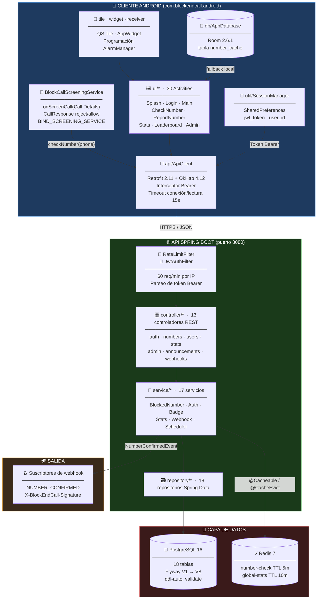
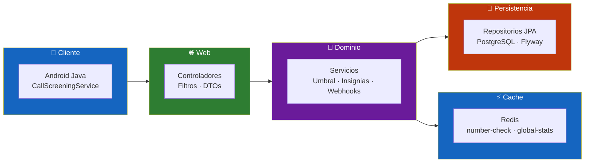
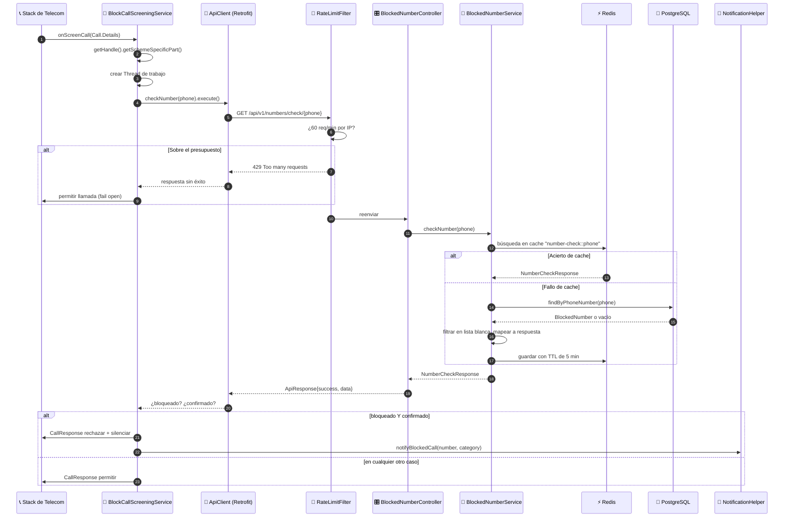
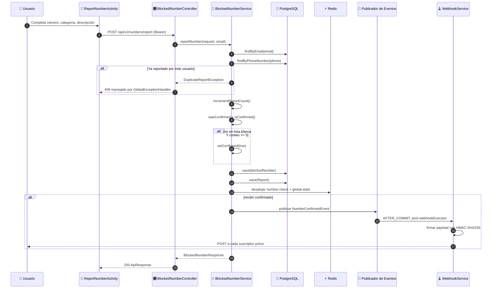
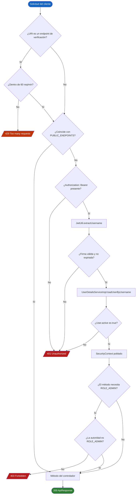
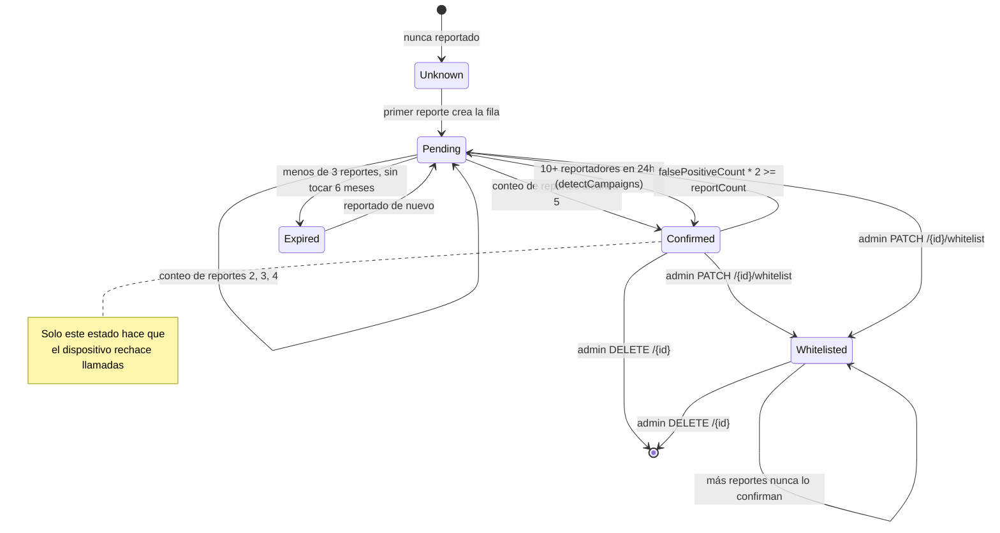

<div align="center">

**🌐 Choose Language / Selecione o Idioma / Elija el Idioma**

[](README.md)&nbsp;&nbsp;&nbsp;[](README_PT.md)&nbsp;&nbsp;&nbsp;[](README_ES.md)

</div>

---

<div align="center">

```
██████╗ ██╗      ██████╗  ██████╗██╗  ██╗███████╗███╗   ██╗██████╗
██╔══██╗██║     ██╔═══██╗██╔════╝██║ ██╔╝██╔════╝████╗  ██║██╔══██╗
██████╔╝██║     ██║   ██║██║     █████╔╝ █████╗  ██╔██╗ ██║██║  ██║
██╔══██╗██║     ██║   ██║██║     ██╔═██╗ ██╔══╝  ██║╚██╗██║██║  ██║
██████╔╝███████╗╚██████╔╝╚██████╗██║  ██╗███████╗██║ ╚████║██████╔╝
╚═════╝ ╚══════╝ ╚═════╝  ╚═════╝╚═╝  ╚═╝╚══════╝╚═╝  ╚═══╝╚═════╝
         ██████╗ █████╗ ██╗     ██╗
        ██╔════╝██╔══██╗██║     ██║
        ██║     ███████║██║     ██║
        ██║     ██╔══██║██║     ██║
        ╚██████╗██║  ██║███████╗███████╗
         ╚═════╝╚═╝  ╚═╝╚══════╝╚══════╝
        Plataforma de Bloqueo de Llamadas Spam Impulsada por la Comunidad
```

---

[](https://openjdk.org/)
[](https://spring.io/projects/spring-boot)
[](https://www.postgresql.org/)
[](https://redis.io/)
[](https://developer.android.com/)
[](https://www.docker.com/)
[](https://swagger.io/)

<br/>

> **Reporta un número spam una vez y queda bloqueado para todos.**
> Una API en Spring Boot más un cliente Android nativo con `CallScreeningService` que rechaza las llamadas spam confirmadas por la comunidad antes de que el teléfono llegue a sonar.

<br/>


</div>

---

## 📑 Tabla de Contenidos

<details>
<summary>▶️ <strong>Haga clic para expandir / contraer esta sección</strong></summary>

<table>
<tr>
<td valign="top" width="50%">

**🏗️ Sistema**
- [Visión General](#-visión-general)
- [Arquitectura del Sistema](#️-arquitectura-del-sistema)
- [Stack Tecnológico](#️-stack-tecnológico)
- [Patrones de Diseño](#-patrones-de-diseño-aplicados)
- [Estructura del Proyecto](#-estructura-del-proyecto)

**📦 Módulos**
- [Capa REST API](#-capa-rest-api--13-controladores)
- [Capa de Servicios](#-capa-de-servicios--17-servicios)
- [Capa de Persistencia](#️-capa-de-persistencia--jpa--flyway)
- [Capa de Seguridad](#-capa-de-seguridad--jwt--bcrypt)
- [Filtro de Rate Limit](#-filtro-de-rate-limit--ventana-deslizante)
- [Capa de Cache](#-capa-de-cache--redis)
- [Subsistema de Webhooks](#-subsistema-de-webhooks--eventos-salientes)
- [Subsistema de Programación](#-subsistema-de-programación--trabajos-cron)
- [Filtrado de Llamadas Android](#-filtrado-de-llamadas-android--el-núcleo-de-bloqueo)
- [Cliente API Android](#-cliente-api-android--retrofit--sesión)
- [Cache Room de Android](#-cache-room-de-android--consultas-offline)
- [Superficie UI de Android](#️-superficie-ui-de-android--30-activities)
- [Superficies del Sistema Android](#-superficies-del-sistema-android--tile-widget-alarm)
- [Infraestructura](#-infraestructura--docker--ci)

</td>
<td valign="top" width="50%">

**💼 Negocio**
- [Reglas de Negocio](#-reglas-de-negocio)
- [Requisitos Funcionales](#-requisitos-funcionales)
- [Requisitos No Funcionales](#-requisitos-no-funcionales)

**📐 Diseño**
- [Modelo de Datos](#️-modelo-de-datos)
- [Flujos del Sistema](#-flujos-del-sistema)
- [Flujo de Filtrado de Llamadas](#flujo-de-filtrado-de-llamadas-entrantes)
- [Flujo de Reporte y Confirmación](#flujo-de-reporte-y-confirmación)
- [Flujo de Autenticación](#flujo-de-autenticación)
- [Ciclo de Vida del Número](#máquina-de-estados-del-ciclo-de-vida-del-número)

**🔐 Seguridad y Operación**
- [Seguridad](#-seguridad)
- [Instalación & Ejecución](#-instalación--ejecución)
- [Pruebas Automatizadas](#-pruebas-automatizadas)
- [Métricas & Monitoreo](#-métricas--monitoreo)
- [Limitaciones Conocidas](#️-limitaciones-conocidas)

</td>
</tr>
</table>

---

</details>

## 🌟 Visión General

<details>
<summary>▶️ <strong>Haga clic para expandir / contraer esta sección</strong></summary>

**BlockEndCall** es una plataforma de dos niveles para la defensa colaborativa contra llamadas spam. Una **API REST en Spring Boot 3.2.5** guarda la base de datos compartida de reputación de números telefónicos, y un **cliente Android nativo** escrito en Java se registra como la aplicación de filtrado de llamadas del dispositivo, de modo que cada llamada entrante se verifica contra esa base de datos antes de que el teléfono suene.

La idea económica detrás del proyecto es simple. Bloquear un número spam es barato para una persona y costoso para toda una población, a menos que el costo se comparta. Cuando un usuario reporta un número a través de `POST /api/v1/numbers/report`, el backend incrementa un contador de reportes en la fila `blocked_numbers`. Una vez que el contador alcanza el umbral configurado, `app.report.threshold` (por defecto **5**), el número pasa a `confirmed = true`, y desde ese momento cada dispositivo con la app instalada lo rechaza en silencio. La molestia de una persona se convierte en la protección de todos.

El sistema se defiende contra el abuso obvio de ese mecanismo. Un usuario solo puede reportar un número determinado una vez, aplicado mediante una restricción `UNIQUE (user_id, blocked_number_id)` en la tabla `reports` y una verificación previa en `BlockedNumberService.reportNumber`. Los números que reciben reportes de falso positivo pierden la confirmación cuando `falsePositiveCount * 2 >= reportCount`. Los administradores pueden poner en lista blanca un número de forma permanente, existe una lista blanca pública que protege a llamantes institucionales conocidos, y cada usuario mantiene una lista negra y blanca personal que sobrescribe localmente el veredicto de la comunidad. Un planificador nocturno vence los números pendientes obsoletos y auto-confirma campañas de spam coordinadas.

### 🎯 Objetivos del Sistema

| Objetivo | Descripción |
|-----------|-------------|
| 📵 **Rechazo Silencioso** | Rechazar spam confirmado por la comunidad vía `CallScreeningService` antes de que el dispositivo suene |
| 🤝 **Reputación Compartida** | Convertir reportes individuales en una lista de bloqueo global mediante un umbral de conteo de reportes |
| ⚖️ **Resistencia al Abuso** | Un reporte por usuario por número, contra-voto de falsos positivos, lista blanca de administrador, lista blanca pública |
| ⚡ **Baja Latencia** | Consultas de números cacheadas en Redis con TTL de 5 minutos, más un cache local Room en el dispositivo |
| 🔐 **Autenticación Sin Estado** | Tokens JWT tipo bearer (jjwt 0.12.5), hash de contraseñas con BCrypt, seguridad basada en roles a nivel de método |
| 🧭 **Anulación Personal** | Lista blanca y negra personal por usuario que tiene precedencia sobre el veredicto de la comunidad |
| 🏅 **Compromiso** | Puntaje de reputación, ocho niveles de insignias y una tabla de clasificación pública para premiar a los reportadores |
| 🪝 **Integrabilidad** | Webhooks salientes firmados con HMAC-SHA256 en `NUMBER_CONFIRMED`, más claves de API por usuario |
| 🇧🇷 **Enriquecimiento Local** | Resolución de código de área DDD brasileño para 67 códigos, nombres de llamantes reportados, línea de tiempo de eventos |
| 🐳 **Reproducibilidad** | Stack Docker Compose (API + PostgreSQL 16 + Redis 7) y un pipeline de CI en GitHub Actions |

---

</details>

## 🏗️ Arquitectura del Sistema

<details>
<summary>▶️ <strong>Haga clic para expandir / contraer esta sección</strong></summary>

### Diagrama de Módulos



### Capas de Arquitectura



---

</details>

## 🛠️ Stack Tecnológico

<details>
<summary>▶️ <strong>Haga clic para expandir / contraer esta sección</strong></summary>

<table>
<thead>
<tr>
<th>Capa</th>
<th>Tecnología</th>
<th>Versión</th>
<th>Propósito</th>
</tr>
</thead>
<tbody>
<tr>
<td rowspan="2"><strong>🧠 Lenguaje</strong></td>
<td>Java (backend)</td>
<td>17</td>
<td>Propiedad <code>java.version</code> en <code>backend/pom.xml</code></td>
</tr>
<tr>
<td>Java (Android)</td>
<td>17</td>
<td><code>sourceCompatibility</code> / <code>targetCompatibility</code> en <code>app/build.gradle</code></td>
</tr>
<tr>
<td rowspan="5"><strong>🌐 Backend</strong></td>
<td>Spring Boot</td>
<td>3.2.5</td>
<td>Starter padre, autoconfiguración, Tomcat embebido en el puerto 8080</td>
</tr>
<tr>
<td>Spring Web MVC</td>
<td>3.2.5</td>
<td><code>spring-boot-starter-web</code>, 13 controladores REST</td>
</tr>
<tr>
<td>Spring Security</td>
<td>6.x</td>
<td>Cadena de filtros sin estado, <code>@EnableMethodSecurity</code>, <code>@PreAuthorize</code></td>
</tr>
<tr>
<td>Spring Data JPA</td>
<td>3.2.5</td>
<td>18 repositorios, Hibernate <code>ddl-auto: validate</code></td>
</tr>
<tr>
<td>Bean Validation</td>
<td>starter</td>
<td><code>spring-boot-starter-validation</code> en los DTO de solicitud</td>
</tr>
<tr>
<td rowspan="2"><strong>🔐 Autenticación</strong></td>
<td>jjwt (api / impl / jackson)</td>
<td>0.12.5</td>
<td>Emisión y verificación de tokens HS256 en <code>JwtUtil</code></td>
</tr>
<tr>
<td>BCryptPasswordEncoder</td>
<td>Spring Security</td>
<td>Bean de hash de contraseñas en <code>SecurityConfig</code></td>
</tr>
<tr>
<td rowspan="3"><strong>💾 Datos</strong></td>
<td>PostgreSQL</td>
<td>16-alpine</td>
<td>Almacén primario, 18 tablas</td>
</tr>
<tr>
<td>Flyway</td>
<td>gestionado por Boot</td>
<td>8 migraciones versionadas en <code>db/migration</code></td>
</tr>
<tr>
<td>Redis</td>
<td>7-alpine</td>
<td><code>spring-boot-starter-data-redis</code>, gestor de cache con TTL de 5 / 10 minutos</td>
</tr>
<tr>
<td rowspan="2"><strong>📖 Documentación API</strong></td>
<td>springdoc-openapi</td>
<td>2.5.0</td>
<td>Documento OpenAPI 3 en <code>/v3/api-docs</code></td>
</tr>
<tr>
<td>Swagger UI</td>
<td>incluido</td>
<td>Consola interactiva en <code>/swagger-ui.html</code></td>
</tr>
<tr>
<td rowspan="6"><strong>📱 Android</strong></td>
<td>Android SDK</td>
<td>mínimo 29 / objetivo 34</td>
<td><code>CallScreeningService</code> requiere API 29 (Android 10)</td>
</tr>
<tr>
<td>Retrofit + conversor Gson</td>
<td>2.11.0</td>
<td>Cliente HTTP tipado en <code>api/ApiClient</code></td>
</tr>
<tr>
<td>OkHttp + interceptor de log</td>
<td>4.12.0</td>
<td>Transporte, inyección de encabezado de auth, log de cuerpo en debug</td>
</tr>
<tr>
<td>Room</td>
<td>2.6.1</td>
<td>Tabla local <code>number_cache</code>, <code>blockendcall.db</code></td>
</tr>
<tr>
<td>Material Components</td>
<td>1.12.0</td>
<td>Widgets Material 3 en 46 layouts</td>
</tr>
<tr>
<td>AndroidX Biometric / Security-Crypto</td>
<td>1.1.0 / 1.1.0-alpha06</td>
<td><code>BiometricHelper</code> y dependencia de preferencias cifradas</td>
</tr>
<tr>
<td rowspan="4"><strong>🔧 Build & Operación</strong></td>
<td>Maven</td>
<td>plugin Boot</td>
<td>Build del backend, <code>spring-boot-maven-plugin</code></td>
</tr>
<tr>
<td>Gradle (Groovy DSL)</td>
<td>fijado por wrapper</td>
<td>Build de Android, R8 habilitado en release</td>
</tr>
<tr>
<td>Docker / Compose</td>
<td>esquema 3.9</td>
<td>Imagen multi-etapa <code>eclipse-temurin:17</code> más servicios de Postgres y Redis</td>
</tr>
<tr>
<td>GitHub Actions</td>
<td><code>backend-ci.yml</code></td>
<td>Test con servicios reales de Postgres y Redis, empaquetado del JAR, build de imagen en <code>main</code></td>
</tr>
<tr>
<td rowspan="3"><strong>🧪 Testing</strong></td>
<td>JUnit 5 (Boot Test)</td>
<td>starter</td>
<td>12 clases de test, 129 métodos <code>@Test</code></td>
</tr>
<tr>
<td>Spring Security Test</td>
<td>compatible</td>
<td>Tests de slice de controlador estilo <code>@WithMockUser</code></td>
</tr>
<tr>
<td>H2</td>
<td>alcance test</td>
<td>Base de datos en memoria modo PostgreSQL, Flyway deshabilitado en tests</td>
</tr>
</tbody>
</table>

---

</details>

## 🎨 Patrones de Diseño Aplicados

<details>
<summary>▶️ <strong>Haga clic para expandir / contraer esta sección</strong></summary>

| Patrón | Dónde | Justificación |
|---------|-------|-----------|
| 🧱 **Arquitectura en Capas** | `controller/` → `service/` → `repository/` → `entity/` | Cada capa depende solo hacia abajo, así los detalles de persistencia nunca se filtran a la superficie HTTP |
| 🗂️ **Repository** | 18 interfaces en `repository/`, p. ej. `BlockedNumberRepository` | Spring Data deriva consultas de los nombres de método, JPQL personalizado solo donde hace falta (`autocomplete`, `findExpiredPending`) |
| 📦 **DTO / Assembler** | `dto/request` (23) y `dto/response` (21) con fábricas estáticas `from(...)` | Las entidades nunca cruzan la red, así las asociaciones lazy y columnas internas permanecen privadas |
| 🏗️ **Builder** | `@Builder` de Lombok en `BlockedNumber`, `User`, `NumberCheckResponse`, `Webhook` | Construcción de estilo inmutable con valores por defecto `@Builder.Default` |
| 🔗 **Chain of Responsibility** | `RateLimitFilter` y luego `JwtAuthFilter`, ambos antes de `UsernamePasswordAuthenticationFilter` | Los rechazos baratos ocurren antes del parseo costoso de tokens |
| 📣 **Observer / Evento de Dominio** | `NumberConfirmedEvent` publicado por `BlockedNumberService`, consumido por `WebhookService` | La entrega de webhooks está desacoplada de la transacción de reporte |
| ⏳ **Transactional Outbox (ligero)** | `@TransactionalEventListener(phase = AFTER_COMMIT)` en `notifyConfirmed` | Los suscriptores que llaman de vuelta solo observan estado ya confirmado |
| 🎭 **Proxy / Decorator** | `@Cacheable("number-check")` y `@CacheEvict` en `BlockedNumberService` | Cache de Redis agregado sin una sola línea dentro del método de negocio |
| 🔒 **Singleton** | `ApiClient.getInstance`, `AppDatabase.getInstance`, ambos con double-checked locking | Un único stack Retrofit y un único handle Room por proceso en el dispositivo |
| 🧩 **Adapter** | `ui/adapter/BlockedNumberAdapter`, `UserReportAdapter`, `BlockedCallLogAdapter` | Adapters de RecyclerView traducen objetos de modelo a vistas de fila |
| 🛡️ **Strategy (política)** | Flags de `UserPreference`: `paranoiaMode`, `blockOnlyConfirmed`, toggles por categoría | La decisión de bloqueo se parametriza por usuario en lugar de estar codificada |
| 🚨 **Manejador Global de Excepciones** | `exception/GlobalExceptionHandler` con `@RestControllerAdvice` | Un único lugar mapea `DuplicateReportException`, `ResourceNotFoundException` y errores de validación a códigos HTTP |

---

</details>

## 📁 Estructura del Proyecto

<details>
<summary>▶️ <strong>Haga clic para expandir / contraer esta sección</strong></summary>

```
BlockEndCall/
│
├── 📄 docker-compose.yml                 # Postgres 16 + Redis 7 + API, con healthchecks
├── 📄 .gitignore                         # Salidas de build, archivos de IDE, propiedades locales
│
├── 📂 .github/workflows/
│   └── 📄 backend-ci.yml                 # Test (PG + Redis reales) → empaquetar → docker build
│
├── 📂 backend/                           # ☕ API REST en Spring Boot 3.2.5
│   ├── 📄 pom.xml                        # Java 17, jjwt 0.12.5, springdoc 2.5.0
│   ├── 📄 Dockerfile                     # Multi-etapa temurin:17-jdk → temurin:17-jre
│   │
│   └── 📂 src/
│       ├── 📂 main/java/com/blockendcall/
│       │   ├── 📄 BlockEndCallApplication.java   # Punto de entrada @SpringBootApplication
│       │   │
│       │   ├── 📂 config/                # 5 clases de configuración
│       │   │   ├── SecurityConfig.java           # Cadena de filtros + lista de endpoints públicos
│       │   │   ├── RedisConfig.java              # CacheManager, TTL por cache
│       │   │   ├── SchedulingConfig.java         # @EnableScheduling + pool webhookExecutor
│       │   │   ├── OpenApiConfig.java            # Metadatos de Swagger
│       │   │   └── RestTemplateConfig.java       # Bean RestTemplate para entrega de webhooks
│       │   │
│       │   ├── 📂 controller/            # ★ 13 controladores REST
│       │   ├── 📂 service/               # ★ 17 servicios de dominio
│       │   ├── 📂 repository/            # 18 repositorios Spring Data JPA
│       │   ├── 📂 entity/                # 18 entidades JPA
│       │   ├── 📂 dto/request/           # 23 payloads entrantes
│       │   ├── 📂 dto/response/          # 21 payloads salientes
│       │   ├── 📂 enums/                 # 7 enums (SpamCategory, BadgeType, UserRole, …)
│       │   ├── 📂 security/              # JwtUtil · JwtAuthFilter · UserDetailsServiceImpl
│       │   ├── 📂 filter/                # RateLimitFilter (ventana deslizante, 60 req/min)
│       │   ├── 📂 exception/             # GlobalExceptionHandler + 2 excepciones de dominio
│       │   └── 📂 event/                 # NumberConfirmedEvent (record)
│       │
│       ├── 📂 main/resources/
│       │   ├── 📄 application.yml               # Datasource, Redis, JWT, umbral de reportes 5
│       │   ├── 📄 application-docker.yml        # Overrides de host para la red de Compose
│       │   └── 📂 db/migration/                 # Scripts Flyway V1 → V8
│       │
│       └── 📂 test/
│           ├── 📂 java/com/blockendcall/        # 12 clases de test · 129 métodos @Test
│           └── 📂 resources/                    # H2 en modo PostgreSQL, Flyway desactivado
│
├── 📂 android/                           # 📱 Cliente Android nativo
│   ├── 📄 build.gradle                   # Script de build raíz
│   ├── 📄 settings.gradle                # Inclusión de módulos
│   ├── 📄 gradle.properties              # Argumentos JVM, flags de AndroidX
│   │
│   └── 📂 app/
│       ├── 📄 build.gradle               # minSdk 29 · targetSdk 34 · BASE_URL buildConfigField
│       ├── 📄 proguard-rules.pro         # Reglas keep de R8 (release habilita minify)
│       │
│       └── 📂 src/main/
│           ├── 📄 AndroidManifest.xml    # 5 permisos, CallScreeningService, receiver
│           │
│           ├── 📂 java/com/blockendcall/android/
│           │   ├── 📄 BlockEndCallApp.java       # Subclase Application
│           │   ├── 📂 service/BlockCallScreeningService.java   # ★ El núcleo de bloqueo
│           │   ├── 📂 api/                       # ApiClient · BlockedNumberApi · PagedResponse
│           │   ├── 📂 db/                        # AppDatabase · NumberCacheDao · NumberCacheEntity
│           │   ├── 📂 model/                     # 22 modelos mapeados con Gson
│           │   ├── 📂 ui/                        # 30 Activities
│           │   ├── 📂 ui/adapter/                # 3 adapters de RecyclerView
│           │   ├── 📂 util/                      # SessionManager · NotificationHelper · BiometricHelper · BlockedCallLog
│           │   ├── 📂 tile/                      # Servicio del tile de Quick Settings
│           │   ├── 📂 widget/                    # Proveedor de AppWidget de pantalla de inicio
│           │   └── 📂 receiver/                  # ScheduledBlockingReceiver (AlarmManager)
│           │
│           └── 📂 res/
│               ├── 📂 layout/            # 46 layouts (activity_* y item_*)
│               ├── 📂 drawable/          # 13 vector drawables
│               ├── 📂 values/            # colors · strings · themes
│               ├── 📂 menu/              # menu_main.xml
│               └── 📂 xml/               # blockendcall_widget_info.xml
│
├── 📄 README.md                          # 🇺🇸 Inglés (primario)
├── 📄 README_PT.md                       # 🇧🇷 Português
└── 📄 README_ES.md                       # 🇪🇸 Español
```

---

</details>

## 📦 Módulos del Sistema

<details>
<summary>▶️ <strong>Haga clic para expandir / contraer esta sección</strong></summary>

### 🌐 Capa REST API — 13 Controladores

Cada controlador está anotado `@RestController` y ubicado bajo `/api/v1`. Las respuestas se envuelven en el sobre genérico `ApiResponse<T>` que lleva `success`, `message` y `data`.

| Controlador | Ruta base | Operaciones clave |
|------------|-----------|----------------|
| `AuthController` | `/api/v1/auth` | `register`, `login`, `verify-email`, `forgot-password`, `reset-password` |
| `BlockedNumberController` | `/api/v1/numbers` | `check/{phoneNumber}`, `report`, `search`, `category/{category}`, `check-batch`, `check-enhanced/{phoneNumber}`, `autocomplete`, `search-description`, `{id}/false-positive`, `{id}/whitelist`, `import/csv` |
| `NumberEnrichmentController` | `/api/v1/numbers` | `{id}/reported-names` (GET/POST), `{id}/timeline`, `{numberId}/confirm`, `ddd`, `ddd/{ddd}` |
| `UserController` | `/api/v1/users` | `me` (GET/PUT/DELETE), `me/password`, `me/reports`, `me/preferences`, `me/badges`, `me/terms` |
| `PersonalListController` | `/api/v1/users/me/...` | `personal-whitelist` y `personal-blacklist` (GET / POST / DELETE por teléfono) |
| `CallLogController` | `/api/v1/users/me/call-log` | Registrar una llamada bloqueada, listar historial, contar |
| `ApiKeyController` | `/api/v1/users/me/api-keys` | Listar, crear, revocar una clave de API de usuario |
| `FcmController` | `/api/v1/users/me/fcm` | Registrar un token push de dispositivo |
| `StatsController` | `/api/v1/stats` | Estadísticas globales, `enhanced`, `leaderboard`, `by-ddd`, `top` |
| `AnnouncementController` | `/api/v1/announcements` | Listado público, creación y borrado por admin |
| `PublicWhitelistController` | `/api/v1/public-whitelist` | Listado público y `check/{phone}`, alta y verificación por admin |
| `AdminController` | `/api/v1/admin` | `users`, suspender / reactivar / promover, `numbers/pending`, aprobación / rechazo masivo, `audit` |
| `WebhookController` | `/api/v1/webhooks` | Registrar, listar, desactivar. Toda la clase es `@PreAuthorize("hasRole('ADMIN')")` |

---

### 🧠 Capa de Servicios — 17 Servicios

`BlockedNumberService` es el corazón del dominio. Su método `reportNumber` contiene la regla de umbral que da nombre al proyecto.

| Servicio | Responsabilidad |
|---------|---------------|
| `BlockedNumberService` | Reportar, verificar, buscar, falso positivo, lista blanca, importación CSV, confirmación por umbral |
| `AuthService` | Registro con guardia de email duplicado, login vía `AuthenticationManager`, emisión de token |
| `UserPreferenceService` | Lee y escribe la fila de política de bloqueo por usuario |
| `PersonalListService` | CRUD de lista blanca y negra personal |
| `PublicWhitelistService` | Números protegidos a nivel institucional y su bandera de verificación |
| `StatsService` | Conteos agregados, estadísticas ampliadas, tabla de clasificación, desglose por DDD |
| `BadgeService` | Otorga `FIRST_REPORT`, `REPORTER_10/50/100/500`, concede +10 de reputación por insignia |
| `CallLogService` | Persiste registros del lado servidor de llamadas bloqueadas por usuario |
| `NumberEnrichmentService` | Nombres de llamantes reportados, eventos de línea de tiempo, confirmaciones "yo también" |
| `OperatorLookupService` | Mapa en memoria de **67 códigos DDD brasileños** a nombres de región |
| `AnnouncementService` | Mensajes de difusión del administrador mostrados en la app |
| `ApiKeyService` | Emite y revoca claves de API de usuario de 64 caracteres |
| `AdminService` | Suspensión de usuarios, promoción, moderación masiva de números |
| `AuditService` | Escribe filas de `audit_log` para cada acción privilegiada |
| `WebhookService` | Validación de URL (HTTPS + protección SSRF), firmado HMAC, entrega asíncrona |
| `SchedulerService` | Tres trabajos cron: expirar, detectar campaña, limpiar auditoría |
| `FcmService` | Almacena tokens de dispositivo. `sendNotification` actualmente solo registra un log |

---

### 🗄️ Capa de Persistencia — JPA + Flyway

La evolución del esquema está versionada, no generada. Hibernate corre con `ddl-auto: validate`, así que la aplicación se niega a iniciar si las entidades y el esquema migrado no coinciden.

| Migración | Introduce |
|-----------|-----------|
| `V1__init.sql` | `users`, `blocked_numbers`, `reports` y tres índices |
| `V2__false_positive.sql` | `false_positive_count`, `whitelisted`, tabla `false_positive_reports` |
| `V3__report_enhancements.sql` | `subcategory`, `caller_name`, `call_frequency`, `typical_call_hour` en report; `reputation_score`, `suspended`, `terms_accepted_at` en user |
| `V4__community_features.sql` | `report_confirmations`, `user_personal_whitelist`, `user_personal_blacklist` |
| `V5__server_logs_and_keys.sql` | `server_blocked_call_log`, `user_api_keys`, `user_badges`, `audit_log` |
| `V6__notifications_and_prefs.sql` | `announcements`, `user_preferences`, `fcm_tokens` |
| `V7__enrichment.sql` | `number_reported_names`, `public_whitelist`, `number_timeline_events` |
| `V8__webhooks.sql` | tabla `webhooks` |

---

### 🔐 Capa de Seguridad — JWT + BCrypt

`SecurityConfig` construye una cadena sin estado. CSRF está deshabilitado porque no hay sesión de cookie, `SessionCreationPolicy.STATELESS` evita la creación de `JSESSIONID`, y un arreglo fijo de endpoints públicos se permite antes de `anyRequest().authenticated()`.

| Componente | Detalle |
|-----------|--------|
| `JwtUtil` | HS256 vía `Keys.hmacShaKeyFor(Decoders.BASE64.decode(secret))`, el subject es el email del usuario |
| TTL del token | `security.jwt.expiration = 86400000` ms, es decir 24 horas |
| `JwtAuthFilter` | `OncePerRequestFilter` que lee el encabezado `Authorization: Bearer` |
| `UserDetailsServiceImpl` | Carga la entidad `User`, que a su vez implementa `UserDetails` |
| Autoridades | `ROLE_USER` o `ROLE_ADMIN`, derivadas del enum `UserRole` |
| Almacenamiento de contraseña | Bean `BCryptPasswordEncoder`, resistencia por defecto |
| Seguridad de método | `@EnableMethodSecurity` más `@PreAuthorize("hasRole('ADMIN')")` en endpoints privilegiados |
| Estado de cuenta | `User.isEnabled()` devuelve la bandera `active`, así las cuentas desactivadas no pueden autenticarse |

Endpoints públicos declarados en `PUBLIC_ENDPOINTS`: `/api/v1/auth/**`, `/api/v1/numbers/check/**`, `/api/v1/numbers/check-batch`, `/api/v1/numbers/autocomplete`, `/api/v1/numbers/search-description`, `/api/v1/numbers/ddd/**`, `/api/v1/stats*`, `/api/v1/announcements`, `/api/v1/public-whitelist/**`, las rutas OpenAPI y `/actuator/health`.

---

### 🚦 Filtro de Rate Limit — Ventana Deslizante

`RateLimitFilter` protege los únicos endpoints que son públicos y a la vez muy solicitados: las consultas de verificación de número que realiza cada dispositivo en cada llamada entrante.

| Propiedad | Valor |
|----------|-------|
| Alcance | URIs que comienzan con `/api/v1/numbers/check` más `/api/v1/numbers/check-batch` |
| Presupuesto | `MAX_REQUESTS = 60` por ventana |
| Ventana | `WINDOW_MS = 60_000` ms, evaluada como una deque deslizante de timestamps |
| Clave | `req.getRemoteAddr()` |
| Almacenamiento | `ConcurrentHashMap<String, Deque<Long>>`, en proceso |
| Protección de memoria | `MAX_TRACKED_IPS = 10_000`, entradas viejas se desalojan al alcanzar el límite |
| Rechazo | HTTP `429` con cuerpo `{"success":false,"message":"Too many requests, please wait"}` |

---

### ⚡ Capa de Cache — Redis

`RedisConfig` instala un `RedisCacheManager` con serialización JSON y cacheo de nulos deshabilitado.

| Nombre de cache | TTL | Poblado por | Desalojado por |
|------------|-----|--------------|------------|
| `number-check` | 5 minutos | `@Cacheable(value = "number-check", key = "#phoneNumber")` en `checkNumber` | `@CacheEvict` en `reportNumber`, `reportFalsePositive`, `adminWhitelist`, `deleteNumber` |
| `global-stats` | 10 minutos | Agregación de estadísticas | El mismo conjunto de desalojo que arriba |

`spring.cache.redis.time-to-live` en `application.yml` también declara 300000 ms, y el bean `RedisTemplate` usa `StringRedisSerializer` para las claves y `GenericJackson2JsonRedisSerializer` para los valores, lo que mantiene las entradas cacheadas legibles con `redis-cli`.

---

### 🪝 Subsistema de Webhooks — Eventos Salientes

Cuando un número cruza el umbral, `BlockedNumberService` publica un record `NumberConfirmedEvent`. `WebhookService.notifyConfirmed` lo consume.

| Aspecto | Implementación |
|--------|---------------|
| Disparo | `@TransactionalEventListener(phase = TransactionPhase.AFTER_COMMIT)` |
| Threading | `@Async("webhookExecutor")`, pool core 2 / max 5 / cola 100, `CallerRunsPolicy` |
| Payload | `{"event":"NUMBER_CONFIRMED","phoneNumber":…,"category":…,"reportCount":…}` |
| Firma | `X-BlockEndCall-Signature: sha256=<HMAC-SHA256 hexadecimal del cuerpo>` cuando hay un secreto almacenado |
| Política de URL | El esquema debe ser `https`, el host debe resolver, y no debe ser loopback, link-local, site-local ni any-local |
| Lista de bloqueo SSRF | Prefijos literales `10.`, `127.`, `0.`, `169.254.`, `192.168.`, `172.16.` hasta `172.31.`, más `localhost` |
| Modo de falla | Try/catch por suscriptor, una entrega fallida se registra en WARN y no aborta el bucle |

---

### ⏰ Subsistema de Programación — Trabajos Cron

`SchedulingConfig` habilita la programación y lo asíncrono. `SchedulerService` posee tres trabajos.

| Cron | Método | Efecto |
|------|--------|--------|
| `0 0 3 * * *` | `autoExpireOldReports` | Números con menos de 3 reportes sin tocar por 6 meses se des-confirman |
| `0 0 4 * * *` | `detectCampaigns` | Números reportados por 10 o más usuarios en las últimas 24 horas se auto-confirman si no están en lista blanca |
| `0 0 2 * * MON` | `cleanOldAuditLogs` | Se eliminan filas de auditoría con más de 1 año |

---

### 📵 Filtrado de Llamadas Android — El Núcleo de Bloqueo

`BlockCallScreeningService` extiende `android.telecom.CallScreeningService`. Está declarado en el manifiesto con `android:permission="android.permission.BIND_SCREENING_SERVICE"` y el filtro de intent `android.telecom.CallScreeningService`, y solo entra en efecto una vez que el usuario concede a la app el rol `ROLE_CALL_SCREENING`.

| Paso | Código |
|------|------|
| 1. Extraer el número | `callDetails.getHandle().getSchemeSpecificPart()` |
| 2. Salir del hilo principal | `new Thread(() -> { … }).start()` |
| 3. Consultar la API | `api.checkNumber(incomingNumber).execute()` (llamada Retrofit síncrona) |
| 4. Decidir | Rechazar solo cuando `result.isBlocked() && result.isConfirmed()` |
| 5a. Rechazar | `setDisallowCall(true)`, `setRejectCall(true)`, `setSilenceCall(true)`, `setSkipCallLog(false)`, `setSkipNotification(false)` |
| 5b. Permitir | `setDisallowCall(false)`, `setRejectCall(false)` |
| 6. Notificar | `NotificationHelper.notifyBlockedCall(context, number, category)` |
| 7. Fallar abierto | Cualquier excepción se registra en ERROR y permite la llamada |

> [!NOTE]
> La política de fallo abierto es deliberada. Una caída del backend nunca debe impedir que el teléfono reciba llamadas legítimas.

---

### 🔌 Cliente API Android — Retrofit + Sesión

| Componente | Detalle |
|-----------|--------|
| `ApiClient.buildRetrofit` | OkHttp con timeout de conexión 15 s, timeout de lectura 15 s |
| Interceptor de auth | Agrega `Authorization: Bearer <token>` cuando `SessionManager.getToken()` no es nulo |
| Log | `HttpLoggingInterceptor` en `BODY` en builds de debug, `NONE` en release |
| Conversor | `GsonConverterFactory` |
| URL base | `BuildConfig.BASE_URL`, `http://10.0.2.2:8080/` en debug y `https://api.blockendcall.com/` en release |
| `BlockedNumberApi` | Interfaz Retrofit que enumera los endpoints que consume el cliente |
| `PagedResponse<T>` | Refleja el sobre `Page` de Spring para endpoints de listado |
| `SessionManager` | Archivo `SharedPreferences` `blockendcall_session` que guarda `jwt_token`, `user_id`, `user_name`, `user_email` |

---

### 💽 Cache Room de Android — Consultas Offline

| Elemento | Detalle |
|---------|--------|
| Base de datos | `AppDatabase`, archivo `blockendcall.db`, versión 1, `exportSchema = false` |
| Política de migración | `fallbackToDestructiveMigration()` |
| Entidad | `NumberCacheEntity`, tabla `number_cache`, clave primaria `phoneNumber` |
| Columnas | `blocked`, `confirmed`, `category`, `reportCount`, `spamScore`, `riskLevel`, `cachedAt` |
| DAO | `NumberCacheDao` |
| Instanciación | Singleton con double-checked locking en `getInstance(Context)` |

---

### 🖼️ Superficie UI de Android — 30 Activities

El cliente incluye 30 activities respaldadas por 46 archivos de layout y 3 adapters de RecyclerView.

| Grupo | Activities |
|-------|-----------|
| Onboarding | `SplashActivity`, `LoginActivity`, `RegisterActivity`, `TermsActivity`, `PrivacyPolicyActivity` |
| Núcleo | `MainActivity`, `CheckNumberActivity`, `ReportNumberActivity`, `BlockedListActivity`, `NumberDetailActivity`, `SearchActivity` |
| Historial | `CallLogActivity`, `CallLogServerActivity`, `BlockedCallLogActivity`, `MyReportsActivity`, `NumberTimelineActivity` |
| Listas personales | `PersonalWhitelistActivity`, `PersonalBlacklistActivity` |
| Comunidad | `StatsActivity`, `LeaderboardActivity`, `BadgesActivity`, `AnnouncementsActivity`, `ReportedNamesActivity` |
| Cuenta | `ProfileActivity`, `SettingsActivity`, `ApiKeysActivity`, `ExportDataActivity`, `DeleteAccountActivity` |
| Admin | `AdminUsersActivity`, `AdminPendingActivity` |

---

### 🧩 Superficies del Sistema Android — Tile, Widget, Alarm

| Superficie | Clase | Comportamiento |
|---------|-------|-----------|
| Tile de Quick Settings | `BlockEndCallTileService` | Lee `RoleManager.isRoleHeld(ROLE_CALL_SCREENING)` para fijar `STATE_ACTIVE` / `STATE_INACTIVE`, abre `MainActivity` al pulsar |
| Widget de inicio | `BlockEndCallWidget` | `AppWidgetProvider` que renderiza `widget_block_end_call.xml`, su botón lanza `CheckNumberActivity` mediante un `PendingIntent` inmutable |
| Bloqueo programado | `ScheduledBlockingReceiver` | `AlarmManager.setRepeating` con `INTERVAL_DAY` alterna la preferencia `scheduled_block_active` en las horas de inicio y fin configuradas |
| Notificaciones | `NotificationHelper` | Canales creados en `onCreate` del servicio de filtrado, una notificación por llamada bloqueada |
| Biometría | `BiometricHelper` | Envuelve `BiometricManager` y `BiometricPrompt` de `androidx.biometric:1.1.0` |

---

### 🐳 Infraestructura — Docker & CI

| Pieza | Detalle |
|-------|--------|
| `docker-compose.yml` | `postgres:16-alpine` (volumen nombrado `postgres_data`, healthcheck `pg_isready`), `redis:7-alpine` (`--save 60 1`, healthcheck `redis-cli ping`), y la API con `depends_on: condition: service_healthy` |
| `backend/Dockerfile` | Etapa 1 `eclipse-temurin:17-jdk-alpine` + Maven construye el JAR, etapa 2 `eclipse-temurin:17-jre-alpine` lo ejecuta con `-Dspring.profiles.active=docker` |
| `application-docker.yml` | Redirige el datasource a `postgres:5432` y Redis a `redis:6379` |
| Job de CI `test` | JDK 17 Temurin con cache de Maven, contenedores de servicio Postgres y Redis reales, `mvn test`, reportes surefire subidos como artefacto |
| Job de CI `docker` | Se ejecuta solo en `main` después de `test`, ejecuta `docker build -t blockendcall-backend:${{ github.sha }} .` |
| Disparadores | Push a `main` o `develop` y pull requests hacia `main`, filtrado a la ruta `backend/**` |

---

</details>

## 💼 Reglas de Negocio

<details>
<summary>▶️ <strong>Haga clic para expandir / contraer esta sección</strong></summary>

### 📞 Reporte y Confirmación

| # | Regla | Aplicación |
|---|------|-------------|
| RN-01 | Un número se confirma comunitariamente a **5 reportes** | `reportCount >= reportThreshold` en `BlockedNumberService.reportNumber`, umbral desde `app.report.threshold` |
| RN-02 | Un usuario puede reportar el mismo número solo una vez | `reportRepository.existsByUserIdAndBlockedNumberId` más `UNIQUE (user_id, blocked_number_id)` en `V1__init.sql` |
| RN-03 | Un reporte duplicado genera un error de dominio, nunca un no-op silencioso | `DuplicateReportException` mapeada por `GlobalExceptionHandler` |
| RN-04 | Reportar un número desconocido crea la fila con `reportCount = 0`, luego la incrementa | `orElseGet(() -> BlockedNumber.builder()…reportCount(0))` seguido de `incrementReportCount()` |
| RN-05 | Un número en lista blanca nunca puede confirmarse | La rama de confirmación está protegida por `!blockedNumber.isWhitelisted()` |
| RN-06 | Cruzar el umbral por primera vez emite exactamente un evento | `wasConfirmed` se captura antes de guardar y se compara después |
| RN-07 | Cada reporte escribe una fila `Report` vinculada a usuario y número | `reportRepository.save(Report.builder()…)` |

### ⚖️ Confianza y Contra-Votación

| # | Regla | Aplicación |
|---|------|-------------|
| RN-08 | Un usuario puede marcar un número como falso positivo solo una vez | `falsePositiveRepository.existsByUserIdAndBlockedNumberId` más una restricción única a nivel de tabla |
| RN-09 | La confirmación se revoca cuando los falsos positivos alcanzan la mitad de los reportes | `if (falsePositiveCount * 2 >= reportCount) setConfirmed(false)` |
| RN-10 | El puntaje de spam es `min(100, reportCount * 10) - falsePositiveCount * 15`, con piso en 0 | `BlockedNumber.getSpamScore()` |
| RN-11 | El nivel de riesgo es `HIGH` si está confirmado, `MEDIUM` con 3 o más reportes, si no `LOW` | `NumberCheckResponse.from(BlockedNumberResponse)` |
| RN-12 | Un número desconocido devuelve el sobre seguro con puntaje 0 y `riskLevel = SAFE` | `NumberCheckResponse.safe(phoneNumber)` |
| RN-13 | Un número en lista blanca se reporta como seguro aunque existan filas | `.filter(n -> !n.isWhitelisted())` en `checkNumber` |

### 🛡️ Política de Bloqueo

| # | Regla | Aplicación |
|---|------|-------------|
| RN-14 | El dispositivo rechaza una llamada solo si el número está bloqueado y confirmado | `result.isBlocked() && result.isConfirmed()` en `onScreenCall` |
| RN-15 | Cualquier fallo al contactar la API permite pasar la llamada | `catch (Exception e)` seguido de `respondToCall(callDetails, buildAllowResponse())` |
| RN-16 | Una llamada rechazada se silencia pero igual se escribe en el registro del sistema | `setSilenceCall(true)` con `setSkipCallLog(false)` |
| RN-17 | Las listas personales existen por usuario y son únicas por número de teléfono | `UNIQUE (user_id, phone_number)` en ambas tablas personales |
| RN-18 | Las entradas de la lista blanca pública están asociadas a una institución y verificadas por admin | `public_whitelist.verified` es `FALSE` por defecto hasta que un admin llama `PATCH /{id}/verify` |

### 🏅 Reputación y Moderación

| # | Regla | Aplicación |
|---|------|-------------|
| RN-19 | Las insignias se otorgan a 1, 10, 50, 100 y 500 reportes | `BadgeService.checkAndAwardBadges` |
| RN-20 | Una insignia se otorga como máximo una vez por usuario | `userBadgeRepository.existsByUserIdAndBadgeType` más `UNIQUE (user_id, badge_type)` |
| RN-21 | Cada nueva insignia agrega 10 puntos de reputación | `user.setReputationScore(user.getReputationScore() + 10)` |
| RN-22 | Cada acción administrativa privilegiada se escribe en el registro de auditoría | `AuditService` invocado por las rutas de `AdminController`, el enum `AuditAction` tiene 9 valores |
| RN-23 | El registro rechaza un email que ya existe | `userRepository.existsByEmail` en `AuthService.register` |
| RN-24 | La importación CSV marca los números como confirmados y eleva su conteo al umbral | `importFromCsv` en `BlockedNumberService`, solo admin |

---

</details>

## ✅ Requisitos Funcionales

<details>
<summary>▶️ <strong>Haga clic para expandir / contraer esta sección</strong></summary>

| ID | Requisito | Prioridad | Estado |
|----|-------------|----------|--------|
| **RF-01** | El sistema debe permitir a un visitante registrarse con nombre, email, teléfono y contraseña | 🔴 Alta | ✅ Implementado |
| **RF-02** | El sistema debe autenticar a un usuario y devolver un JWT firmado válido por 24 horas | 🔴 Alta | ✅ Implementado |
| **RF-03** | El sistema debe exponer un endpoint de verificación de número sin autenticación para el filtrado de llamadas | 🔴 Alta | ✅ Implementado |
| **RF-04** | El sistema debe permitir a un usuario autenticado reportar un número spam con una categoría | 🔴 Alta | ✅ Implementado |
| **RF-05** | El sistema debe auto-confirmar un número cuando su conteo de reportes alcanza el umbral | 🔴 Alta | ✅ Implementado |
| **RF-06** | El cliente Android debe rechazar llamadas spam confirmadas antes de que el dispositivo suene | 🔴 Alta | ✅ Implementado |
| **RF-07** | El sistema debe notificar al usuario cuando se bloquea una llamada | 🟡 Media | ✅ Implementado |
| **RF-08** | El sistema debe permitir reportar un falso positivo con una razón | 🔴 Alta | ✅ Implementado |
| **RF-09** | El sistema debe proveer gestión de lista blanca y negra personal por usuario | 🔴 Alta | ✅ Implementado |
| **RF-10** | El sistema debe mantener una lista blanca pública de números institucionales verificados | 🟡 Media | ✅ Implementado |
| **RF-11** | El sistema debe soportar la verificación en lote de varios números en una sola solicitud | 🟡 Media | ✅ Implementado |
| **RF-12** | El sistema debe proveer autocompletado por prefijo sobre números conocidos, limitado a 10 resultados | 🟢 Baja | ✅ Implementado |
| **RF-13** | El sistema debe proveer búsqueda de texto completo en las descripciones de reportes | 🟢 Baja | ✅ Implementado |
| **RF-14** | El sistema debe resolver un código de área DDD brasileño a su nombre de región | 🟢 Baja | ✅ Implementado |
| **RF-15** | El sistema debe registrar nombres de llamantes reportados por número | 🟡 Media | ✅ Implementado |
| **RF-16** | El sistema debe mantener una línea de tiempo cronológica de eventos por número | 🟡 Media | ✅ Implementado |
| **RF-17** | El sistema debe publicar estadísticas globales, una tabla de clasificación y un desglose por DDD | 🟡 Media | ✅ Implementado |
| **RF-18** | El sistema debe otorgar insignias y mantener un puntaje de reputación | 🟢 Baja | ✅ Implementado |
| **RF-19** | El sistema debe permitir a un administrador suspender, reactivar y promover usuarios | 🔴 Alta | ✅ Implementado |
| **RF-20** | El sistema debe permitir a un administrador aprobar o rechazar números pendientes en lote | 🟡 Media | ✅ Implementado |
| **RF-21** | El sistema debe registrar una entrada de auditoría por cada acción privilegiada | 🔴 Alta | ✅ Implementado |
| **RF-22** | El sistema debe entregar webhooks firmados cuando un número se confirma | 🟡 Media | ✅ Implementado |
| **RF-23** | El sistema debe emitir y revocar claves de API por usuario | 🟢 Baja | ✅ Implementado |
| **RF-24** | El sistema debe aceptar una importación CSV administrativa de números spam conocidos | 🟢 Baja | ✅ Implementado |
| **RF-25** | El sistema debe permitir a un usuario eliminar su propia cuenta y exportar sus datos | 🔴 Alta | ⚠️ Parcial — los endpoints existen, la exportación es solo del lado cliente |
| **RF-26** | El sistema debe verificar direcciones de email y soportar restablecimiento de contraseña | 🟡 Media | ⬜ Planeado — `AuthService` lanza `UnsupportedOperationException` |
| **RF-27** | El sistema debe enviar notificaciones push a dispositivos FCM registrados | 🟡 Media | ⚠️ Parcial — los tokens se almacenan, `sendNotification` solo registra un log |
| **RF-28** | El sistema debe soportar ventanas de bloqueo programado en el dispositivo | 🟢 Baja | ⚠️ Parcial — las alarmas alternan una preferencia que el servicio de filtrado aún no lee |

---

</details>

## ⚡ Requisitos No Funcionales

<details>
<summary>▶️ <strong>Haga clic para expandir / contraer esta sección</strong></summary>

| ID | Categoría | Requisito | Objetivo |
|----|----------|-------------|--------|
| **RNF-01** | ⚡ Rendimiento | Verificación de número cacheada servida desde Redis | < 20 ms tiempo de servidor |
| **RNF-02** | ⚡ Rendimiento | Verificación de número sin cache contra la columna indexada `phone_number` | < 100 ms tiempo de servidor |
| **RNF-03** | ⚡ Rendimiento | Decisión de filtrado extremo a extremo en el dispositivo | Dentro de la ventana de filtrado de telecom |
| **RNF-04** | ⚡ Rendimiento | Presupuesto HTTP del dispositivo | Timeout de conexión 15 s y de lectura 15 s, configurado en `ApiClient` |
| **RNF-05** | 📈 Escalabilidad | Ratio de aciertos de cache en `number-check` bajo carga estable | > 80 % con TTL de 5 minutos |
| **RNF-06** | 📈 Escalabilidad | Escalado horizontal de la API | Sesiones JWT sin estado, sin almacén de sesión del lado servidor |
| **RNF-07** | 🔐 Seguridad | Almacenamiento de contraseñas | BCrypt, nunca reversible |
| **RNF-08** | 🔐 Seguridad | Transporte para webhooks | HTTPS forzado, rangos privados rechazados |
| **RNF-09** | 🔐 Seguridad | Protección de abuso en endpoints públicos | 60 solicitudes por minuto por IP en endpoints de verificación |
| **RNF-10** | 🔐 Seguridad | Verbosidad de errores | `server.error.include-message: never` en `application.yml` |
| **RNF-11** | 🛡️ Confiabilidad | Comportamiento en el dispositivo ante caída del backend | Fallar abierto, se permite la llamada |
| **RNF-12** | 🛡️ Confiabilidad | Orden de arranque de contenedores | `depends_on` con `service_healthy` en Postgres y Redis |
| **RNF-13** | 🛡️ Confiabilidad | Protección contra deriva de esquema | `ddl-auto: validate`, la app se niega a arrancar ante discrepancia |
| **RNF-14** | 🧪 Testabilidad | Cobertura automatizada del backend | 12 clases de test, 129 métodos de test, H2 en modo PostgreSQL |
| **RNF-15** | 🧱 Mantenibilidad | Separación de capas | Ninguna entidad sale de la capa de servicio, 44 clases DTO en total |
| **RNF-16** | 📱 Compatibilidad | Piso de versión Android | API 29 (Android 10), requerido por `CallScreeningService` |
| **RNF-17** | 📱 Compatibilidad | Endurecimiento de release | `minifyEnabled true` con `proguard-android-optimize.txt` |
| **RNF-18** | 📖 Observabilidad | Documentación de la API | OpenAPI 3 en `/v3/api-docs`, Swagger UI en `/swagger-ui.html` |
| **RNF-19** | 📖 Observabilidad | Salud en tiempo de ejecución | Actuator exponiendo `health`, `info`, `metrics` |
| **RNF-20** | ♿ Usabilidad | Retroalimentación en cada llamada bloqueada | Notificación del sistema con número y categoría |

---

</details>

## 🗄️ Modelo de Datos

<details>
<summary>▶️ <strong>Haga clic para expandir / contraer esta sección</strong></summary>

### Diagrama Entidad-Relación

```mermaid
erDiagram
    USERS ||--o{ REPORTS : "envía"
    USERS ||--o{ FALSE_POSITIVE_REPORTS : "disputa"
    USERS ||--o{ USER_PERSONAL_WHITELIST : "posee"
    USERS ||--o{ USER_PERSONAL_BLACKLIST : "posee"
    USERS ||--o{ USER_BADGES : "gana"
    USERS ||--o{ USER_API_KEYS : "emite"
    USERS ||--o{ FCM_TOKENS : "registra"
    USERS ||--o| USER_PREFERENCES : "configura"
    USERS ||--o{ SERVER_BLOCKED_CALL_LOG : "registra"
    USERS ||--o{ AUDIT_LOG : "actúa en"
    USERS ||--o{ ANNOUNCEMENTS : "autoriza"
    BLOCKED_NUMBERS ||--o{ REPORTS : "acumula"
    BLOCKED_NUMBERS ||--o{ FALSE_POSITIVE_REPORTS : "recibe"
    BLOCKED_NUMBERS ||--o{ REPORT_CONFIRMATIONS : "confirmado por"
    BLOCKED_NUMBERS ||--o{ NUMBER_REPORTED_NAMES : "conocido como"
    BLOCKED_NUMBERS ||--o{ NUMBER_TIMELINE_EVENTS : "registra"
    BLOCKED_NUMBERS ||--o{ SERVER_BLOCKED_CALL_LOG : "coincide con"

    USERS {
        bigserial id PK "identidad"
        varchar name "100 caracteres, requerido"
        varchar email UK "150 caracteres, login único"
        varchar phone "20 caracteres, opcional"
        varchar password "hash BCrypt"
        varchar role "USER o ADMIN"
        boolean active "impulsa isEnabled()"
        int reputation_score "+10 por insignia"
        boolean suspended "bandera de moderación admin"
        timestamp terms_accepted_at "nullable"
    }

    BLOCKED_NUMBERS {
        bigserial id PK "identidad"
        varchar phone_number UK "30 caracteres, indexado"
        varchar category "enum SpamCategory"
        int report_count "impulsa el umbral"
        boolean confirmed "true a los 5 reportes"
        int false_positive_count "contra-votos"
        boolean whitelisted "override de admin"
        int confirmation_count "contador yo-también"
        text description "contexto libre"
    }

    REPORTS {
        bigserial id PK "identidad"
        bigint user_id FK "reportador"
        bigint blocked_number_id FK "objetivo"
        text description "qué pasó"
        varchar subcategory "SpamSubcategory, V3"
        varchar caller_name "identidad declarada, V3"
        varchar call_frequency "enum CallFrequency, V3"
        int typical_call_hour "0-23, V3"
    }

    FALSE_POSITIVE_REPORTS {
        bigserial id PK "identidad"
        bigint user_id FK "disputador"
        bigint blocked_number_id FK "número disputado"
        text reason "justificación"
    }

    USER_PREFERENCES {
        bigserial id PK "identidad"
        bigint user_id FK "único por usuario"
        boolean block_only_confirmed "modo estricto"
        boolean paranoia_mode "modo agresivo"
        int sensitivity "por defecto 5"
        boolean block_telemarketing "toggle de categoría"
        boolean block_scam "toggle de categoría"
        boolean block_robocall "toggle de categoría"
        boolean voicemail_mode "enrutar a buzón de voz"
    }

    PUBLIC_WHITELIST {
        bigserial id PK "identidad"
        varchar phone_number UK "30 caracteres"
        varchar organization "nombre de la institución"
        varchar category "clasificación"
        boolean verified "aprobado por admin"
        bigint added_by FK "autor opcional"
    }

    SERVER_BLOCKED_CALL_LOG {
        bigserial id PK "identidad"
        bigint user_id FK "dueño del dispositivo"
        varchar phone_number "llamante"
        timestamp blocked_at "momento del evento"
        varchar block_result "enum BlockedCallResult"
        bigint matched_number_id FK "opcional"
    }

    AUDIT_LOG {
        bigserial id PK "identidad"
        bigint actor_id FK "admin opcional"
        varchar action "enum AuditAction"
        varchar target_type "nombre de entidad"
        bigint target_id "id de entidad"
        text details "contexto"
    }

    WEBHOOKS {
        bigserial id PK "identidad"
        varchar url "500 caracteres, solo HTTPS"
        varchar secret "clave HMAC"
        boolean active "bandera de entrega"
    }
```



### Enumeraciones

| Enum | Valores |
|------|--------|
| `SpamCategory` | `TELEMARKETING`, `SCAM`, `ROBOCALL`, `DEBT_COLLECTOR`, `PHISHING`, `UNKNOWN` |
| `SpamSubcategory` | `SPAM_CALL`, `POLITICAL`, `SURVEY`, `CHARITY`, `INSURANCE`, `WARRANTY`, `INVESTMENT`, `BANK_FRAUD`, `PRIZE_SCAM`, `IMPERSONATION`, `TECH_SUPPORT`, `VACATION_SCAM`, `OTHER` |
| `BadgeType` | `FIRST_REPORT`, `REPORTER_10`, `REPORTER_50`, `REPORTER_100`, `REPORTER_500`, `FIRST_CONFIRMED`, `STREAK_7`, `EARLY_ADOPTER` |
| `AuditAction` | `USER_SUSPEND`, `USER_UNSUSPEND`, `USER_PROMOTE`, `NUMBER_WHITELIST`, `NUMBER_DELETE`, `NUMBER_APPROVE`, `NUMBER_REJECT`, `ANNOUNCEMENT_CREATE`, `API_KEY_REVOKE` |
| `BlockedCallResult` | `REJECTED`, `SILENCED`, `ALLOWED`, `VOICEMAIL` |
| `CallFrequency` | `ONCE`, `DAILY`, `WEEKLY`, `MULTIPLE_TIMES_DAY`, `UNKNOWN` |
| `UserRole` | `USER`, `ADMIN` |

### Claves de Configuración

| Clave | Por defecto | Significado |
|-----|---------|---------|
| `app.report.threshold` | `5` | Reportes requeridos para auto-confirmar un número |
| `security.jwt.secret` | Literal Base64, sobrescribible con `JWT_SECRET` | Clave de firma HMAC |
| `security.jwt.expiration` | `86400000` | Vida del token en milisegundos |
| `spring.cache.redis.time-to-live` | `300000` | TTL de cache por defecto en milisegundos |
| `spring.jpa.hibernate.ddl-auto` | `validate` | El esquema pertenece a Flyway, no a Hibernate |
| `spring.jpa.open-in-view` | `false` | Sin lazy loading fuera de la transacción |
| `server.error.include-message` | `never` | Los mensajes de excepción no se devuelven a los clientes |
| `management.endpoints.web.exposure.include` | `health,info,metrics` | Superficie del Actuator |
| `BASE_URL` (debug) | `http://10.0.2.2:8080/` | Loopback del emulador hacia la máquina anfitriona |
| `BASE_URL` (release) | `https://api.blockendcall.com/` | Host de la API de producción |

---

</details>

## 🔄 Flujos del Sistema

<details>
<summary>▶️ <strong>Haga clic para expandir / contraer esta sección</strong></summary>

### Flujo de Filtrado de Llamadas Entrantes



### Flujo de Reporte y Confirmación



### Flujo de Autenticación



### Máquina de Estados del Ciclo de Vida del Número



---

</details>

## 🔐 Seguridad

<details>
<summary>▶️ <strong>Haga clic para expandir / contraer esta sección</strong></summary>

### Controles Implementados

| Control | Implementación | Efecto |
|---------|---------------|--------|
| 🔑 **Autenticación JWT sin estado** | `JwtAuthFilter` + `JwtUtil` con HS256 y TTL de 24 horas | Ninguna sesión del lado servidor que secuestrar o fijar |
| 🧂 **Hash de contraseñas** | Bean `BCryptPasswordEncoder` en `SecurityConfig` | Las credenciales nunca son recuperables desde un volcado de la base de datos |
| 🚪 **Denegar por defecto** | `.anyRequest().authenticated()` después de una lista de permitidos `PUBLIC_ENDPOINTS` explícita | Un endpoint recién agregado queda protegido salvo que se abra deliberadamente |
| 👮 **Seguridad de método basada en roles** | `@EnableMethodSecurity` con `@PreAuthorize("hasRole('ADMIN')")` | Las operaciones de admin están protegidas a nivel de método, no solo de ruta |
| 🚦 **Limitación de tasa** | `RateLimitFilter`, 60 solicitudes por minuto por IP en endpoints de verificación | La enumeración masiva de la base de números se limita |
| 🧾 **Rastro de auditoría** | `AuditService` escribe `audit_log` con actor, acción, objetivo y detalles | Las acciones privilegiadas son atribuibles y se retienen por un año |
| 🕸️ **Webhooks endurecidos contra SSRF** | Solo HTTPS, lista de prefijos privados más verificaciones `InetAddress` de loopback / link-local / site-local | Una URL de suscriptor no puede usarse para sondear la red interna |
| ✍️ **Firma del payload de webhook** | HMAC-SHA256 hexadecimal en `X-BlockEndCall-Signature` | Los receptores pueden verificar autenticidad e integridad |
| 🤫 **Divulgación mínima de errores** | `server.error.include-message: never` | Los detalles de stack y mensajes internos no salen en las respuestas |
| 🧊 **Sin exposición de entidades** | 44 clases DTO con mappers estáticos `from(...)` | Los hashes de contraseña y banderas internas no pueden filtrarse por serialización |
| 🔒 **Control de estado de cuenta** | `User.isEnabled()` ligado a la columna `active`, más una bandera `suspended` | Las cuentas desactivadas se rechazan al momento de autenticar |
| 📵 **Modelo de permisos de filtrado** | `BIND_SCREENING_SERVICE` y el rol `ROLE_CALL_SCREENING` | Solo el usuario, mediante ajustes del sistema, puede conceder la intercepción de llamadas |

### Limitaciones de Seguridad Conocidas

> [!WARNING]
> Los ítems a continuación son propiedades reales del código actual. Léalos antes de desplegar este proyecto en cualquier entorno público.

| Limitación | Riesgo | Ruta de mitigación |
|------------|------|-----------------|
| 🔓 **Secreto JWT por defecto en el repositorio** | `application.yml` incluye una clave HMAC literal, y `docker-compose.yml` la repite. Cualquiera puede emitir tokens válidos contra un despliegue por defecto | Exigir `JWT_SECRET` sin fallback y fallar rápido si está ausente |
| 🔑 **Contraseña de base de datos por defecto en el repositorio** | `blockendcall123` aparece en `application.yml`, `docker-compose.yml` y el workflow de CI | Mover a Docker secrets o a un gestor de secretos externo |
| 🌐 **Tráfico en texto plano permitido en Android** | `android:usesCleartextTraffic="true"` en el manifiesto permite HTTP plano | Restringir con una configuración de seguridad de red que permita texto plano solo para el host del emulador |
| 🗝️ **JWT almacenado en SharedPreferences sin cifrar** | `SessionManager` usa preferencias `MODE_PRIVATE`. En un dispositivo rooteado el token es legible | Usar `EncryptedSharedPreferences`, la dependencia `security-crypto` ya está declarada |
| 📞 **Los números de teléfono viajan sin autenticación** | `/api/v1/numbers/check/**` es público, así que cada llamada filtrada revela un número a un endpoint sin autenticación | Exigir una clave de API o token de dispositivo para las consultas de filtrado |
| 🧮 **La limitación de tasa es por instancia y por IP** | El contador vive en un `ConcurrentHashMap` local, así que N réplicas permiten N veces el presupuesto, y los grupos NAT agrupan usuarios | Mover la ventana deslizante a Redis y usar la clave de API como clave |
| 🧷 **Sin bloqueo de cuenta ni limitación de login** | `/api/v1/auth/**` está excluido de la limitación de tasa, así que la adivinación de contraseñas no está medida | Extender `RateLimitFilter` a las rutas de auth y agregar bloqueo por intentos fallidos |
| 🕰️ **Sin revocación de token** | Un JWT robado sigue siendo válido hasta 24 horas, el logout es solo del lado cliente | Introducir un modelo de refresh token o una lista de denegación respaldada por Redis |
| 🚫 **Sin configuración de CORS** | La cadena de filtros nunca llama a `.cors(...)`, así que los clientes de navegador son territorio indefinido | Declarar un `CorsConfigurationSource` explícito con una lista de orígenes conocida |
| 🧨 **La importación CSV confía en su entrada** | `importFromCsv` marca cada fila importada como confirmada y solo está limitada por el rol de admin | Agregar límites de tamaño, modo de simulación y una entrada de auditoría por lote de importación |
| 📜 **Las claves de API se almacenan en texto plano** | `user_api_keys.key_value` guarda la clave de 64 caracteres en crudo | Almacenar solo un hash y mostrar el texto plano una única vez al crearla |

---

</details>

## 🚀 Instalación & Ejecución

<details>
<summary>▶️ <strong>Haga clic para expandir / contraer esta sección</strong></summary>

### Prerrequisitos

```bash
# Java 17 (el backend apunta a java.version=17)
java -version          # se espera 17.x

# Maven (o usar el que trae el IDE)
mvn -version

# Docker con el plugin Compose, para la ruta de un solo comando
docker --version
docker compose version

# Para el cliente Android
adb devices            # un dispositivo o emulador con API 29 o superior
```

### Build

```bash
# --- Backend: compilar, correr tests, producir el JAR gordo ---
cd backend
mvn clean package
# Salida: backend/target/blockendcall-backend-1.0.0.jar

# Saltar tests cuando solo se necesita el artefacto
mvn clean package -DskipTests

# Construir la imagen del contenedor directamente
docker build -t blockendcall-backend:local ./backend

# --- Android: ensamblar el APK de debug ---
cd android
./gradlew assembleDebug
# Salida: android/app/build/outputs/apk/debug/app-debug.apk
```

### Ejecución

```bash
# --- Ruta A: stack completo con Docker Compose (recomendado) ---
docker compose up -d
# API:      http://localhost:8080
# Swagger:  http://localhost:8080/swagger-ui.html
# Salud:    http://localhost:8080/actuator/health
# Postgres: localhost:5432  (db/user blockendcall, pass blockendcall123)
# Redis:    localhost:6379

docker compose logs -f backend    # seguir logs de la API
docker compose down               # detener, manteniendo los volúmenes nombrados
docker compose down -v            # detener y borrar postgres_data + redis_data

# --- Ruta B: correr la API en el host ---
# PostgreSQL 16 y Redis 7 deben estar accesibles en localhost
cd backend
mvn spring-boot:run

# Sobrescribir los valores por defecto antes de exponer cualquier cosa
export JWT_SECRET="$(openssl rand -hex 32 | base64)"
export DB_USER=blockendcall
export DB_PASS=cambiar-esto
export REDIS_HOST=localhost
mvn spring-boot:run

# --- Ruta C: cliente Android ---
cd android
./gradlew installDebug
# El build de debug apunta a http://10.0.2.2:8080/, el alias del emulador para el host.
# Para un dispositivo físico, editar BASE_URL en app/build.gradle a la IP LAN de la máquina.
```

**Checklist de primera ejecución**

1. Levantar el stack y confirmar que `GET /actuator/health` devuelve `{"status":"UP"}`.
2. `POST /api/v1/auth/register` para crear una cuenta, y guardar el `token` devuelto.
3. `POST /api/v1/numbers/report` cinco veces, desde cinco cuentas distintas, contra un mismo número.
4. `GET /api/v1/numbers/check/{number}` y confirmar que `confirmed` cambió a `true`.
5. Instalar el APK, iniciar sesión, y luego conceder a la app el rol de **Call Screening** en los ajustes del sistema.
6. Llamar al dispositivo desde el número reportado y confirmar que la llamada se rechaza en silencio.

### Comandos y Objetivos

| Comando | Propósito |
|---------|---------|
| `mvn clean package` | Compilar, correr los 129 tests, construir el JAR ejecutable |
| `mvn test` | Correr solo los tests, usando H2 en modo PostgreSQL |
| `mvn spring-boot:run` | Correr la API contra Postgres y Redis locales |
| `docker compose up -d` | Iniciar Postgres, Redis y la API con orden por healthcheck |
| `docker compose logs -f backend` | Seguir los logs de la aplicación |
| `docker compose down -v` | Apagar incluyendo los volúmenes de datos |
| `./gradlew assembleDebug` | Construir el APK de debug |
| `./gradlew assembleRelease` | Construir el APK de release minificado con R8 |
| `./gradlew installDebug` | Construir e instalar en el dispositivo conectado |
| `./gradlew lint` | Análisis estático Android Lint |
| `adb shell dumpsys telecom` | Inspeccionar qué app posee actualmente el rol de filtrado de llamadas |

### Configuración de Build

| Ajuste | Valor | Declarado en |
|---------|-------|-------------|
| `groupId` / `artifactId` | `com.blockendcall` / `blockendcall-backend` | `backend/pom.xml` |
| Versión del backend | `1.0.0` | `backend/pom.xml` |
| Padre Spring Boot | `3.2.5` | `backend/pom.xml` |
| `java.version` | `17` | `backend/pom.xml` |
| `jjwt.version` | `0.12.5` | `backend/pom.xml` |
| Versión de springdoc | `2.5.0` | `backend/pom.xml` |
| Puerto del servidor | `8080` | `application.yml` |
| Umbral de reportes | `5` | `application.yml` |
| `namespace` / `applicationId` | `com.blockendcall.android` | `android/app/build.gradle` |
| `compileSdk` / `minSdk` / `targetSdk` | `34` / `29` / `34` | `android/app/build.gradle` |
| `versionCode` / `versionName` | `1` / `1.0.0` | `android/app/build.gradle` |
| `minifyEnabled` (release) | `true` | `android/app/build.gradle` |
| `viewBinding` / `buildConfig` | habilitados | `android/app/build.gradle` |

---

</details>

## 🧪 Pruebas Automatizadas

<details>
<summary>▶️ <strong>Haga clic para expandir / contraer esta sección</strong></summary>

### Arquitectura de Tests

```mermaid
flowchart TB
    subgraph UNIT["🧩 Tests Unitarios / de Slice"]
        direction TB
        U1["JwtUtilTest\n8 tests\nEmisión · parseo · expiración de token"]
        U2["BlockedNumberSpamScoreTest\n8 tests\nAritmética de puntaje"]
        U3["RateLimitFilterTest\n6 tests\nComportamiento de la ventana"]
        U4["GlobalExceptionHandlerTest\n8 tests\nMapeo de estados"]
    end
    subgraph SERVICE["🧠 Tests de Servicio"]
        direction TB
        S1["BlockedNumberServiceTest\n18 tests"]
        S2["WebhookServiceTest\n17 tests"]
        S3["AuthServiceTest\n8 tests"]
        S4["CallLogServiceTest\n7 tests"]
    end
    subgraph WEB["🌐 Tests de Controlador"]
        direction TB
        C1["BlockedNumberControllerTest\n18 tests"]
        C2["AuthControllerTest\n11 tests"]
        C3["WebhookControllerTest\n13 tests"]
        C4["CallLogControllerTest\n7 tests"]
    end
    subgraph INFRA["⚙️ Infraestructura de Test"]
        I1["spring-boot-starter-test\nJUnit 5 · Mockito · AssertJ"]
        I2["spring-security-test\nStubs de solicitud autenticada"]
        I3[("H2 en memoria\nMODE=PostgreSQL\nddl-auto: create-drop\nFlyway deshabilitado")]
    end

    UNIT --> I1
    SERVICE --> I1
    WEB --> I1 & I2
    SERVICE --> I3
    WEB --> I3

    style UNIT fill:#1e3a5f,color:#fff
    style SERVICE fill:#1a3a1a,color:#fff
    style WEB fill:#3a1a1a,color:#fff
    style INFRA fill:#3a2a1a,color:#fff
```



### Inventario de la Suite de Tests

| Clase de test | Paquete | métodos `@Test` | Enfoque |
|------------|---------|-----------------|-------|
| `BlockedNumberServiceTest` | `service` | 18 | Confirmación por umbral, reportes duplicados, falsos positivos, rutas de desalojo de cache |
| `BlockedNumberControllerTest` | `controller` | 18 | Verificación, reporte, búsqueda, rutas solo-admin |
| `WebhookServiceTest` | `service` | 17 | Validación de URL, rechazo SSRF, firma HMAC, resiliencia de entrega |
| `WebhookControllerTest` | `controller` | 13 | Registro, listado y desactivación solo-admin |
| `AuthControllerTest` | `controller` | 11 | Registro, login, fallos de validación |
| `AuthServiceTest` | `service` | 8 | Email duplicado, emisión de token, rutas de reset no soportadas |
| `JwtUtilTest` | `security` | 8 | Firma, extracción de subject, detección de expiración |
| `BlockedNumberSpamScoreTest` | `entity` | 8 | Límites y pisos de `getSpamScore()` |
| `GlobalExceptionHandlerTest` | `exception` | 8 | Mapeo de excepciones de dominio a códigos de estado |
| `CallLogServiceTest` | `service` | 7 | Persistencia y conteo de llamadas bloqueadas |
| `CallLogControllerTest` | `controller` | 7 | Contrato del endpoint de registro |
| `RateLimitFilterTest` | `filter` | 6 | Aplicación del presupuesto, deslizamiento de ventana, desalojo |
| **Total** | **12 clases** | **129** | |

### Ejecución de los Tests

```bash
# Suite completa del backend (H2, sin servicios externos necesarios)
cd backend
mvn test

# Una clase
mvn test -Dtest=BlockedNumberServiceTest

# Un método
mvn test -Dtest=WebhookServiceTest#rejectsPrivateAddress

# Reporte Surefire
# backend/target/surefire-reports/

# Andamiaje instrumentado de Android (las dependencias androidTest están declaradas)
cd android
./gradlew test
./gradlew connectedAndroidTest
```

El workflow de CI corre `mvn test` con contenedores de servicio reales `postgres:16-alpine` y `redis:7-alpine`, luego `mvn package -DskipTests`, y finalmente construye la imagen Docker cuando la rama es `main`.

### Checklist de Aceptación Manual

| # | Escenario | Resultado esperado |
|---|----------|-----------------|
| 1 | `docker compose up -d`, luego consultar `/actuator/health` | `{"status":"UP"}` |
| 2 | Registrar dos cuentas con el mismo email | El segundo intento se rechaza con un error de email duplicado |
| 3 | Reportar un número, luego reportarlo de nuevo desde la misma cuenta | `DuplicateReportException`, sin incremento del contador |
| 4 | Reportar el mismo número desde cinco cuentas distintas | `confirmed` pasa a `true` en el quinto |
| 5 | Verificar ese número inmediatamente después | `riskLevel = HIGH`, `spamScore = 50` |
| 6 | Verificar el mismo número dos veces seguidas | La segunda respuesta se sirve desde Redis, verificable con `redis-cli KEYS "number-check*"` |
| 7 | Reportar un falso positivo desde tres cuentas en un número con cinco reportes | La confirmación se revoca cuando `falsePositiveCount * 2 >= reportCount` |
| 8 | Llamar a `/api/v1/numbers/check/x` 61 veces en un minuto | La solicitud 61 devuelve HTTP 429 |
| 9 | Llamar a una ruta de admin con un token `USER` | HTTP 403 |
| 10 | Registrar una URL de webhook `http://` | Rechazada, HTTPS es obligatorio |
| 11 | Registrar una URL de webhook `https://127.0.0.1/...` | Rechazada por la protección SSRF |
| 12 | Conceder el rol de Call Screening, luego recibir una llamada desde un número confirmado | Llamada rechazada en silencio, notificación publicada |
| 13 | Detener el backend, luego recibir una llamada | La llamada se permite, la app falla abierto |
| 14 | Agregar un número a la lista blanca personal | El override local se guarda y lo devuelve `check-enhanced` |

---

</details>

## 📊 Métricas & Monitoreo

<details>
<summary>▶️ <strong>Haga clic para expandir / contraer esta sección</strong></summary>

### Métricas del Código

| Métrica | Valor |
|--------|-------|
| Archivos Java de producción del backend | 131 |
| Líneas de Java de producción del backend | 5 369 |
| Archivos / líneas de test del backend | 12 / 2 158 |
| Métodos de test del backend | 129 |
| Controladores REST | 13 |
| Servicios de dominio | 17 |
| Entidades JPA | 18 |
| Repositorios Spring Data | 18 |
| DTO de solicitud / respuesta | 23 / 21 |
| Enums | 7 |
| Migraciones Flyway | 8 (V1 → V8) |
| Tablas de base de datos | 18 |
| Archivos Java de Android | 70 |
| Líneas de Java de Android | 5 729 |
| Activities de Android | 30 |
| Layouts de Android | 46 |
| Modelos de Android | 22 |
| Trabajos programados | 3 |
| Permisos del manifiesto | 5 |

### Señales en Tiempo de Ejecución

| Señal | Fuente | Dónde observar |
|--------|--------|------------------|
| Salud de la aplicación | `spring-boot-starter-actuator` | `GET /actuator/health` |
| Métricas de JVM y HTTP | Micrometer vía Actuator | `GET /actuator/metrics` |
| Efectividad del cache | Espacio de claves de Redis | `redis-cli --scan --pattern "number-check*"` |
| Rechazos por rate limit | `RateLimitFilter` | Respuestas HTTP 429 en la ruta de acceso |
| Fallos de entrega de webhook | `WebhookService` | `log.warn("Webhook delivery failed for {}: {}")` |
| Auto-confirmación de campaña | `SchedulerService` | `log.info("Auto-confirmed campaign number: {}")` |
| Barrido de expiración | `SchedulerService` | `log.info("Auto-expired {} old pending numbers")` |
| Otorgamiento de insignias | `BadgeService` | `log.info("Awarded badge {} to user {}")` |
| Bloqueo de llamadas en el dispositivo | `BlockCallScreeningService` | `adb logcat -s BlockCallScreening` |
| Posesión del rol de filtrado | Android Telecom | `adb shell dumpsys telecom` |

### Comandos de Diagnóstico

```bash
# Salud y métricas del backend
curl -s http://localhost:8080/actuator/health | jq
curl -s http://localhost:8080/actuator/metrics | jq

# Verificación pública de número, sin auth requerida
curl -s http://localhost:8080/api/v1/numbers/check/11999998888 | jq

# Autenticarse y guardar el token
TOKEN=$(curl -s -X POST http://localhost:8080/api/v1/auth/login \
  -H 'Content-Type: application/json' \
  -d '{"email":"you@example.com","password":"secret"}' | jq -r '.data.token')

# Reportar un número con el token
curl -s -X POST http://localhost:8080/api/v1/numbers/report \
  -H "Authorization: Bearer $TOKEN" -H 'Content-Type: application/json' \
  -d '{"phoneNumber":"11999998888","category":"TELEMARKETING","description":"daily robocall"}' | jq

# Inspeccionar el cache de Redis
docker compose exec redis redis-cli KEYS 'number-check*'
docker compose exec redis redis-cli TTL 'number-check::11999998888'

# Inspeccionar la base de datos
docker compose exec postgres psql -U blockendcall -d blockendcall \
  -c "SELECT phone_number, report_count, confirmed, false_positive_count FROM blocked_numbers ORDER BY report_count DESC LIMIT 20;"
docker compose exec postgres psql -U blockendcall -d blockendcall -c "\dt"
docker compose exec postgres psql -U blockendcall -d blockendcall -c "SELECT * FROM flyway_schema_history;"

# Lado Android
adb logcat -s BlockCallScreening
adb shell dumpsys telecom | grep -i screening
adb shell pm dump com.blockendcall.android | grep -A 10 "runtime permissions"
```

### Códigos de Estado Estandarizados

| Código | Significado en esta API | Levantado por |
|------|--------------------|-----------|
| `200 OK` | Lectura o comando exitoso | Cada controlador que devuelve `ApiResponse` |
| `201 Created` | Recurso creado | Registro, registro de webhook, adiciones a listas |
| `400 Bad Request` | Fallo de Bean Validation o payload malformado | `GlobalExceptionHandler` |
| `401 Unauthorized` | JWT ausente, malformado, expirado o inválido | `JwtAuthFilter` y el entry point de Spring Security |
| `403 Forbidden` | Token válido sin `ROLE_ADMIN` en un método protegido | `@PreAuthorize` |
| `404 Not Found` | `ResourceNotFoundException` para un número, webhook o usuario | Capa de servicio |
| `409 Conflict` | `DuplicateReportException`, email duplicado | `BlockedNumberService`, `AuthService` |
| `429 Too Many Requests` | Más de 60 solicitudes de verificación por minuto desde una IP | `RateLimitFilter` |
| `500 Internal Server Error` | Fallo no manejado, mensaje suprimido por configuración | `GlobalExceptionHandler` |
| Semántica `501` | `UnsupportedOperationException` de flujos de auth no implementados | `AuthService.verifyEmail` y métodos de reset |

---

</details>

## ⚠️ Limitaciones Conocidas

<details>
<summary>▶️ <strong>Haga clic para expandir / contraer esta sección</strong></summary>

> [!IMPORTANT]
> BlockEndCall es un proyecto de portafolio y estudio. Demuestra un pipeline completo de moderación comunitaria desde un hook de telecom en Android hasta un esquema PostgreSQL versionado, pero nunca ha operado a escala, y los secretos comprometidos por sí solos hacen que la configuración por defecto no sea apta para un despliegue público.

| Categoría | Problema | Estado |
|----------|-------|--------|
| 🔓 **Secretos** | La clave de firma JWT y la contraseña de base de datos son literales comprometidos en `application.yml`, `docker-compose.yml` y el workflow de CI | ⚠️ Abierto — inyectar mediante el entorno y eliminar los fallbacks |
| 📱 **Cobertura del manifiesto** | Solo 14 de las 30 activities están declaradas en `AndroidManifest.xml`, y ni `BlockEndCallTileService` ni `BlockEndCallWidget` están registrados, así que el tile y el widget son inalcanzables en tiempo de ejecución | ⚠️ Abierto — declarar los componentes faltantes |
| 🔁 **El filtrado no lee las preferencias** | `BlockCallScreeningService` solo verifica `blocked && confirmed`. Los campos de `UserPreference` como `paranoiaMode`, `blockOnlyConfirmed` y los toggles por categoría se almacenan pero nunca se consultan en el dispositivo | ⚠️ Abierto — obtener y aplicar la fila de preferencias antes de decidir |
| 💽 **Cache Room sin usar por el filtrador** | `NumberCacheEntity` y `NumberCacheDao` existen, pero `onScreenCall` siempre realiza una llamada de red y no tiene ruta offline | ⚠️ Abierto — leer primero el cache local, refrescar de forma asíncrona |
| ⏰ **El bloqueo programado es inerte** | `ScheduledBlockingReceiver` alterna `scheduled_block_active` en `blockendcall_settings`, pero ningún consumidor lee esa bandera | ⚠️ Abierto — condicionar la decisión de filtrado a ella |
| 🔔 **Las notificaciones push son un stub** | `FcmService.sendNotification` solo escribe una línea de log, no hay dependencia del Firebase Admin SDK presente | ⚠️ Abierto — integrar `firebase-admin` o eliminar el endpoint |
| 📧 **Flujos de email no implementados** | `verifyEmail`, `sendPasswordResetEmail` y `resetPassword` lanzan todos `UnsupportedOperationException`, aunque las rutas están públicamente expuestas | ⚠️ Abierto — implementar o eliminar los endpoints |
| 🧮 **La limitación de tasa no está distribuida** | La ventana deslizante vive en un `ConcurrentHashMap` por instancia, así que el presupuesto se multiplica con cada réplica | ⚠️ Abierto — respaldarla con Redis |
| 🔌 **El cliente Retrofit es un estático mutable** | `ApiClient` mantiene `static Retrofit`/`static BlockedNumberApi` junto a un singleton de instancia, y `reset()` debe llamarse manualmente tras el logout | ⚠️ Abierto — colapsar en un único holder consciente del ciclo de vida |
| 🧵 **Un hilo crudo por llamada filtrada** | `onScreenCall` inicia `new Thread(...)` por cada llamada en lugar de usar un executor acotado | ⚠️ Abierto — usar un pequeño executor compartido |
| 🧪 **Sin cobertura de test en Android** | Las dependencias de test están declaradas, pero no existen fuentes de test unitario ni instrumentado bajo `android/app/src` | ⚠️ Abierto — agregar cobertura para `SessionManager` y la decisión de filtrado |
| 🌍 **Cadenas de usuario en idioma mixto** | Mensajes de dominio como *"Você já reportou este número"* y nombres de insignias son literales en portugués dentro de fuentes Java | ➕ Intencional — el producto está dirigido a Brasil, pero las cadenas deberían externalizarse |
| 🇧🇷 **Enriquecimiento específico de Brasil** | `OperatorLookupService` codifica de forma fija 67 códigos DDD brasileños y devuelve *"Desconhecido"* para cualquier otro | ➕ Intencional — el alcance es el plan de numeración brasileño |

> [!TIP]
> El cambio de mayor valor es hacer que la decisión en el dispositivo use los datos que el sistema ya recolecta: leer `UserPreference` y el cache Room `number_cache` dentro de `onScreenCall`. Ese único cambio elimina el viaje de red de la ruta crítica de la llamada, le da a la app un modo de bloqueo offline, y finalmente hace que la sensibilidad, la paranoia y los ajustes por categoría signifiquen algo.

</details>

---

<div align="center">

---

### 📵 BlockEndCall

*Un reporte protege a todos*

[](https://spring.io/projects/spring-boot)
[](https://openjdk.org/)
[](https://www.postgresql.org/)
[](https://redis.io/)
[](https://developer.android.com/)

<br/>

```
"Una llamada spam es una molestia privada hasta que alguien la registra.
 Después de la quinta firma, se convierte en un registro público."
```

</div>
