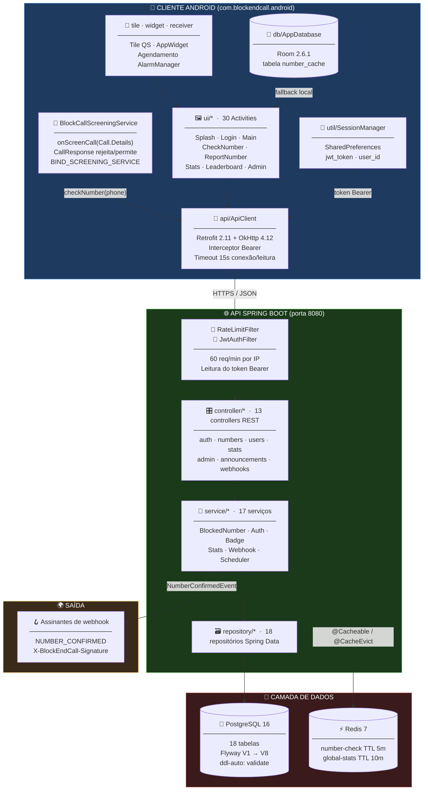
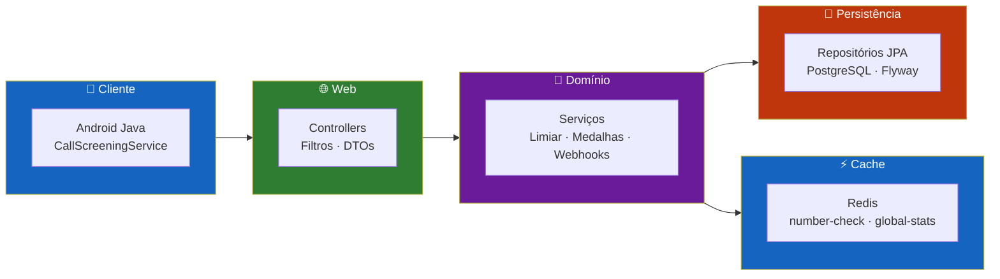
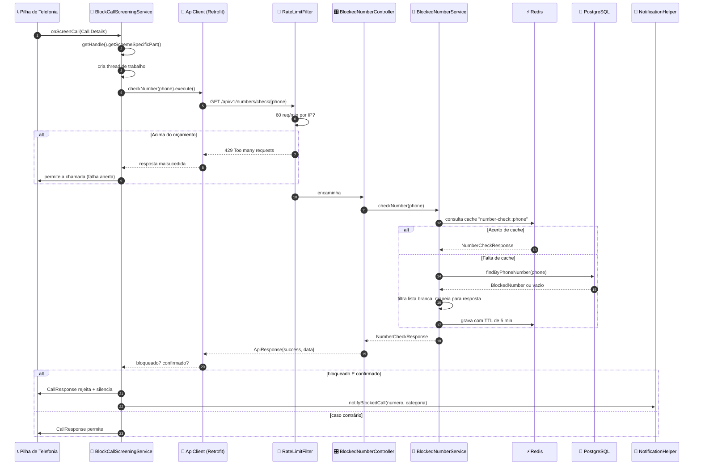
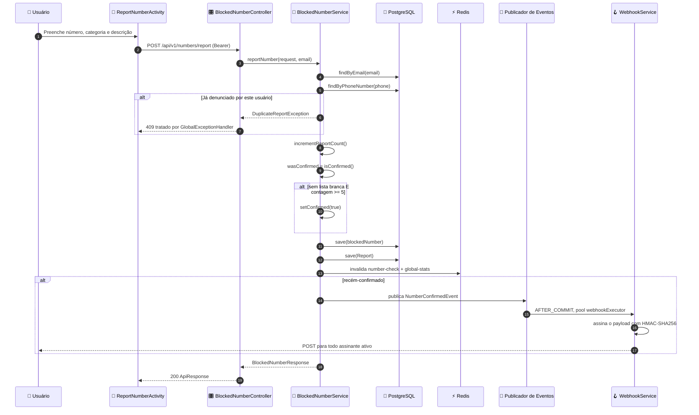
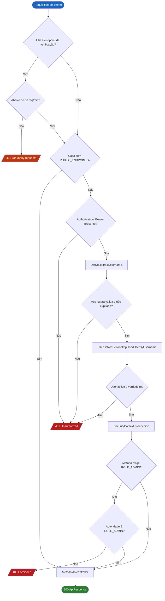
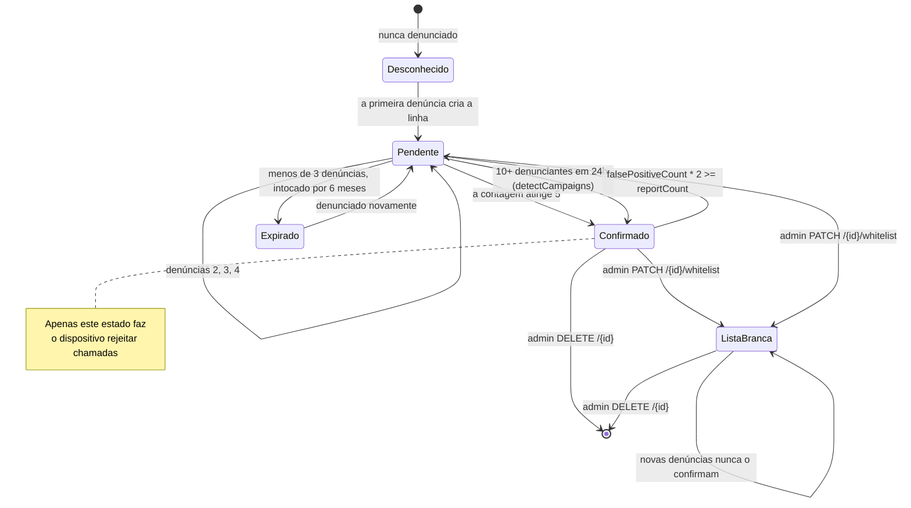

<div align="center">

**🌐 Choose Language / Selecione o Idioma / Elija el Idioma**

[](README.md)&nbsp;&nbsp;&nbsp;[](README_PT.md)&nbsp;&nbsp;&nbsp;[](README_ES.md)

</div>

---

<div align="center">

```
██████╗ ██╗      ██████╗  ██████╗██╗  ██╗███████╗███╗   ██╗██████╗
██╔══██╗██║     ██╔═══██╗██╔════╝██║ ██╔╝██╔════╝████╗  ██║██╔══██╗
██████╔╝██║     ██║   ██║██║     █████╔╝ █████╗  ██╔██╗ ██║██║  ██║
██╔══██╗██║     ██║   ██║██║     ██╔═██╗ ██╔══╝  ██║╚██╗██║██║  ██║
██████╔╝███████╗╚██████╔╝╚██████╗██║  ██╗███████╗██║ ╚████║██████╔╝
╚═════╝ ╚══════╝ ╚═════╝  ╚═════╝╚═╝  ╚═╝╚══════╝╚═╝  ╚═══╝╚═════╝
         ██████╗ █████╗ ██╗     ██╗
        ██╔════╝██╔══██╗██║     ██║
        ██║     ███████║██║     ██║
        ██║     ██╔══██║██║     ██║
        ╚██████╗██║  ██║███████╗███████╗
         ╚═════╝╚═╝  ╚═╝╚══════╝╚══════╝
    Plataforma Comunitária de Bloqueio de Chamadas de Spam
```

---

[](https://openjdk.org/)
[](https://spring.io/projects/spring-boot)
[](https://www.postgresql.org/)
[](https://redis.io/)
[](https://developer.android.com/)
[](https://www.docker.com/)
[](https://swagger.io/)

<br/>

> **Denuncie um número de spam uma vez e ele passa a ser bloqueado para todos.**
> Uma API Spring Boot somada a um `CallScreeningService` Android nativo que rejeita spam confirmado pela comunidade antes que o telefone toque.

<br/>


</div>

---

## 📑 Índice

<details>
<summary>▶️ <strong>Clique para expandir / recolher esta seção</strong></summary>

<table>
<tr>
<td valign="top" width="50%">

**🏗️ Sistema**
- [Visão Geral](#-visão-geral)
- [Arquitetura do Sistema](#️-arquitetura-do-sistema)
- [Stack Tecnológica](#️-stack-tecnológica)
- [Padrões de Projeto](#-padrões-de-projeto-aplicados)
- [Estrutura do Projeto](#-estrutura-do-projeto)

**📦 Módulos**
- [Camada REST](#-camada-rest--13-controllers)
- [Camada de Serviços](#-camada-de-serviços--17-serviços)
- [Camada de Persistência](#️-camada-de-persistência--jpa--flyway)
- [Camada de Segurança](#-camada-de-segurança--jwt--bcrypt)
- [Filtro de Rate Limit](#-filtro-de-rate-limit--janela-deslizante)
- [Camada de Cache](#-camada-de-cache--redis)
- [Subsistema de Webhooks](#-subsistema-de-webhooks--eventos-de-saída)
- [Subsistema de Agendamento](#-subsistema-de-agendamento--tarefas-cron)
- [Triagem de Chamadas Android](#-triagem-de-chamadas-android--o-núcleo-do-bloqueio)
- [Cliente HTTP Android](#-cliente-http-android--retrofit--sessão)
- [Cache Room Android](#-cache-room-android--consultas-offline)
- [Superfície de UI Android](#️-superfície-de-ui-android--30-activities)
- [Superfícies de Sistema Android](#-superfícies-de-sistema-android--tile-widget-alarme)
- [Infraestrutura](#-infraestrutura--docker--ci)

</td>
<td valign="top" width="50%">

**💼 Negócio**
- [Regras de Negócio](#-regras-de-negócio)
- [Requisitos Funcionais](#-requisitos-funcionais)
- [Requisitos Não Funcionais](#-requisitos-não-funcionais)

**📐 Design**
- [Modelo de Dados](#️-modelo-de-dados)
- [Fluxos do Sistema](#-fluxos-do-sistema)
- [Fluxo de Triagem de Chamada](#fluxo-de-triagem-de-chamada-recebida)
- [Fluxo de Denúncia e Confirmação](#fluxo-de-denúncia-e-confirmação)
- [Fluxo de Autenticação](#fluxo-de-autenticação)
- [Ciclo de Vida do Número](#máquina-de-estados-do-ciclo-de-vida-do-número)

**🔐 Segurança & Operação**
- [Segurança](#-segurança)
- [Instalação & Execução](#-instalação--execução)
- [Testes Automatizados](#-testes-automatizados)
- [Métricas & Monitoramento](#-métricas--monitoramento)
- [Limitações Conhecidas](#️-limitações-conhecidas)

</td>
</tr>
</table>

---

</details>

## 🌟 Visão Geral

<details>
<summary>▶️ <strong>Clique para expandir / recolher esta seção</strong></summary>

O **BlockEndCall** é uma plataforma de duas camadas para defesa colaborativa contra chamadas de spam. Uma **API REST Spring Boot 3.2.5** mantém o banco compartilhado de reputação de números de telefone, e um **cliente Android nativo** escrito em Java se registra como aplicativo de triagem de chamadas do dispositivo, de modo que toda chamada recebida é verificada contra esse banco antes de o telefone tocar.

A ideia econômica por trás do projeto é simples. Bloquear um número de spam é barato para uma pessoa e caro para uma população inteira, a menos que o custo seja compartilhado. Quando um usuário denuncia um número através de `POST /api/v1/numbers/report`, o backend incrementa um contador de denúncias na linha de `blocked_numbers`. Assim que o contador atinge o limiar configurado, `app.report.threshold` (padrão **5**), o número passa a `confirmed = true`, e a partir desse momento todo dispositivo com o aplicativo o rejeita silenciosamente. O incômodo de uma pessoa vira proteção de todos.

O sistema se defende do abuso óbvio desse mecanismo. Um usuário só pode denunciar um dado número uma vez, o que é garantido por uma restrição `UNIQUE (user_id, blocked_number_id)` na tabela `reports` e por uma verificação prévia em `BlockedNumberService.reportNumber`. Números que recebem denúncias de falso positivo perdem a confirmação quando `falsePositiveCount * 2 >= reportCount`. Administradores podem colocar um número em lista branca permanente, uma lista branca pública protege números institucionais conhecidos, e cada usuário mantém listas negra e branca pessoais que sobrepõem localmente o veredito da comunidade. Um agendador noturno expira números pendentes antigos e confirma automaticamente campanhas coordenadas de spam.

### 🎯 Objetivos do Sistema

| Objetivo | Descrição |
|----------|-----------|
| 📵 **Rejeição Silenciosa** | Rejeitar spam confirmado pela comunidade via `CallScreeningService` antes de o aparelho tocar |
| 🤝 **Reputação Compartilhada** | Transformar denúncias individuais em lista de bloqueio global por limiar de contagem |
| ⚖️ **Resistência a Abuso** | Uma denúncia por usuário por número, contravoto de falso positivo, lista branca de admin e lista branca pública |
| ⚡ **Baixa Latência** | Consultas de número cacheadas no Redis com TTL de 5 minutos, mais cache local Room no dispositivo |
| 🔐 **Autenticação Stateless** | Tokens JWT bearer (jjwt 0.12.5), hash BCrypt de senhas, segurança de método por papel |
| 🧭 **Sobreposição Pessoal** | Listas branca e negra por usuário com precedência sobre o veredito comunitário |
| 🏅 **Engajamento** | Pontuação de reputação, oito níveis de medalha e ranking público para recompensar quem denuncia |
| 🪝 **Integrabilidade** | Webhooks de saída assinados com HMAC-SHA256 em `NUMBER_CONFIRMED`, além de chaves de API por usuário |
| 🇧🇷 **Enriquecimento Local** | Resolução de 67 DDDs brasileiros, nomes de chamador reportados e linhas do tempo de eventos |
| 🐳 **Reprodutibilidade** | Stack Docker Compose (API + PostgreSQL 16 + Redis 7) e pipeline de CI no GitHub Actions |

---

</details>

## 🏗️ Arquitetura do Sistema

<details>
<summary>▶️ <strong>Clique para expandir / recolher esta seção</strong></summary>

### Diagrama de Módulos



### Camadas da Arquitetura



---

</details>

## 🛠️ Stack Tecnológica

<details>
<summary>▶️ <strong>Clique para expandir / recolher esta seção</strong></summary>

<table>
<thead>
<tr>
<th>Camada</th>
<th>Tecnologia</th>
<th>Versão</th>
<th>Finalidade</th>
</tr>
</thead>
<tbody>
<tr>
<td rowspan="2"><strong>🧠 Linguagem</strong></td>
<td>Java (backend)</td>
<td>17</td>
<td>Propriedade <code>java.version</code> em <code>backend/pom.xml</code></td>
</tr>
<tr>
<td>Java (Android)</td>
<td>17</td>
<td><code>sourceCompatibility</code> / <code>targetCompatibility</code> em <code>app/build.gradle</code></td>
</tr>
<tr>
<td rowspan="5"><strong>🌐 Backend</strong></td>
<td>Spring Boot</td>
<td>3.2.5</td>
<td>Starter pai, autoconfiguração, Tomcat embutido na porta 8080</td>
</tr>
<tr>
<td>Spring Web MVC</td>
<td>3.2.5</td>
<td><code>spring-boot-starter-web</code>, 13 controllers REST</td>
</tr>
<tr>
<td>Spring Security</td>
<td>6.x</td>
<td>Cadeia de filtros stateless, <code>@EnableMethodSecurity</code>, <code>@PreAuthorize</code></td>
</tr>
<tr>
<td>Spring Data JPA</td>
<td>3.2.5</td>
<td>18 repositórios, Hibernate com <code>ddl-auto: validate</code></td>
</tr>
<tr>
<td>Bean Validation</td>
<td>starter</td>
<td><code>spring-boot-starter-validation</code> nos DTOs de requisição</td>
</tr>
<tr>
<td rowspan="2"><strong>🔐 Autenticação</strong></td>
<td>jjwt (api / impl / jackson)</td>
<td>0.12.5</td>
<td>Emissão e verificação HS256 em <code>JwtUtil</code></td>
</tr>
<tr>
<td>BCryptPasswordEncoder</td>
<td>Spring Security</td>
<td>Bean de hash de senha em <code>SecurityConfig</code></td>
</tr>
<tr>
<td rowspan="3"><strong>💾 Dados</strong></td>
<td>PostgreSQL</td>
<td>16-alpine</td>
<td>Armazenamento principal, 18 tabelas</td>
</tr>
<tr>
<td>Flyway</td>
<td>gerenciado pelo Boot</td>
<td>8 migrações versionadas em <code>db/migration</code></td>
</tr>
<tr>
<td>Redis</td>
<td>7-alpine</td>
<td><code>spring-boot-starter-data-redis</code>, cache com TTLs de 5 e 10 minutos</td>
</tr>
<tr>
<td rowspan="2"><strong>📖 Documentação</strong></td>
<td>springdoc-openapi</td>
<td>2.5.0</td>
<td>Documento OpenAPI 3 em <code>/v3/api-docs</code></td>
</tr>
<tr>
<td>Swagger UI</td>
<td>embutido</td>
<td>Console interativo em <code>/swagger-ui.html</code></td>
</tr>
<tr>
<td rowspan="6"><strong>📱 Android</strong></td>
<td>Android SDK</td>
<td>min 29 / target 34</td>
<td><code>CallScreeningService</code> exige API 29 (Android 10)</td>
</tr>
<tr>
<td>Retrofit + conversor Gson</td>
<td>2.11.0</td>
<td>Cliente HTTP tipado em <code>api/ApiClient</code></td>
</tr>
<tr>
<td>OkHttp + logging interceptor</td>
<td>4.12.0</td>
<td>Transporte, injeção do cabeçalho de autenticação, log de corpo em debug</td>
</tr>
<tr>
<td>Room</td>
<td>2.6.1</td>
<td>Tabela local <code>number_cache</code>, arquivo <code>blockendcall.db</code></td>
</tr>
<tr>
<td>Material Components</td>
<td>1.12.0</td>
<td>Componentes Material 3 em 46 layouts</td>
</tr>
<tr>
<td>AndroidX Biometric / Security-Crypto</td>
<td>1.1.0 / 1.1.0-alpha06</td>
<td><code>BiometricHelper</code> e dependência de preferências criptografadas</td>
</tr>
<tr>
<td rowspan="4"><strong>🔧 Build & Operação</strong></td>
<td>Maven</td>
<td>plugin do Boot</td>
<td>Build do backend, <code>spring-boot-maven-plugin</code></td>
</tr>
<tr>
<td>Gradle (Groovy DSL)</td>
<td>fixado pelo wrapper</td>
<td>Build Android, R8 habilitado no release</td>
</tr>
<tr>
<td>Docker / Compose</td>
<td>esquema 3.9</td>
<td>Imagem multi-estágio <code>eclipse-temurin:17</code> mais serviços Postgres e Redis</td>
</tr>
<tr>
<td>GitHub Actions</td>
<td><code>backend-ci.yml</code></td>
<td>Testes com Postgres e Redis reais, empacotamento do JAR, build da imagem em <code>main</code></td>
</tr>
<tr>
<td rowspan="3"><strong>🧪 Testes</strong></td>
<td>JUnit 5 (Boot Test)</td>
<td>starter</td>
<td>12 classes de teste, 129 métodos <code>@Test</code></td>
</tr>
<tr>
<td>Spring Security Test</td>
<td>compatível</td>
<td>Testes de fatia de controller com usuário autenticado</td>
</tr>
<tr>
<td>H2</td>
<td>escopo de teste</td>
<td>Banco em memória no modo PostgreSQL, Flyway desativado nos testes</td>
</tr>
</tbody>
</table>

---

</details>

## 🎨 Padrões de Projeto Aplicados

<details>
<summary>▶️ <strong>Clique para expandir / recolher esta seção</strong></summary>

| Padrão | Onde | Justificativa |
|--------|------|---------------|
| 🧱 **Arquitetura em Camadas** | `controller/` → `service/` → `repository/` → `entity/` | Cada camada depende apenas da inferior, então detalhes de persistência não vazam para a superfície HTTP |
| 🗂️ **Repository** | 18 interfaces em `repository/`, por exemplo `BlockedNumberRepository` | O Spring Data deriva consultas dos nomes dos métodos, com JPQL customizado só onde necessário (`autocomplete`, `findExpiredPending`) |
| 📦 **DTO / Assembler** | `dto/request` (23) e `dto/response` (21) com fábricas estáticas `from(...)` | Entidades nunca trafegam pela rede, então associações lazy e colunas internas permanecem privadas |
| 🏗️ **Builder** | Lombok `@Builder` em `BlockedNumber`, `User`, `NumberCheckResponse`, `Webhook` | Construção em estilo imutável com padrões via `@Builder.Default` |
| 🔗 **Chain of Responsibility** | `RateLimitFilter` e depois `JwtAuthFilter`, ambos antes de `UsernamePasswordAuthenticationFilter` | Rejeições baratas acontecem antes da análise cara do token |
| 📣 **Observer / Evento de Domínio** | `NumberConfirmedEvent` publicado por `BlockedNumberService` e consumido por `WebhookService` | A entrega de webhook fica desacoplada da transação de denúncia |
| ⏳ **Outbox Transacional (simplificado)** | `@TransactionalEventListener(phase = AFTER_COMMIT)` em `notifyConfirmed` | Assinantes que retornam chamadas só observam estado já commitado |
| 🎭 **Proxy / Decorator** | `@Cacheable("number-check")` e `@CacheEvict` em `BlockedNumberService` | Cache Redis adicionado sem uma única linha dentro do método de negócio |
| 🔒 **Singleton** | `ApiClient.getInstance` e `AppDatabase.getInstance`, ambos com double-checked locking | Uma única pilha Retrofit e um único handle Room por processo no dispositivo |
| 🧩 **Adapter** | `ui/adapter/BlockedNumberAdapter`, `UserReportAdapter`, `BlockedCallLogAdapter` | Adapters de RecyclerView traduzem objetos de modelo em views de linha |
| 🛡️ **Strategy (política)** | Flags de `UserPreference`: `paranoiaMode`, `blockOnlyConfirmed`, alternâncias por categoria | A decisão de bloqueio é parametrizada por usuário em vez de fixada no código |
| 🚨 **Handler Global de Exceções** | `exception/GlobalExceptionHandler` com `@RestControllerAdvice` | Um só lugar mapeia `DuplicateReportException`, `ResourceNotFoundException` e erros de validação para códigos HTTP |

---

</details>

## 📁 Estrutura do Projeto

<details>
<summary>▶️ <strong>Clique para expandir / recolher esta seção</strong></summary>

```
BlockEndCall/
│
├── 📄 docker-compose.yml                 # Postgres 16 + Redis 7 + API, com healthchecks
├── 📄 .gitignore                         # Saídas de build, arquivos de IDE, propriedades locais
│
├── 📂 .github/workflows/
│   └── 📄 backend-ci.yml                 # Teste (PG + Redis reais) → empacota → build docker
│
├── 📂 backend/                           # ☕ API REST Spring Boot 3.2.5
│   ├── 📄 pom.xml                        # Java 17, jjwt 0.12.5, springdoc 2.5.0
│   ├── 📄 Dockerfile                     # Multi-estágio temurin:17-jdk → temurin:17-jre
│   │
│   └── 📂 src/
│       ├── 📂 main/java/com/blockendcall/
│       │   ├── 📄 BlockEndCallApplication.java   # Ponto de entrada @SpringBootApplication
│       │   │
│       │   ├── 📂 config/                # 5 classes de configuração
│       │   │   ├── SecurityConfig.java           # Cadeia de filtros + lista de endpoints públicos
│       │   │   ├── RedisConfig.java              # CacheManager, TTL por cache
│       │   │   ├── SchedulingConfig.java         # @EnableScheduling + pool webhookExecutor
│       │   │   ├── OpenApiConfig.java            # Metadados do Swagger
│       │   │   └── RestTemplateConfig.java       # Bean RestTemplate para entrega de webhooks
│       │   │
│       │   ├── 📂 controller/            # ★ 13 controllers REST
│       │   ├── 📂 service/               # ★ 17 serviços de domínio
│       │   ├── 📂 repository/            # 18 repositórios Spring Data JPA
│       │   ├── 📂 entity/                # 18 entidades JPA
│       │   ├── 📂 dto/request/           # 23 payloads de entrada
│       │   ├── 📂 dto/response/          # 21 payloads de saída
│       │   ├── 📂 enums/                 # 7 enums (SpamCategory, BadgeType, UserRole, …)
│       │   ├── 📂 security/              # JwtUtil · JwtAuthFilter · UserDetailsServiceImpl
│       │   ├── 📂 filter/                # RateLimitFilter (janela deslizante, 60 req/min)
│       │   ├── 📂 exception/             # GlobalExceptionHandler + 2 exceções de domínio
│       │   └── 📂 event/                 # NumberConfirmedEvent (record)
│       │
│       ├── 📂 main/resources/
│       │   ├── 📄 application.yml               # Datasource, Redis, JWT, limiar de denúncia 5
│       │   ├── 📄 application-docker.yml        # Sobrescritas de host para a rede do Compose
│       │   └── 📂 db/migration/                 # Scripts Flyway V1 → V8
│       │
│       └── 📂 test/
│           ├── 📂 java/com/blockendcall/        # 12 classes de teste · 129 métodos @Test
│           └── 📂 resources/                    # H2 em modo PostgreSQL, Flyway desligado
│
├── 📂 android/                           # 📱 Cliente Android nativo
│   ├── 📄 build.gradle                   # Script de build raiz
│   ├── 📄 settings.gradle                # Inclusão de módulos
│   ├── 📄 gradle.properties              # Argumentos de JVM, flags AndroidX
│   │
│   └── 📂 app/
│       ├── 📄 build.gradle               # minSdk 29 · targetSdk 34 · buildConfigField BASE_URL
│       ├── 📄 proguard-rules.pro         # Regras de keep do R8 (release habilita minify)
│       │
│       └── 📂 src/main/
│           ├── 📄 AndroidManifest.xml    # 5 permissões, CallScreeningService, receiver
│           │
│           ├── 📂 java/com/blockendcall/android/
│           │   ├── 📄 BlockEndCallApp.java       # Subclasse de Application
│           │   ├── 📂 service/BlockCallScreeningService.java   # ★ O núcleo do bloqueio
│           │   ├── 📂 api/                       # ApiClient · BlockedNumberApi · PagedResponse
│           │   ├── 📂 db/                        # AppDatabase · NumberCacheDao · NumberCacheEntity
│           │   ├── 📂 model/                     # 22 modelos mapeados por Gson
│           │   ├── 📂 ui/                        # 30 Activities
│           │   ├── 📂 ui/adapter/                # 3 adapters de RecyclerView
│           │   ├── 📂 util/                      # SessionManager · NotificationHelper · BiometricHelper · BlockedCallLog
│           │   ├── 📂 tile/                      # Serviço de tile de Configurações Rápidas
│           │   ├── 📂 widget/                    # Provedor de AppWidget para a tela inicial
│           │   └── 📂 receiver/                  # ScheduledBlockingReceiver (AlarmManager)
│           │
│           └── 📂 res/
│               ├── 📂 layout/            # 46 layouts (activity_* e item_*)
│               ├── 📂 drawable/          # 13 vetores
│               ├── 📂 values/            # colors · strings · themes
│               ├── 📂 menu/              # menu_main.xml
│               └── 📂 xml/               # blockendcall_widget_info.xml
│
├── 📄 README.md                          # 🇺🇸 Inglês (principal)
├── 📄 README_PT.md                       # 🇧🇷 Português
└── 📄 README_ES.md                       # 🇪🇸 Espanhol
```

---

</details>

## 📦 Módulos do Sistema

<details>
<summary>▶️ <strong>Clique para expandir / recolher esta seção</strong></summary>

### 🌐 Camada REST — 13 Controllers

Todo controller é anotado com `@RestController` e ancorado sob `/api/v1`. As respostas são embrulhadas no envelope genérico `ApiResponse<T>`, que carrega `success`, `message` e `data`.

| Controller | Caminho base | Operações principais |
|------------|--------------|----------------------|
| `AuthController` | `/api/v1/auth` | `register`, `login`, `verify-email`, `forgot-password`, `reset-password` |
| `BlockedNumberController` | `/api/v1/numbers` | `check/{phoneNumber}`, `report`, `search`, `category/{category}`, `check-batch`, `check-enhanced/{phoneNumber}`, `autocomplete`, `search-description`, `{id}/false-positive`, `{id}/whitelist`, `import/csv` |
| `NumberEnrichmentController` | `/api/v1/numbers` | `{id}/reported-names` (GET/POST), `{id}/timeline`, `{numberId}/confirm`, `ddd`, `ddd/{ddd}` |
| `UserController` | `/api/v1/users` | `me` (GET/PUT/DELETE), `me/password`, `me/reports`, `me/preferences`, `me/badges`, `me/terms` |
| `PersonalListController` | `/api/v1/users/me/...` | `personal-whitelist` e `personal-blacklist` (GET / POST / DELETE por telefone) |
| `CallLogController` | `/api/v1/users/me/call-log` | Registrar chamada bloqueada, listar histórico, contar |
| `ApiKeyController` | `/api/v1/users/me/api-keys` | Listar, criar e revogar chave de API do usuário |
| `FcmController` | `/api/v1/users/me/fcm` | Registrar token push do dispositivo |
| `StatsController` | `/api/v1/stats` | Estatísticas globais, `enhanced`, `leaderboard`, `by-ddd`, `top` |
| `AnnouncementController` | `/api/v1/announcements` | Listagem pública, criação e remoção por admin |
| `PublicWhitelistController` | `/api/v1/public-whitelist` | Listagem pública e `check/{phone}`, inclusão e verificação por admin |
| `AdminController` | `/api/v1/admin` | `users`, suspender / reativar / promover, `numbers/pending`, aprovação e rejeição em lote, `audit` |
| `WebhookController` | `/api/v1/webhooks` | Registrar, listar, desativar. A classe inteira é `@PreAuthorize("hasRole('ADMIN')")` |

---

### 🧠 Camada de Serviços — 17 Serviços

`BlockedNumberService` é o coração do domínio. Seu método `reportNumber` contém a regra de limiar que dá nome ao projeto.

| Serviço | Responsabilidade |
|---------|------------------|
| `BlockedNumberService` | Denunciar, verificar, buscar, falso positivo, lista branca, importação CSV, confirmação por limiar |
| `AuthService` | Cadastro com guarda de e-mail duplicado, login via `AuthenticationManager`, emissão de token |
| `UserPreferenceService` | Lê e grava a linha de política de bloqueio por usuário |
| `PersonalListService` | CRUD das listas branca e negra pessoais |
| `PublicWhitelistService` | Números protegidos em nível institucional e sua flag de verificação |
| `StatsService` | Contagens agregadas, estatísticas ampliadas, ranking, quebra por DDD |
| `BadgeService` | Concede `FIRST_REPORT`, `REPORTER_10/50/100/500`, com +10 de reputação por medalha |
| `CallLogService` | Persiste registros de chamadas bloqueadas no servidor, por usuário |
| `NumberEnrichmentService` | Nomes de chamador reportados, eventos de linha do tempo, confirmações "eu também" |
| `OperatorLookupService` | Mapa em memória de **67 DDDs brasileiros** para nomes de região |
| `AnnouncementService` | Mensagens de difusão do admin exibidas no aplicativo |
| `ApiKeyService` | Emite e revoga chaves de API de 64 caracteres |
| `AdminService` | Suspensão de usuários, promoção, moderação em lote de números |
| `AuditService` | Grava linhas em `audit_log` para cada ação privilegiada |
| `WebhookService` | Validação de URL (HTTPS + proteção SSRF), assinatura HMAC, entrega assíncrona |
| `SchedulerService` | Três tarefas cron: expiração, detecção de campanha, limpeza de auditoria |
| `FcmService` | Armazena tokens de dispositivo. `sendNotification` atualmente apenas registra em log |

---

### 🗄️ Camada de Persistência — JPA + Flyway

A evolução de esquema é versionada, não gerada. O Hibernate roda com `ddl-auto: validate`, então a aplicação se recusa a iniciar se as entidades e o esquema migrado divergirem.

| Migração | Introduz |
|----------|----------|
| `V1__init.sql` | `users`, `blocked_numbers`, `reports` e três índices |
| `V2__false_positive.sql` | `false_positive_count`, `whitelisted`, tabela `false_positive_reports` |
| `V3__report_enhancements.sql` | Em reports: `subcategory`, `caller_name`, `call_frequency`, `typical_call_hour`; em users: `reputation_score`, `suspended`, `terms_accepted_at` |
| `V4__community_features.sql` | `report_confirmations`, `user_personal_whitelist`, `user_personal_blacklist` |
| `V5__server_logs_and_keys.sql` | `server_blocked_call_log`, `user_api_keys`, `user_badges`, `audit_log` |
| `V6__notifications_and_prefs.sql` | `announcements`, `user_preferences`, `fcm_tokens` |
| `V7__enrichment.sql` | `number_reported_names`, `public_whitelist`, `number_timeline_events` |
| `V8__webhooks.sql` | Tabela `webhooks` |

---

### 🔐 Camada de Segurança — JWT + BCrypt

`SecurityConfig` monta uma cadeia stateless. O CSRF está desabilitado porque não existe sessão em cookie, `SessionCreationPolicy.STATELESS` impede a criação de `JSESSIONID`, e um array fixo de endpoints públicos é liberado antes de `anyRequest().authenticated()`.

| Componente | Detalhe |
|------------|---------|
| `JwtUtil` | HS256 via `Keys.hmacShaKeyFor(Decoders.BASE64.decode(secret))`, o subject é o e-mail do usuário |
| TTL do token | `security.jwt.expiration = 86400000` ms, ou seja 24 horas |
| `JwtAuthFilter` | `OncePerRequestFilter` que lê o cabeçalho `Authorization: Bearer` |
| `UserDetailsServiceImpl` | Carrega a entidade `User`, que implementa `UserDetails` |
| Autoridades | `ROLE_USER` ou `ROLE_ADMIN`, derivadas do enum `UserRole` |
| Armazenamento de senha | Bean `BCryptPasswordEncoder`, força padrão |
| Segurança de método | `@EnableMethodSecurity` mais `@PreAuthorize("hasRole('ADMIN')")` nos endpoints privilegiados |
| Estado da conta | `User.isEnabled()` retorna a flag `active`, então contas desativadas não autenticam |

Endpoints públicos declarados em `PUBLIC_ENDPOINTS`: `/api/v1/auth/**`, `/api/v1/numbers/check/**`, `/api/v1/numbers/check-batch`, `/api/v1/numbers/autocomplete`, `/api/v1/numbers/search-description`, `/api/v1/numbers/ddd/**`, `/api/v1/stats*`, `/api/v1/announcements`, `/api/v1/public-whitelist/**`, os caminhos do OpenAPI e `/actuator/health`.

---

### 🚦 Filtro de Rate Limit — Janela Deslizante

`RateLimitFilter` protege os únicos endpoints que são simultaneamente públicos e quentes, as consultas de número feitas por cada dispositivo em cada chamada recebida.

| Propriedade | Valor |
|-------------|-------|
| Escopo | URIs que começam com `/api/v1/numbers/check` mais `/api/v1/numbers/check-batch` |
| Orçamento | `MAX_REQUESTS = 60` por janela |
| Janela | `WINDOW_MS = 60_000` ms, avaliada como um deque deslizante de timestamps |
| Chave | `req.getRemoteAddr()` |
| Armazenamento | `ConcurrentHashMap<String, Deque<Long>>`, em processo |
| Proteção de memória | `MAX_TRACKED_IPS = 10_000`, entradas obsoletas removidas ao atingir o teto |
| Rejeição | HTTP `429` com corpo `{"success":false,"message":"Too many requests, please wait"}` |

---

### ⚡ Camada de Cache — Redis

`RedisConfig` instala um `RedisCacheManager` com serialização JSON e cache de nulos desabilitado.

| Nome do cache | TTL | Populado por | Invalidado por |
|---------------|-----|--------------|----------------|
| `number-check` | 5 minutos | `@Cacheable(value = "number-check", key = "#phoneNumber")` em `checkNumber` | `@CacheEvict` em `reportNumber`, `reportFalsePositive`, `adminWhitelist`, `deleteNumber` |
| `global-stats` | 10 minutos | Agregação de estatísticas | O mesmo conjunto de invalidações acima |

A chave `spring.cache.redis.time-to-live` em `application.yml` também declara 300000 ms, e o bean `RedisTemplate` usa `StringRedisSerializer` para chaves e `GenericJackson2JsonRedisSerializer` para valores, o que mantém as entradas legíveis pelo `redis-cli`.

---

### 🪝 Subsistema de Webhooks — Eventos de Saída

Quando um número cruza o limiar, `BlockedNumberService` publica um record `NumberConfirmedEvent`. `WebhookService.notifyConfirmed` o consome.

| Aspecto | Implementação |
|---------|---------------|
| Disparo | `@TransactionalEventListener(phase = TransactionPhase.AFTER_COMMIT)` |
| Threading | `@Async("webhookExecutor")`, pool core 2 / máx 5 / fila 100, `CallerRunsPolicy` |
| Payload | `{"event":"NUMBER_CONFIRMED","phoneNumber":…,"category":…,"reportCount":…}` |
| Assinatura | `X-BlockEndCall-Signature: sha256=<HMAC-SHA256 hex do corpo>` quando há segredo armazenado |
| Política de URL | Esquema precisa ser `https`, o host precisa resolver e não pode ser loopback, link-local, site-local nem any-local |
| Blocklist SSRF | Prefixos literais `10.`, `127.`, `0.`, `169.254.`, `192.168.`, `172.16.` a `172.31.`, além de `localhost` |
| Modo de falha | Try / catch por assinante, uma entrega falha é registrada em WARN e não aborta o laço |

---

### ⏰ Subsistema de Agendamento — Tarefas Cron

`SchedulingConfig` habilita agendamento e execução assíncrona. `SchedulerService` possui três tarefas.

| Cron | Método | Efeito |
|------|--------|--------|
| `0 0 3 * * *` | `autoExpireOldReports` | Números com menos de 3 denúncias intocados por 6 meses são desconfirmados |
| `0 0 4 * * *` | `detectCampaigns` | Números denunciados por 10 ou mais usuários nas últimas 24 horas são confirmados automaticamente se não estiverem em lista branca |
| `0 0 2 * * MON` | `cleanOldAuditLogs` | Linhas de auditoria com mais de 1 ano são excluídas |

---

### 📵 Triagem de Chamadas Android — O Núcleo do Bloqueio

`BlockCallScreeningService` estende `android.telecom.CallScreeningService`. Está declarado no manifesto com `android:permission="android.permission.BIND_SCREENING_SERVICE"` e o intent filter `android.telecom.CallScreeningService`, e só entra em vigor quando o usuário concede ao aplicativo o papel `ROLE_CALL_SCREENING`.

| Passo | Código |
|-------|--------|
| 1. Extrair o número | `callDetails.getHandle().getSchemeSpecificPart()` |
| 2. Sair da thread principal | `new Thread(() -> { … }).start()` |
| 3. Consultar a API | `api.checkNumber(incomingNumber).execute()` (chamada Retrofit síncrona) |
| 4. Decidir | Rejeitar apenas quando `result.isBlocked() && result.isConfirmed()` |
| 5a. Rejeitar | `setDisallowCall(true)`, `setRejectCall(true)`, `setSilenceCall(true)`, `setSkipCallLog(false)`, `setSkipNotification(false)` |
| 5b. Permitir | `setDisallowCall(false)`, `setRejectCall(false)` |
| 6. Notificar | `NotificationHelper.notifyBlockedCall(context, number, category)` |
| 7. Falhar aberto | Qualquer exceção é registrada em ERROR e a chamada é permitida |

> [!NOTE]
> A política de falhar aberto é deliberada. Uma indisponibilidade do backend jamais pode impedir o telefone de receber chamadas legítimas.

---

### 🔌 Cliente HTTP Android — Retrofit + Sessão

| Componente | Detalhe |
|------------|---------|
| `ApiClient.buildRetrofit` | OkHttp com timeout de conexão de 15 s e de leitura de 15 s |
| Interceptor de autenticação | Adiciona `Authorization: Bearer <token>` quando `SessionManager.getToken()` não é nulo |
| Log | `HttpLoggingInterceptor` em `BODY` nas builds de debug e `NONE` no release |
| Conversor | `GsonConverterFactory` |
| URL base | `BuildConfig.BASE_URL`, `http://10.0.2.2:8080/` em debug e `https://api.blockendcall.com/` em release |
| `BlockedNumberApi` | Interface Retrofit que enumera os endpoints consumidos pelo cliente |
| `PagedResponse<T>` | Espelha o envelope `Page` do Spring para endpoints de listagem |
| `SessionManager` | Arquivo `SharedPreferences` `blockendcall_session` com `jwt_token`, `user_id`, `user_name`, `user_email` |

---

### 💽 Cache Room Android — Consultas Offline

| Elemento | Detalhe |
|----------|---------|
| Banco | `AppDatabase`, arquivo `blockendcall.db`, versão 1, `exportSchema = false` |
| Política de migração | `fallbackToDestructiveMigration()` |
| Entidade | `NumberCacheEntity`, tabela `number_cache`, chave primária `phoneNumber` |
| Colunas | `blocked`, `confirmed`, `category`, `reportCount`, `spamScore`, `riskLevel`, `cachedAt` |
| DAO | `NumberCacheDao` |
| Instanciação | Singleton com double-checked locking em `getInstance(Context)` |

---

### 🖼️ Superfície de UI Android — 30 Activities

O cliente entrega 30 activities apoiadas por 46 arquivos de layout e 3 adapters de RecyclerView.

| Grupo | Activities |
|-------|-----------|
| Onboarding | `SplashActivity`, `LoginActivity`, `RegisterActivity`, `TermsActivity`, `PrivacyPolicyActivity` |
| Núcleo | `MainActivity`, `CheckNumberActivity`, `ReportNumberActivity`, `BlockedListActivity`, `NumberDetailActivity`, `SearchActivity` |
| Histórico | `CallLogActivity`, `CallLogServerActivity`, `BlockedCallLogActivity`, `MyReportsActivity`, `NumberTimelineActivity` |
| Listas pessoais | `PersonalWhitelistActivity`, `PersonalBlacklistActivity` |
| Comunidade | `StatsActivity`, `LeaderboardActivity`, `BadgesActivity`, `AnnouncementsActivity`, `ReportedNamesActivity` |
| Conta | `ProfileActivity`, `SettingsActivity`, `ApiKeysActivity`, `ExportDataActivity`, `DeleteAccountActivity` |
| Administração | `AdminUsersActivity`, `AdminPendingActivity` |

---

### 🧩 Superfícies de Sistema Android — Tile, Widget, Alarme

| Superfície | Classe | Comportamento |
|------------|--------|---------------|
| Tile de Configurações Rápidas | `BlockEndCallTileService` | Lê `RoleManager.isRoleHeld(ROLE_CALL_SCREENING)` para definir `STATE_ACTIVE` / `STATE_INACTIVE` e abre `MainActivity` ao toque |
| Widget de tela inicial | `BlockEndCallWidget` | `AppWidgetProvider` que renderiza `widget_block_end_call.xml`, cujo botão abre `CheckNumberActivity` por um `PendingIntent` imutável |
| Bloqueio agendado | `ScheduledBlockingReceiver` | `AlarmManager.setRepeating` com `INTERVAL_DAY` alterna a preferência `scheduled_block_active` nos horários configurados |
| Notificações | `NotificationHelper` | Canais criados no `onCreate` do serviço de triagem, uma notificação por chamada bloqueada |
| Biometria | `BiometricHelper` | Encapsula `BiometricManager` e `BiometricPrompt` de `androidx.biometric:1.1.0` |

---

### 🐳 Infraestrutura — Docker & CI

| Peça | Detalhe |
|------|---------|
| `docker-compose.yml` | `postgres:16-alpine` (volume nomeado `postgres_data`, healthcheck `pg_isready`), `redis:7-alpine` (`--save 60 1`, healthcheck `redis-cli ping`) e a API com `depends_on: condition: service_healthy` |
| `backend/Dockerfile` | Estágio 1 `eclipse-temurin:17-jdk-alpine` + Maven constrói o JAR, estágio 2 `eclipse-temurin:17-jre-alpine` o executa com `-Dspring.profiles.active=docker` |
| `application-docker.yml` | Reaponta o datasource para `postgres:5432` e o Redis para `redis:6379` |
| Job de CI `test` | JDK 17 Temurin com cache Maven, containers de serviço Postgres e Redis reais, `mvn test`, relatórios surefire enviados como artefato |
| Job de CI `docker` | Executa apenas em `main` depois de `test`, roda `docker build -t blockendcall-backend:${{ github.sha }} .` |
| Gatilhos | Push em `main` ou `develop` e pull requests para `main`, filtrados pelo caminho `backend/**` |

---

</details>

## 💼 Regras de Negócio

<details>
<summary>▶️ <strong>Clique para expandir / recolher esta seção</strong></summary>

### 📞 Denúncia e Confirmação

| # | Regra | Aplicação |
|---|-------|-----------|
| RN-01 | Um número passa a confirmado pela comunidade com **5 denúncias** | `reportCount >= reportThreshold` em `BlockedNumberService.reportNumber`, limiar vindo de `app.report.threshold` |
| RN-02 | Um usuário só pode denunciar o mesmo número uma vez | `reportRepository.existsByUserIdAndBlockedNumberId` mais `UNIQUE (user_id, blocked_number_id)` em `V1__init.sql` |
| RN-03 | Uma denúncia duplicada gera erro de domínio, nunca um no-op silencioso | `DuplicateReportException` mapeada por `GlobalExceptionHandler` |
| RN-04 | Denunciar um número desconhecido cria a linha com `reportCount = 0` e então a incrementa | `orElseGet(() -> BlockedNumber.builder()…reportCount(0))` seguido de `incrementReportCount()` |
| RN-05 | Um número em lista branca nunca pode ser confirmado | O ramo de confirmação é guardado por `!blockedNumber.isWhitelisted()` |
| RN-06 | Cruzar o limiar pela primeira vez emite exatamente um evento | `wasConfirmed` é capturado antes do save e comparado depois |
| RN-07 | Toda denúncia grava uma linha `Report` vinculada ao usuário e ao número | `reportRepository.save(Report.builder()…)` |

### ⚖️ Confiança e Contravoto

| # | Regra | Aplicação |
|---|-------|-----------|
| RN-08 | Um usuário só pode marcar um número como falso positivo uma vez | `falsePositiveRepository.existsByUserIdAndBlockedNumberId` mais restrição única na tabela |
| RN-09 | A confirmação é revogada quando os falsos positivos atingem metade das denúncias | `if (falsePositiveCount * 2 >= reportCount) setConfirmed(false)` |
| RN-10 | A pontuação de spam é `min(100, reportCount * 10) - falsePositiveCount * 15`, com piso em 0 | `BlockedNumber.getSpamScore()` |
| RN-11 | O nível de risco é `HIGH` quando confirmado, `MEDIUM` com 3 ou mais denúncias e `LOW` caso contrário | `NumberCheckResponse.from(BlockedNumberResponse)` |
| RN-12 | Um número desconhecido retorna o envelope seguro com pontuação 0 e `riskLevel = SAFE` | `NumberCheckResponse.safe(phoneNumber)` |
| RN-13 | Um número em lista branca é reportado como seguro mesmo que existam linhas | `.filter(n -> !n.isWhitelisted())` em `checkNumber` |

### 🛡️ Política de Bloqueio

| # | Regra | Aplicação |
|---|-------|-----------|
| RN-14 | O dispositivo só rejeita uma chamada quando o número está bloqueado **e** confirmado | `result.isBlocked() && result.isConfirmed()` em `onScreenCall` |
| RN-15 | Qualquer falha ao alcançar a API deixa a chamada passar | `catch (Exception e)` e então `respondToCall(callDetails, buildAllowResponse())` |
| RN-16 | Uma chamada rejeitada é silenciada, mas ainda registrada no log de chamadas do sistema | `setSilenceCall(true)` com `setSkipCallLog(false)` |
| RN-17 | Listas pessoais existem por usuário e são únicas por número | `UNIQUE (user_id, phone_number)` nas duas tabelas pessoais |
| RN-18 | Entradas da lista branca pública têm escopo institucional e verificação por admin | `public_whitelist.verified` começa em `FALSE` até um admin chamar `PATCH /{id}/verify` |

### 🏅 Reputação e Moderação

| # | Regra | Aplicação |
|---|-------|-----------|
| RN-19 | Medalhas são concedidas em 1, 10, 50, 100 e 500 denúncias | `BadgeService.checkAndAwardBadges` |
| RN-20 | Uma medalha é concedida no máximo uma vez por usuário | `userBadgeRepository.existsByUserIdAndBadgeType` mais `UNIQUE (user_id, badge_type)` |
| RN-21 | Cada nova medalha soma 10 pontos de reputação | `user.setReputationScore(user.getReputationScore() + 10)` |
| RN-22 | Toda ação privilegiada de admin é gravada no log de auditoria | `AuditService` invocado pelos caminhos de `AdminController`, o enum `AuditAction` tem 9 valores |
| RN-23 | O cadastro rejeita um e-mail já existente | `userRepository.existsByEmail` em `AuthService.register` |
| RN-24 | A importação CSV marca números como confirmados e eleva sua contagem ao limiar | `importFromCsv` em `BlockedNumberService`, exclusivo de admin |

---

</details>

## ✅ Requisitos Funcionais

<details>
<summary>▶️ <strong>Clique para expandir / recolher esta seção</strong></summary>

| ID | Requisito | Prioridade | Status |
|----|-----------|------------|--------|
| **RF-01** | O sistema deve permitir cadastro com nome, e-mail, telefone e senha | 🔴 Alta | ✅ Implementado |
| **RF-02** | O sistema deve autenticar o usuário e retornar um JWT assinado válido por 24 horas | 🔴 Alta | ✅ Implementado |
| **RF-03** | O sistema deve expor um endpoint de verificação de número sem autenticação para triagem | 🔴 Alta | ✅ Implementado |
| **RF-04** | O sistema deve permitir que um usuário autenticado denuncie um número com categoria | 🔴 Alta | ✅ Implementado |
| **RF-05** | O sistema deve confirmar automaticamente um número ao atingir o limiar de denúncias | 🔴 Alta | ✅ Implementado |
| **RF-06** | O cliente Android deve rejeitar chamadas de spam confirmado antes de o aparelho tocar | 🔴 Alta | ✅ Implementado |
| **RF-07** | O sistema deve notificar o usuário quando uma chamada for bloqueada | 🟡 Média | ✅ Implementado |
| **RF-08** | O sistema deve permitir denunciar um falso positivo com justificativa | 🔴 Alta | ✅ Implementado |
| **RF-09** | O sistema deve oferecer listas branca e negra pessoais por usuário | 🔴 Alta | ✅ Implementado |
| **RF-10** | O sistema deve manter uma lista branca pública de números institucionais verificados | 🟡 Média | ✅ Implementado |
| **RF-11** | O sistema deve suportar verificação em lote de vários números em uma requisição | 🟡 Média | ✅ Implementado |
| **RF-12** | O sistema deve oferecer autocompletar por prefixo sobre números conhecidos, limitado a 10 resultados | 🟢 Baixa | ✅ Implementado |
| **RF-13** | O sistema deve oferecer busca textual nas descrições das denúncias | 🟢 Baixa | ✅ Implementado |
| **RF-14** | O sistema deve resolver um DDD brasileiro para o nome da região | 🟢 Baixa | ✅ Implementado |
| **RF-15** | O sistema deve registrar nomes de chamador reportados por número | 🟡 Média | ✅ Implementado |
| **RF-16** | O sistema deve manter uma linha do tempo cronológica de eventos por número | 🟡 Média | ✅ Implementado |
| **RF-17** | O sistema deve publicar estatísticas globais, ranking e quebra por DDD | 🟡 Média | ✅ Implementado |
| **RF-18** | O sistema deve conceder medalhas e manter uma pontuação de reputação | 🟢 Baixa | ✅ Implementado |
| **RF-19** | O sistema deve permitir que um administrador suspenda, reative e promova usuários | 🔴 Alta | ✅ Implementado |
| **RF-20** | O sistema deve permitir aprovação ou rejeição em lote de números pendentes | 🟡 Média | ✅ Implementado |
| **RF-21** | O sistema deve registrar uma entrada de auditoria para cada ação privilegiada | 🔴 Alta | ✅ Implementado |
| **RF-22** | O sistema deve entregar webhooks assinados quando um número for confirmado | 🟡 Média | ✅ Implementado |
| **RF-23** | O sistema deve emitir e revogar chaves de API por usuário | 🟢 Baixa | ✅ Implementado |
| **RF-24** | O sistema deve aceitar importação administrativa em CSV de números de spam conhecidos | 🟢 Baixa | ✅ Implementado |
| **RF-25** | O sistema deve permitir excluir a própria conta e exportar seus dados | 🔴 Alta | ⚠️ Parcial — os endpoints existem, a tela de exportação é apenas do cliente |
| **RF-26** | O sistema deve verificar e-mails e suportar redefinição de senha | 🟡 Média | ⬜ Planejado — `AuthService` lança `UnsupportedOperationException` |
| **RF-27** | O sistema deve enviar notificações push aos dispositivos FCM registrados | 🟡 Média | ⚠️ Parcial — tokens são armazenados, `sendNotification` só registra em log |
| **RF-28** | O sistema deve suportar janelas de bloqueio agendadas no dispositivo | 🟢 Baixa | ⚠️ Parcial — os alarmes alteram uma preferência que o serviço de triagem ainda não lê |

---

</details>

## ⚡ Requisitos Não Funcionais

<details>
<summary>▶️ <strong>Clique para expandir / recolher esta seção</strong></summary>

| ID | Categoria | Requisito | Meta |
|----|-----------|-----------|------|
| **RNF-01** | ⚡ Desempenho | Verificação de número servida a partir do Redis | < 20 ms de tempo de servidor |
| **RNF-02** | ⚡ Desempenho | Verificação sem cache contra a coluna indexada `phone_number` | < 100 ms de tempo de servidor |
| **RNF-03** | ⚡ Desempenho | Decisão de triagem fim a fim no dispositivo | Dentro da janela de triagem do sistema de telefonia |
| **RNF-04** | ⚡ Desempenho | Orçamento HTTP do dispositivo | Timeout de 15 s de conexão e 15 s de leitura, configurado em `ApiClient` |
| **RNF-05** | 📈 Escalabilidade | Taxa de acerto de cache em `number-check` sob carga estável | > 80 % com TTL de 5 minutos |
| **RNF-06** | 📈 Escalabilidade | Escalonamento horizontal da API | Sessões JWT stateless, sem repositório de sessão no servidor |
| **RNF-07** | 🔐 Segurança | Armazenamento de senha | BCrypt, nunca reversível |
| **RNF-08** | 🔐 Segurança | Transporte de webhooks | HTTPS obrigatório, faixas privadas rejeitadas |
| **RNF-09** | 🔐 Segurança | Proteção contra abuso de endpoints públicos | 60 requisições por minuto por IP nos endpoints de verificação |
| **RNF-10** | 🔐 Segurança | Verbosidade de erros | `server.error.include-message: never` em `application.yml` |
| **RNF-11** | 🛡️ Confiabilidade | Comportamento do dispositivo em queda do backend | Falha aberta, a chamada é permitida |
| **RNF-12** | 🛡️ Confiabilidade | Ordem de inicialização dos containers | `depends_on` com `service_healthy` em Postgres e Redis |
| **RNF-13** | 🛡️ Confiabilidade | Proteção contra divergência de esquema | `ddl-auto: validate`, a aplicação recusa iniciar em caso de incompatibilidade |
| **RNF-14** | 🧪 Testabilidade | Cobertura automatizada do backend | 12 classes de teste, 129 métodos, H2 em modo PostgreSQL |
| **RNF-15** | 🧱 Manutenibilidade | Separação de camadas | Nenhuma entidade sai da camada de serviço, 44 classes DTO no total |
| **RNF-16** | 📱 Compatibilidade | Versão mínima de Android | API 29 (Android 10), exigida por `CallScreeningService` |
| **RNF-17** | 📱 Compatibilidade | Endurecimento do release | `minifyEnabled true` com `proguard-android-optimize.txt` |
| **RNF-18** | 📖 Observabilidade | Documentação da API | OpenAPI 3 em `/v3/api-docs`, Swagger UI em `/swagger-ui.html` |
| **RNF-19** | 📖 Observabilidade | Saúde em execução | Actuator expondo `health`, `info`, `metrics` |
| **RNF-20** | ♿ Usabilidade | Retorno visível em cada chamada bloqueada | Notificação do sistema com número e categoria |

---

</details>

## 🗄️ Modelo de Dados

<details>
<summary>▶️ <strong>Clique para expandir / recolher esta seção</strong></summary>

### Diagrama Entidade-Relacionamento

```mermaid
erDiagram
    USERS ||--o{ REPORTS : "envia"
    USERS ||--o{ FALSE_POSITIVE_REPORTS : "contesta"
    USERS ||--o{ USER_PERSONAL_WHITELIST : "possui"
    USERS ||--o{ USER_PERSONAL_BLACKLIST : "possui"
    USERS ||--o{ USER_BADGES : "conquista"
    USERS ||--o{ USER_API_KEYS : "emite"
    USERS ||--o{ FCM_TOKENS : "registra"
    USERS ||--o| USER_PREFERENCES : "configura"
    USERS ||--o{ SERVER_BLOCKED_CALL_LOG : "registra"
    USERS ||--o{ AUDIT_LOG : "atua em"
    USERS ||--o{ ANNOUNCEMENTS : "escreve"
    BLOCKED_NUMBERS ||--o{ REPORTS : "acumula"
    BLOCKED_NUMBERS ||--o{ FALSE_POSITIVE_REPORTS : "recebe"
    BLOCKED_NUMBERS ||--o{ REPORT_CONFIRMATIONS : "confirmado por"
    BLOCKED_NUMBERS ||--o{ NUMBER_REPORTED_NAMES : "conhecido como"
    BLOCKED_NUMBERS ||--o{ NUMBER_TIMELINE_EVENTS : "registra"
    BLOCKED_NUMBERS ||--o{ SERVER_BLOCKED_CALL_LOG : "correspondido por"

    USERS {
        bigserial id PK "identidade"
        varchar name "100 caracteres, obrigatório"
        varchar email UK "150 caracteres, login único"
        varchar phone "20 caracteres, opcional"
        varchar password "hash BCrypt"
        varchar role "USER ou ADMIN"
        boolean active "determina isEnabled()"
        int reputation_score "+10 por medalha"
        boolean suspended "flag de moderação"
        timestamp terms_accepted_at "anulável"
    }

    BLOCKED_NUMBERS {
        bigserial id PK "identidade"
        varchar phone_number UK "30 caracteres, indexado"
        varchar category "enum SpamCategory"
        int report_count "motor do limiar"
        boolean confirmed "verdadeiro com 5 denúncias"
        int false_positive_count "contravotos"
        boolean whitelisted "sobreposição do admin"
        int confirmation_count "contador eu-também"
        text description "contexto livre"
    }

    REPORTS {
        bigserial id PK "identidade"
        bigint user_id FK "denunciante"
        bigint blocked_number_id FK "alvo"
        text description "o que aconteceu"
        varchar subcategory "SpamSubcategory, V3"
        varchar caller_name "identidade alegada, V3"
        varchar call_frequency "enum CallFrequency, V3"
        int typical_call_hour "0-23, V3"
    }

    FALSE_POSITIVE_REPORTS {
        bigserial id PK "identidade"
        bigint user_id FK "contestante"
        bigint blocked_number_id FK "número contestado"
        text reason "justificativa"
    }

    USER_PREFERENCES {
        bigserial id PK "identidade"
        bigint user_id FK "único por usuário"
        boolean block_only_confirmed "modo estrito"
        boolean paranoia_mode "modo agressivo"
        int sensitivity "padrão 5"
        boolean block_telemarketing "alternância por categoria"
        boolean block_scam "alternância por categoria"
        boolean block_robocall "alternância por categoria"
        boolean voicemail_mode "encaminha para caixa postal"
    }

    PUBLIC_WHITELIST {
        bigserial id PK "identidade"
        varchar phone_number UK "30 caracteres"
        varchar organization "nome da instituição"
        varchar category "classificação"
        boolean verified "aprovado por admin"
        bigint added_by FK "autor anulável"
    }

    SERVER_BLOCKED_CALL_LOG {
        bigserial id PK "identidade"
        bigint user_id FK "dono do dispositivo"
        varchar phone_number "quem ligou"
        timestamp blocked_at "instante do evento"
        varchar block_result "enum BlockedCallResult"
        bigint matched_number_id FK "anulável"
    }

    AUDIT_LOG {
        bigserial id PK "identidade"
        bigint actor_id FK "admin anulável"
        varchar action "enum AuditAction"
        varchar target_type "nome da entidade"
        bigint target_id "id da entidade"
        text details "contexto"
    }

    WEBHOOKS {
        bigserial id PK "identidade"
        varchar url "500 caracteres, apenas HTTPS"
        varchar secret "chave HMAC"
        boolean active "flag de entrega"
    }
```



### Enumerações

| Enum | Valores |
|------|---------|
| `SpamCategory` | `TELEMARKETING`, `SCAM`, `ROBOCALL`, `DEBT_COLLECTOR`, `PHISHING`, `UNKNOWN` |
| `SpamSubcategory` | `SPAM_CALL`, `POLITICAL`, `SURVEY`, `CHARITY`, `INSURANCE`, `WARRANTY`, `INVESTMENT`, `BANK_FRAUD`, `PRIZE_SCAM`, `IMPERSONATION`, `TECH_SUPPORT`, `VACATION_SCAM`, `OTHER` |
| `BadgeType` | `FIRST_REPORT`, `REPORTER_10`, `REPORTER_50`, `REPORTER_100`, `REPORTER_500`, `FIRST_CONFIRMED`, `STREAK_7`, `EARLY_ADOPTER` |
| `AuditAction` | `USER_SUSPEND`, `USER_UNSUSPEND`, `USER_PROMOTE`, `NUMBER_WHITELIST`, `NUMBER_DELETE`, `NUMBER_APPROVE`, `NUMBER_REJECT`, `ANNOUNCEMENT_CREATE`, `API_KEY_REVOKE` |
| `BlockedCallResult` | `REJECTED`, `SILENCED`, `ALLOWED`, `VOICEMAIL` |
| `CallFrequency` | `ONCE`, `DAILY`, `WEEKLY`, `MULTIPLE_TIMES_DAY`, `UNKNOWN` |
| `UserRole` | `USER`, `ADMIN` |

### Chaves de Configuração

| Chave | Padrão | Significado |
|-------|--------|-------------|
| `app.report.threshold` | `5` | Denúncias necessárias para confirmar um número automaticamente |
| `security.jwt.secret` | literal Base64, sobrescrito por `JWT_SECRET` | Chave de assinatura HMAC |
| `security.jwt.expiration` | `86400000` | Vida útil do token em milissegundos |
| `spring.cache.redis.time-to-live` | `300000` | TTL padrão de cache em milissegundos |
| `spring.jpa.hibernate.ddl-auto` | `validate` | O esquema pertence ao Flyway, não ao Hibernate |
| `spring.jpa.open-in-view` | `false` | Sem carregamento lazy fora da transação |
| `server.error.include-message` | `never` | Mensagens de exceção não são ecoadas aos clientes |
| `management.endpoints.web.exposure.include` | `health,info,metrics` | Superfície do Actuator |
| `BASE_URL` (debug) | `http://10.0.2.2:8080/` | Loopback do emulador para a máquina host |
| `BASE_URL` (release) | `https://api.blockendcall.com/` | Host da API de produção |

---

</details>

## 🔄 Fluxos do Sistema

<details>
<summary>▶️ <strong>Clique para expandir / recolher esta seção</strong></summary>

### Fluxo de Triagem de Chamada Recebida



### Fluxo de Denúncia e Confirmação



### Fluxo de Autenticação



### Máquina de Estados do Ciclo de Vida do Número



---

</details>

## 🔐 Segurança

<details>
<summary>▶️ <strong>Clique para expandir / recolher esta seção</strong></summary>

### Controles Implementados

| Controle | Implementação | Efeito |
|----------|---------------|--------|
| 🔑 **Autenticação JWT stateless** | `JwtAuthFilter` + `JwtUtil` com HS256 e TTL de 24 horas | Não há sessão no servidor para sequestrar ou fixar |
| 🧂 **Hash de senha** | Bean `BCryptPasswordEncoder` em `SecurityConfig` | Credenciais nunca são recuperáveis a partir de um dump do banco |
| 🚪 **Negar por padrão** | `.anyRequest().authenticated()` após uma lista explícita `PUBLIC_ENDPOINTS` | Um endpoint recém-criado nasce protegido, a menos que seja aberto deliberadamente |
| 👮 **Segurança por papel no método** | `@EnableMethodSecurity` com `@PreAuthorize("hasRole('ADMIN')")` | Operações de admin são protegidas no método, não apenas na rota |
| 🚦 **Limitação de taxa** | `RateLimitFilter`, 60 requisições por minuto por IP nos endpoints de verificação | A enumeração em massa da base de números é contida |
| 🧾 **Trilha de auditoria** | `AuditService` gravando `audit_log` com ator, ação, alvo e detalhes | Ações privilegiadas são atribuíveis e retidas por um ano |
| 🕸️ **Webhooks resistentes a SSRF** | Apenas HTTPS, blocklist de prefixos privados literais mais checagens de loopback, link-local e site-local via `InetAddress` | Uma URL de assinante não pode ser usada para sondar a rede interna |
| ✍️ **Assinatura do payload de webhook** | HMAC-SHA256 hex em `X-BlockEndCall-Signature` | Os receptores conseguem verificar autenticidade e integridade |
| 🤫 **Divulgação mínima de erros** | `server.error.include-message: never` | Detalhes de stack e mensagens internas ficam fora das respostas |
| 🧊 **Nenhuma exposição de entidade** | 44 classes DTO com mapeadores estáticos `from(...)` | Hashes de senha e flags internas não vazam pela serialização |
| 🔒 **Controle do estado da conta** | `User.isEnabled()` ligado à coluna `active`, mais a flag `suspended` | Contas desativadas são rejeitadas no momento da autenticação |
| 📵 **Modelo de permissão de triagem** | `BIND_SCREENING_SERVICE` e o papel `ROLE_CALL_SCREENING` | Somente o usuário, pelas configurações do sistema, concede a interceptação de chamadas |

### Limitações Conhecidas de Segurança

> [!WARNING]
> Os itens abaixo são propriedades reais do código atual. Leia antes de implantar este projeto em qualquer ambiente público.

| Limitação | Risco | Caminho de mitigação |
|-----------|-------|----------------------|
| 🔓 **Segredo JWT padrão versionado** | O `application.yml` traz uma chave HMAC literal, repetida no `docker-compose.yml`. Qualquer pessoa pode forjar tokens válidos contra uma instalação padrão | Exigir `JWT_SECRET` sem fallback e falhar rápido quando ausente |
| 🔑 **Senha de banco padrão versionada** | `blockendcall123` aparece em `application.yml`, `docker-compose.yml` e no workflow de CI | Migrar para Docker secrets ou um gerenciador externo de segredos |
| 🌐 **Tráfego em texto claro no Android** | `android:usesCleartextTraffic="true"` no manifesto permite HTTP simples | Restringir com um network security config que só permita texto claro para o host do emulador |
| 🗝️ **JWT em SharedPreferences simples** | `SessionManager` usa preferências `MODE_PRIVATE`. Em um aparelho com root o token é legível | Usar `EncryptedSharedPreferences`, a dependência `security-crypto` já está declarada |
| 📞 **Números trafegam sem autenticação** | `/api/v1/numbers/check/**` é público, então cada chamada triada revela um número a um endpoint não autenticado | Exigir chave de API ou token de dispositivo para consultas de triagem |
| 🧮 **Rate limit por instância e por IP** | O contador vive em um `ConcurrentHashMap` local, então N réplicas permitem N vezes o orçamento, e o NAT agrupa usuários | Mover a janela deslizante para o Redis e chavear por chave de API |
| 🧷 **Sem bloqueio de conta nem limite de login** | `/api/v1/auth/**` está fora do rate limit, então a adivinhação de senha é irrestrita | Estender `RateLimitFilter` aos caminhos de autenticação e adicionar bloqueio por tentativas falhas |
| 🕰️ **Sem revogação de token** | Um JWT roubado permanece válido por até 24 horas, o logout é apenas do lado do cliente | Introduzir refresh tokens ou uma denylist apoiada em Redis |
| 🚫 **Sem configuração de CORS** | A cadeia de filtros nunca chama `.cors(...)`, então clientes de navegador ficam em terreno indefinido | Declarar um `CorsConfigurationSource` explícito com lista de origens conhecidas |
| 🧨 **Importação CSV confia na entrada** | `importFromCsv` marca cada linha importada como confirmada e é limitada apenas pelo papel de admin | Adicionar limites de tamanho, modo de simulação e uma entrada de auditoria por lote |
| 📜 **Chaves de API armazenadas em claro** | `user_api_keys.key_value` guarda a chave bruta de 64 caracteres | Armazenar apenas um hash e exibir o texto puro uma única vez na criação |

---

</details>

## 🚀 Instalação & Execução

<details>
<summary>▶️ <strong>Clique para expandir / recolher esta seção</strong></summary>

### Pré-requisitos

```bash
# Java 17 (o backend usa java.version=17)
java -version          # espere 17.x

# Maven (ou use o embutido na IDE)
mvn -version

# Docker com o plugin Compose, para o caminho de um comando só
docker --version
docker compose version

# Para o cliente Android
adb devices            # um dispositivo ou emulador com API 29 ou superior
```

### Build

```bash
# --- Backend: compila, roda os testes e gera o JAR ---
cd backend
mvn clean package
# Saída: backend/target/blockendcall-backend-1.0.0.jar

# Pule os testes quando quiser apenas o artefato
mvn clean package -DskipTests

# Construa a imagem de container diretamente
docker build -t blockendcall-backend:local ./backend

# --- Android: monta o APK de debug ---
cd android
./gradlew assembleDebug
# Saída: android/app/build/outputs/apk/debug/app-debug.apk
```

### Execução

```bash
# --- Caminho A: stack completa com Docker Compose (recomendado) ---
docker compose up -d
# API:      http://localhost:8080
# Swagger:  http://localhost:8080/swagger-ui.html
# Saúde:    http://localhost:8080/actuator/health
# Postgres: localhost:5432  (banco/usuário blockendcall, senha blockendcall123)
# Redis:    localhost:6379

docker compose logs -f backend    # acompanha os logs da API
docker compose down               # para, mantendo os volumes nomeados
docker compose down -v            # para e apaga postgres_data + redis_data

# --- Caminho B: rodar a API no host ---
# PostgreSQL 16 e Redis 7 precisam estar acessíveis em localhost
cd backend
mvn spring-boot:run

# Sobrescreva os padrões versionados antes de expor qualquer coisa
export JWT_SECRET="$(openssl rand -hex 32 | base64)"
export DB_USER=blockendcall
export DB_PASS=troque-me
export REDIS_HOST=localhost
mvn spring-boot:run

# --- Caminho C: cliente Android ---
cd android
./gradlew installDebug
# A build de debug aponta para http://10.0.2.2:8080/, o alias do emulador para o host.
# Para um aparelho físico, edite BASE_URL em app/build.gradle com o IP da sua máquina na LAN.
```

**Checklist da primeira execução**

1. Suba a stack e confirme que `GET /actuator/health` retorna `{"status":"UP"}`.
2. Faça `POST /api/v1/auth/register` para criar uma conta e guarde o `token` retornado.
3. Faça `POST /api/v1/numbers/report` cinco vezes, de cinco contas diferentes, contra um mesmo número.
4. Faça `GET /api/v1/numbers/check/{numero}` e confirme que `confirmed` virou `true`.
5. Instale o APK, faça login e conceda ao aplicativo o papel de **Triagem de Chamadas** nas configurações do sistema.
6. Ligue para o aparelho a partir do número denunciado e confirme que a chamada é rejeitada em silêncio.

### Comandos e Alvos

| Comando | Finalidade |
|---------|-----------|
| `mvn clean package` | Compila, roda os 129 testes e gera o JAR executável |
| `mvn test` | Executa apenas os testes, com H2 em modo PostgreSQL |
| `mvn spring-boot:run` | Roda a API contra Postgres e Redis locais |
| `docker compose up -d` | Sobe Postgres, Redis e a API com ordenação por healthcheck |
| `docker compose logs -f backend` | Acompanha os logs da aplicação |
| `docker compose down -v` | Derruba tudo, incluindo os volumes de dados |
| `./gradlew assembleDebug` | Monta o APK de debug |
| `./gradlew assembleRelease` | Monta o APK de release minificado pelo R8 |
| `./gradlew installDebug` | Monta e instala no dispositivo conectado |
| `./gradlew lint` | Análise estática do Android Lint |
| `adb shell dumpsys telecom` | Inspeciona qual app detém o papel de triagem de chamadas |

### Configuração de Build

| Ajuste | Valor | Declarado em |
|--------|-------|--------------|
| `groupId` / `artifactId` | `com.blockendcall` / `blockendcall-backend` | `backend/pom.xml` |
| Versão do backend | `1.0.0` | `backend/pom.xml` |
| Parent Spring Boot | `3.2.5` | `backend/pom.xml` |
| `java.version` | `17` | `backend/pom.xml` |
| `jjwt.version` | `0.12.5` | `backend/pom.xml` |
| Versão do springdoc | `2.5.0` | `backend/pom.xml` |
| Porta do servidor | `8080` | `application.yml` |
| Limiar de denúncias | `5` | `application.yml` |
| `namespace` / `applicationId` | `com.blockendcall.android` | `android/app/build.gradle` |
| `compileSdk` / `minSdk` / `targetSdk` | `34` / `29` / `34` | `android/app/build.gradle` |
| `versionCode` / `versionName` | `1` / `1.0.0` | `android/app/build.gradle` |
| `minifyEnabled` (release) | `true` | `android/app/build.gradle` |
| `viewBinding` / `buildConfig` | habilitados | `android/app/build.gradle` |

---

</details>

## 🧪 Testes Automatizados

<details>
<summary>▶️ <strong>Clique para expandir / recolher esta seção</strong></summary>

### Arquitetura de Testes

```mermaid
flowchart TB
    subgraph UNIT["🧩 Testes Unitários / de Fatia"]
        direction TB
        U1["JwtUtilTest\n8 testes\nEmissão · leitura · expiração"]
        U2["BlockedNumberSpamScoreTest\n8 testes\nAritmética da pontuação"]
        U3["RateLimitFilterTest\n6 testes\nComportamento da janela"]
        U4["GlobalExceptionHandlerTest\n8 testes\nMapeamento de status"]
    end
    subgraph SERVICE["🧠 Testes de Serviço"]
        direction TB
        S1["BlockedNumberServiceTest\n18 testes"]
        S2["WebhookServiceTest\n17 testes"]
        S3["AuthServiceTest\n8 testes"]
        S4["CallLogServiceTest\n7 testes"]
    end
    subgraph WEB["🌐 Testes de Controller"]
        direction TB
        C1["BlockedNumberControllerTest\n18 testes"]
        C2["AuthControllerTest\n11 testes"]
        C3["WebhookControllerTest\n13 testes"]
        C4["CallLogControllerTest\n7 testes"]
    end
    subgraph INFRA["⚙️ Infraestrutura de Teste"]
        I1["spring-boot-starter-test\nJUnit 5 · Mockito · AssertJ"]
        I2["spring-security-test\nRequisições autenticadas simuladas"]
        I3[("H2 em memória\nMODE=PostgreSQL\nddl-auto: create-drop\nFlyway desabilitado")]
    end

    UNIT --> I1
    SERVICE --> I1
    WEB --> I1 & I2
    SERVICE --> I3
    WEB --> I3

    style UNIT fill:#1e3a5f,color:#fff
    style SERVICE fill:#1a3a1a,color:#fff
    style WEB fill:#3a1a1a,color:#fff
    style INFRA fill:#3a2a1a,color:#fff
```



### Inventário da Suíte de Testes

| Classe de teste | Pacote | Métodos `@Test` | Foco |
|-----------------|--------|-----------------|------|
| `BlockedNumberServiceTest` | `service` | 18 | Confirmação por limiar, denúncias duplicadas, falsos positivos, caminhos de invalidação de cache |
| `BlockedNumberControllerTest` | `controller` | 18 | Verificação, denúncia, busca, rotas exclusivas de admin |
| `WebhookServiceTest` | `service` | 17 | Validação de URL, rejeição de SSRF, assinatura HMAC, resiliência de entrega |
| `WebhookControllerTest` | `controller` | 13 | Registro, listagem e desativação restritos a admin |
| `AuthControllerTest` | `controller` | 11 | Cadastro, login, falhas de validação |
| `AuthServiceTest` | `service` | 8 | E-mail duplicado, emissão de token, caminhos de redefinição não suportados |
| `JwtUtilTest` | `security` | 8 | Assinatura, extração do subject, detecção de expiração |
| `BlockedNumberSpamScoreTest` | `entity` | 8 | Limites e pisos de `getSpamScore()` |
| `GlobalExceptionHandlerTest` | `exception` | 8 | Mapeamento de exceções de domínio para códigos de status |
| `CallLogServiceTest` | `service` | 7 | Persistência e contagem de chamadas bloqueadas |
| `CallLogControllerTest` | `controller` | 7 | Contrato do endpoint de registro |
| `RateLimitFilterTest` | `filter` | 6 | Aplicação do orçamento, deslizamento da janela, remoção de entradas |
| **Total** | **12 classes** | **129** | |

### Executando os Testes

```bash
# Suíte completa do backend (H2, sem serviços externos)
cd backend
mvn test

# Uma classe
mvn test -Dtest=BlockedNumberServiceTest

# Um método
mvn test -Dtest=WebhookServiceTest#rejectsPrivateAddress

# Relatório do Surefire
# backend/target/surefire-reports/

# Estrutura de testes Android (as dependências androidTest estão declaradas)
cd android
./gradlew test
./gradlew connectedAndroidTest
```

O workflow de CI executa `mvn test` com containers de serviço `postgres:16-alpine` e `redis:7-alpine` reais, depois `mvn package -DskipTests` e, por fim, constrói a imagem Docker quando o branch é `main`.

### Checklist de Aceitação Manual

| # | Cenário | Resultado esperado |
|---|---------|--------------------|
| 1 | `docker compose up -d` e então acessar `/actuator/health` | `{"status":"UP"}` |
| 2 | Cadastrar duas contas com o mesmo e-mail | A segunda tentativa é rejeitada por e-mail duplicado |
| 3 | Denunciar um número e denunciá-lo de novo na mesma conta | `DuplicateReportException`, sem aumento do contador |
| 4 | Denunciar o mesmo número a partir de cinco contas distintas | `confirmed` vira `true` na quinta |
| 5 | Verificar esse número logo em seguida | `riskLevel = HIGH`, `spamScore = 50` |
| 6 | Verificar o mesmo número duas vezes seguidas | A segunda resposta vem do Redis, verificável com `redis-cli KEYS "number-check*"` |
| 7 | Denunciar falso positivo de três contas num número com cinco denúncias | A confirmação é revogada quando `falsePositiveCount * 2 >= reportCount` |
| 8 | Chamar `/api/v1/numbers/check/x` 61 vezes em um minuto | A requisição 61 retorna HTTP 429 |
| 9 | Chamar uma rota de admin com token `USER` | HTTP 403 |
| 10 | Registrar uma URL de webhook `http://` | Rejeitada, HTTPS é obrigatório |
| 11 | Registrar uma URL de webhook `https://127.0.0.1/...` | Rejeitada pela proteção contra SSRF |
| 12 | Conceder o papel de triagem e receber chamada de número confirmado | Chamada rejeitada em silêncio, notificação exibida |
| 13 | Parar o backend e receber uma chamada | A chamada é permitida, o app falha aberto |
| 14 | Adicionar um número à lista branca pessoal | A sobreposição local é gravada e retornada por `check-enhanced` |

---

</details>

## 📊 Métricas & Monitoramento

<details>
<summary>▶️ <strong>Clique para expandir / recolher esta seção</strong></summary>

### Métricas de Código

| Métrica | Valor |
|---------|-------|
| Arquivos Java de produção no backend | 131 |
| Linhas de Java de produção no backend | 5 369 |
| Arquivos / linhas de teste do backend | 12 / 2 158 |
| Métodos de teste do backend | 129 |
| Controllers REST | 13 |
| Serviços de domínio | 17 |
| Entidades JPA | 18 |
| Repositórios Spring Data | 18 |
| DTOs de requisição / resposta | 23 / 21 |
| Enums | 7 |
| Migrações Flyway | 8 (V1 → V8) |
| Tabelas do banco | 18 |
| Arquivos Java do Android | 70 |
| Linhas de Java do Android | 5 729 |
| Activities Android | 30 |
| Layouts Android | 46 |
| Modelos Android | 22 |
| Tarefas agendadas | 3 |
| Permissões no manifesto | 5 |

### Sinais de Execução

| Sinal | Origem | Onde observar |
|-------|--------|---------------|
| Saúde da aplicação | `spring-boot-starter-actuator` | `GET /actuator/health` |
| Métricas de JVM e HTTP | Micrometer via Actuator | `GET /actuator/metrics` |
| Efetividade do cache | Keyspace do Redis | `redis-cli --scan --pattern "number-check*"` |
| Rejeições por rate limit | `RateLimitFilter` | Respostas HTTP 429 no caminho de acesso |
| Falhas de entrega de webhook | `WebhookService` | `log.warn("Webhook delivery failed for {}: {}")` |
| Autoconfirmação de campanha | `SchedulerService` | `log.info("Auto-confirmed campaign number: {}")` |
| Varredura de expiração | `SchedulerService` | `log.info("Auto-expired {} old pending numbers")` |
| Concessão de medalhas | `BadgeService` | `log.info("Awarded badge {} to user {}")` |
| Bloqueio de chamada no aparelho | `BlockCallScreeningService` | `adb logcat -s BlockCallScreening` |
| Posse do papel de triagem | Telecom do Android | `adb shell dumpsys telecom` |

### Comandos de Diagnóstico

```bash
# Saúde e métricas do backend
curl -s http://localhost:8080/actuator/health | jq
curl -s http://localhost:8080/actuator/metrics | jq

# Verificação pública de número, sem autenticação
curl -s http://localhost:8080/api/v1/numbers/check/11999998888 | jq

# Autenticar e guardar o token
TOKEN=$(curl -s -X POST http://localhost:8080/api/v1/auth/login \
  -H 'Content-Type: application/json' \
  -d '{"email":"voce@exemplo.com","password":"segredo"}' | jq -r '.data.token')

# Denunciar um número com o token
curl -s -X POST http://localhost:8080/api/v1/numbers/report \
  -H "Authorization: Bearer $TOKEN" -H 'Content-Type: application/json' \
  -d '{"phoneNumber":"11999998888","category":"TELEMARKETING","description":"robocall diario"}' | jq

# Inspecionar o cache Redis
docker compose exec redis redis-cli KEYS 'number-check*'
docker compose exec redis redis-cli TTL 'number-check::11999998888'

# Inspecionar o banco
docker compose exec postgres psql -U blockendcall -d blockendcall \
  -c "SELECT phone_number, report_count, confirmed, false_positive_count FROM blocked_numbers ORDER BY report_count DESC LIMIT 20;"
docker compose exec postgres psql -U blockendcall -d blockendcall -c "\dt"
docker compose exec postgres psql -U blockendcall -d blockendcall -c "SELECT * FROM flyway_schema_history;"

# Lado Android
adb logcat -s BlockCallScreening
adb shell dumpsys telecom | grep -i screening
adb shell pm dump com.blockendcall.android | grep -A 10 "runtime permissions"
```

### Códigos de Status Padronizados

| Código | Significado nesta API | Emitido por |
|--------|-----------------------|-------------|
| `200 OK` | Leitura ou comando bem-sucedido | Todo controller que retorna `ApiResponse` |
| `201 Created` | Recurso criado | Cadastro, registro de webhook, inclusões em listas |
| `400 Bad Request` | Falha de Bean Validation ou payload malformado | `GlobalExceptionHandler` |
| `401 Unauthorized` | JWT ausente, malformado, expirado ou inválido | `JwtAuthFilter` e o entry point do Spring Security |
| `403 Forbidden` | Token válido sem `ROLE_ADMIN` em método protegido | `@PreAuthorize` |
| `404 Not Found` | `ResourceNotFoundException` de número, webhook ou usuário | Camada de serviço |
| `409 Conflict` | `DuplicateReportException`, e-mail duplicado | `BlockedNumberService`, `AuthService` |
| `429 Too Many Requests` | Mais de 60 verificações por minuto de um mesmo IP | `RateLimitFilter` |
| `500 Internal Server Error` | Falha não tratada, mensagem suprimida por configuração | `GlobalExceptionHandler` |
| Semântica `501` | `UnsupportedOperationException` dos fluxos de autenticação não implementados | `AuthService.verifyEmail` e métodos de redefinição |

---

</details>

## ⚠️ Limitações Conhecidas

<details>
<summary>▶️ <strong>Clique para expandir / recolher esta seção</strong></summary>

> [!IMPORTANT]
> O BlockEndCall é um projeto de portfólio e estudo. Ele demonstra um pipeline completo de moderação comunitária, de um gancho de telefonia Android até um esquema PostgreSQL versionado, mas nunca foi operado em escala, e os segredos versionados por si só tornam a configuração padrão inadequada para implantação pública.

| Categoria | Problema | Situação |
|-----------|----------|----------|
| 🔓 **Segredos** | A chave de assinatura JWT e a senha do banco são literais versionados em `application.yml`, `docker-compose.yml` e no workflow de CI | ⚠️ Aberto — injetar pelo ambiente e remover os fallbacks |
| 📱 **Cobertura do manifesto** | Apenas 14 das 30 activities estão declaradas no `AndroidManifest.xml`, e nem `BlockEndCallTileService` nem `BlockEndCallWidget` estão registrados, então tile e widget são inalcançáveis em execução | ⚠️ Aberto — declarar os componentes ausentes |
| 🔁 **A triagem não lê as preferências** | `BlockCallScreeningService` verifica apenas `blocked && confirmed`. Campos de `UserPreference` como `paranoiaMode`, `blockOnlyConfirmed` e as alternâncias por categoria são armazenados, mas nunca consultados no aparelho | ⚠️ Aberto — buscar e aplicar a linha de preferências antes de decidir |
| 💽 **Cache Room não usado pela triagem** | `NumberCacheEntity` e `NumberCacheDao` existem, mas `onScreenCall` sempre faz chamada de rede e não tem caminho offline | ⚠️ Aberto — ler o cache local primeiro e atualizar de forma assíncrona |
| ⏰ **Bloqueio agendado inerte** | `ScheduledBlockingReceiver` alterna `scheduled_block_active` em `blockendcall_settings`, mas nenhum consumidor lê essa flag | ⚠️ Aberto — condicionar a decisão de triagem a ela |
| 🔔 **Push é um stub** | `FcmService.sendNotification` apenas escreve uma linha de log, não há dependência do Firebase Admin SDK | ⚠️ Aberto — integrar `firebase-admin` ou remover o endpoint |
| 📧 **Fluxos de e-mail não implementados** | `verifyEmail`, `sendPasswordResetEmail` e `resetPassword` lançam `UnsupportedOperationException`, embora as rotas estejam publicamente expostas | ⚠️ Aberto — implementar ou remover os endpoints |
| 🧮 **Rate limit não distribuído** | A janela deslizante vive em um `ConcurrentHashMap` por instância, então o orçamento se multiplica a cada réplica | ⚠️ Aberto — apoiá-la no Redis |
| 🔌 **Cliente Retrofit como estático mutável** | `ApiClient` mantém `static Retrofit`/`static BlockedNumberApi` ao lado de um singleton de instância, e `reset()` precisa ser chamado manualmente após o logout | ⚠️ Aberto — unificar em um único detentor ciente do ciclo de vida |
| 🧵 **Thread crua por chamada triada** | `onScreenCall` inicia `new Thread(...)` para cada chamada em vez de usar um executor limitado | ⚠️ Aberto — usar um pequeno executor compartilhado |
| 🧪 **Sem cobertura de testes Android** | As dependências de teste estão declaradas, mas não existem fontes de teste unitário ou instrumentado em `android/app/src` | ⚠️ Aberto — cobrir `SessionManager` e a decisão de triagem |
| 🌍 **Textos de usuário em idiomas misturados** | Mensagens de domínio como *"Você já reportou este número"* e nomes de medalhas são literais em português dentro de fontes Java | ➕ Intencional — o produto mira o Brasil, mas os textos deveriam ser externalizados |
| 🇧🇷 **Enriquecimento específico do Brasil** | `OperatorLookupService` fixa 67 DDDs brasileiros e retorna *"Desconhecido"* para qualquer outro | ➕ Intencional — o escopo é o plano de numeração brasileiro |

> [!TIP]
> A mudança de maior valor é fazer a decisão no dispositivo usar os dados que o sistema já coleta: ler `UserPreference` e o cache Room `number_cache` dentro de `onScreenCall`. Essa única mudança remove a ida à rede do caminho crítico da chamada, dá ao aplicativo um modo de bloqueio offline e finalmente faz as configurações de sensibilidade, paranoia e categoria significarem algo.

</details>

---

<div align="center">

---

### 📵 BlockEndCall

*Uma denúncia protege todo mundo*

[](https://spring.io/projects/spring-boot)
[](https://openjdk.org/)
[](https://www.postgresql.org/)
[](https://redis.io/)
[](https://developer.android.com/)

<br/>

```
"Uma chamada de spam é um incômodo privado até que alguém a registre.
 Depois da quinta assinatura, ela vira registro público."
```

</div>
